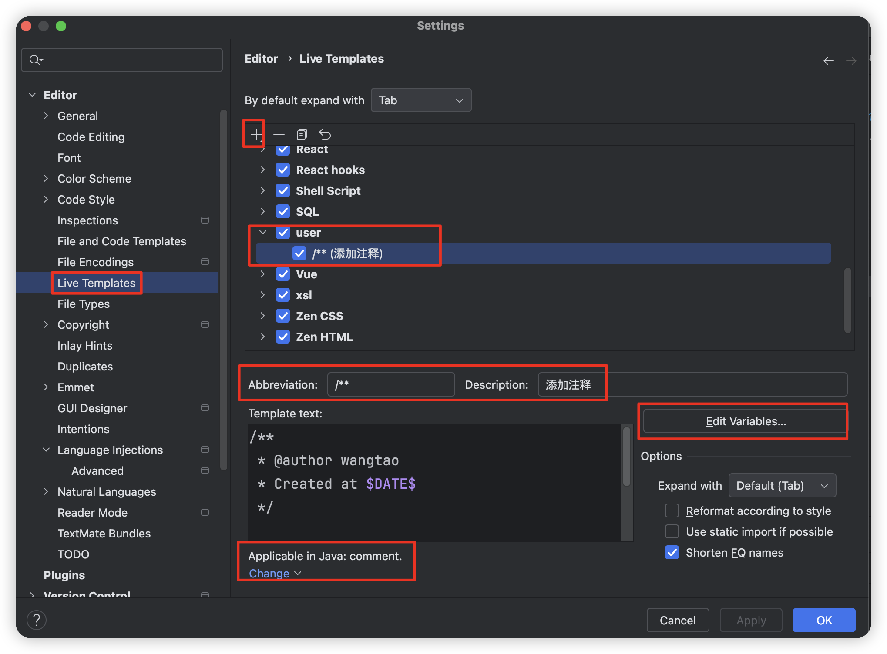

### 关于MyBatis XML中<sql>标签语法报错问题

找到Language Injections -》MyBatis sql|select|insert|update|delete

这就是为什么在xml中的这些标签里会有sql语法提示的原因。

直接复制一份，然后去掉sql标签，再把内建的这个规则勾选去掉即可。

关于Scope作用域

* Built-in，内建的规则，对所有项目生效。不要对内建的规则本身进行修改，若要修改复制一份修改，然后把内建的禁用掉即可。
* IDE，自己新增的规则，对所有项目生效。
* Project，自己新增的规则，只对当前项目生效。

IDE、Project作用域可以互相转换。

### 关于文件头注释

对于新建文件

对于已有文件

