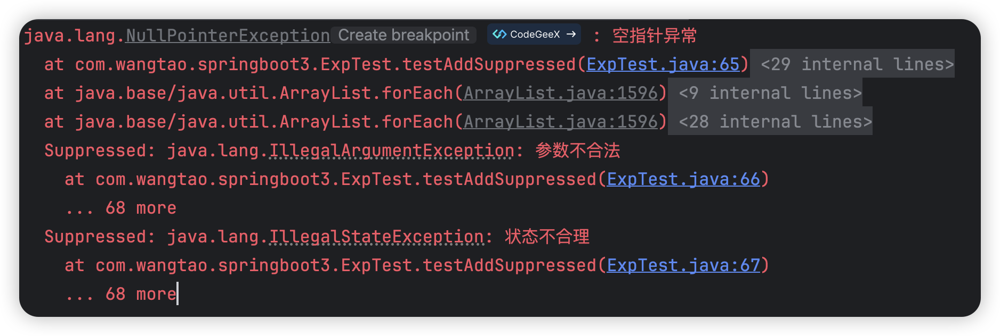

### 背景

有时候一个方法中可能会调用多个方法，每个内部方法都可能发生异常，但是出现异常时又不想直接终止程序，想要所有的方法执行完了后再抛出所有的异常信息，但是抛异常只能抛出一个，`addSuppressed`方法可以做到这个效果，使得异常堆栈信息中包含所有的异常。这有一点点类似于异常中的cause，但是场景不一样，因为这些异常完全是无关的，而cause是用于异常转换，记录真正引发故障的异常信息。

### 用法

`addSuppressed`方法可以调用多次

```java
@Test
public void testAddSuppressed() {
    NullPointerException e1 = new NullPointerException("空指针异常");
    IllegalArgumentException e2 = new IllegalArgumentException("参数不合法");
    IllegalStateException e3 = new IllegalStateException("状态不合理");
    e1.addSuppressed(e2);
    e1.addSuppressed(e3);
    e1.printStackTrace();
}
```

结果



### 案例1-关闭资源

```java
public static class FileCreator implements AutoCloseable {

    void create(boolean throwExp) {
        if (throwExp) {
            throw new IllegalArgumentException("illegal name");
        }
    }

    void close(boolean throwExp) {
        if (throwExp) {
            throw new RuntimeException("can't be closed");
        }
    }

    @Override
    public void close() {
        throw new RuntimeException("can't be closed");
    }
}
```

测试类

```java
@Test
public void testExp() {
    FileCreator fileCreator = new FileCreator();
    try {
        fileCreator.create(true);
    } catch (Exception e1) {
        try {
            fileCreator.close(true);
        } catch (Exception e2) {
            e1.addSuppressed(e2);
        }
        throw e1;
    }
    fileCreator.close(true);
}
```

### 案例2-try with resource

```java
@Test
public void testTryWithResource() {
    try (FileCreator creator = new FileCreator()) {
        creator.create(true);
    }
}
```

将class反编译之后的代码

```java
@Test
public void testTryWithResource() {
    FileCreator creator = new FileCreator();
    try {
        creator.create(true);
    } catch (Throwable var5) {
        try {
            creator.close();
        } catch (Throwable var4) {
            var5.addSuppressed(var4);
        }
        throw var5;
    }
    creator.close();
}
```

可以清楚看到try with resource语法糖的本质。