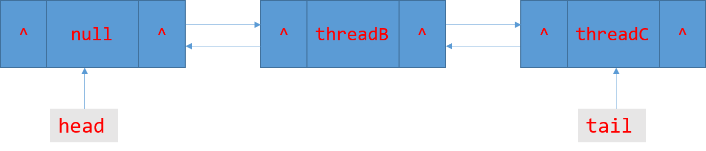
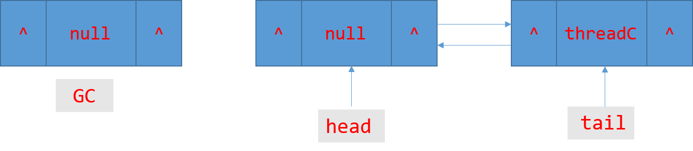
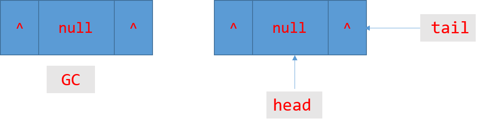

### AQS简介
AbstractQueuedSynchronizer 即队列同步器, 是一个用来构建锁或者其它同步组件的基础框架, 内部使用一个int类型的state字段表示同步状态, 还有一个队列来完成线程获取资源的工作。这个类使用非常广泛, JUC包下很多组件是依赖于AQS类实现的。比如ReentrantLock, ReentrantReadWriteLock, CountDownLatch, Semaphore类等。AQS主要分为两类操作独占式获取释放同步状态, 共享式独占释放同步状态。本文将借助ReentrantLock来说明AQS独占式(exclusive)操作的实现。

### 独占式主要API
void acquire(int arg); 独占式获取同步状态, 如果当前线程获取同步状态成功则方法结束, 否则将会进入同步队列等待, 会调用tryAcquire()方法
boolean tryAcquire(int arg) 由子类自己实现
void release(int arg); 独占式释放同步状态
boolean tryRelease(int arg) 由子类自己实现

### 源码分析
从ReentrantLock(可重入锁)类入手, 该类基于AQS独占式实现。而且还分为公平策略和非公平策略。
公平锁即获取锁的顺序应当与被阻塞的先后循序相同, 就是说如果多个线程因为获取锁失败而阻塞, 当锁释放后应当按照线程阻塞的先后时间来获取锁, 这样才公平, 也可以有效地防止线程饥饿现象。否则就是非公平锁了。

先明确一个概念, state > 0说明是已经获取同步状态, 大于0是因为ReentrantLock是可重入的, 当持有锁的线程再次获取该锁, state = state + 1; state = 0 说明该锁已被释放。

``` java

	//同步队列, 继承了AQS
	private final Sync sync;
	
	abstract static class Sync extends AbstractQueuedSynchronizer {
		//略
	}

	//非公平实现
	static final class NonfairSync extends Sync {
		//略
	}

	公平实现
	static final class FairSync extends Sync {
		//略
	}

```

``` java
	
	//获取锁, 直接调用FairSync的lock方法
	public void lock() {
        sync.lock();
    }
	
	//调用继承自AQS的acquire方法
	final void lock() {
		acquire(1);
    }
	
	//AQS acquire方法
	public final void acquire(int arg) {
        if (!tryAcquire(arg) &&
            acquireQueued(addWaiter(Node.EXCLUSIVE), arg))
            selfInterrupt();
    }

	//FairSync子类实现
	protected final boolean tryAcquire(int acquires) {
		//获取当前线程
		final Thread current = Thread.currentThread();
		//获取同步状态
		int c = getState();
		//如果state = 0说明还没有线程持有该锁
		if (c == 0) {
			//如果队列中没有前驱结点(体现公平性的关键), 则使用CAS操作修改state的值为1
		    if (!hasQueuedPredecessors() &&
		        compareAndSetState(0, acquires)) {
				//设置当前线程拥有锁
		        setExclusiveOwnerThread(current);
		        return true;
		    }
		}
		//该锁已被线程拥有, 继续判断获取锁的线程是否是当前线程(实现可重入锁的关键)
		else if (current == getExclusiveOwnerThread()) {
			//将state的值加1
		    int nextc = c + acquires;
			//变成负数了, 说明整型溢出, 抛出异常
		    if (nextc < 0)
		        throw new Error("Maximum lock count exceeded");
			//修改值
		    setState(nextc);
		    return true;
		}
		//获取失败
		return false;
	}
	
	//判断队列是否有前驱结点
	public final boolean hasQueuedPredecessors() {
		/*
		 * 未初始化时(队空) head = tail = null
		 * 初始化后head = tail, 队列只有一个结点, 没有被阻塞的线程, return false
		 * head != tail, s = h.next; 判断当前线程是否是第一个被阻塞的线程
		 * 不是说明当前线程没有机会获取同步状态, 有前驱结点。
		*/
		Node t = tail; // Read fields in reverse initialization order
		Node h = head;
		Node s;
		return h != t &&
		    ((s = h.next) == null || s.thread != Thread.currentThread());
	}
```

说明:<br/>
在调用AQS的acquire时, 如果tryAcquire()方法返回true, 即获取同步状态成功, 方法结束。
当tryAcquire()方法返回false时, 调用addWaiter方法将当前线程构建成节点以独占模式加入队列末尾中。<br/>
再看看addWaiter方法以及acquireQueued的实现<br/>

``` java

	private Node addWaiter(Node mode) {
		//将获取同步状态的当前线程以独占模式构造成节点
        Node node = new Node(Thread.currentThread(), mode);

        // Try the fast path of enq; backup to full enq on failure
		// 队尾
        Node pred = tail;
        if (pred != null) {
			//以CAS原子操作更新队尾指向当前线程节点
            node.prev = pred;
            if (compareAndSetTail(pred, node)) {
                pred.next = node;
                return node;
            }
        }
        enq(node);
        return node;
    }

	private Node enq(final Node node) {
        for (;;) {
            Node t = tail;
			//队空, 初始化队列
            if (t == null) { // Must initialize
                if (compareAndSetHead(new Node()))
                    tail = head;
            } else {
				//与addWaiter()方法相同
                node.prev = t;
                if (compareAndSetTail(t, node)) {
                    t.next = node;
                    return t;
                }
            }
        }
    }

	//自旋等待获取锁并且返回中断标识
	final boolean acquireQueued(final Node node, int arg) {
        boolean failed = true;
        try {
            boolean interrupted = false;
            for (;;) {
				//获取当前结点的前驱结点
                final Node p = node.predecessor();
				//如果前驱结点是头结点, 让当前结点线程再尝试获取下同步状态
                if (p == head && tryAcquire(arg)) {
					//成功获取同步状态, 将当前结点设置为头结点
                    setHead(node);
                    p.next = null; // help GC
					//置为false, finally中的语句将不再执行
                    failed = false;
					//返回false, 那么acquire方法也会结束, 即当前线程也不会被挂起
                    return interrupted;
                }
				//获取同步状态失败检查是否应该把当前线程挂起
                if (shouldParkAfterFailedAcquire(p, node) &&
                    parkAndCheckInterrupt())
                    interrupted = true;
            }
        } finally {
			//如果异常退出循环则取消获取锁的请求, 从队列中摘掉该节点
            if (failed)
                cancelAcquire(node);
        }
    }

	//检查是否应该挂起当前线程
	private static boolean shouldParkAfterFailedAcquire(Node pred, Node node) {
        int ws = pred.waitStatus;
		//waitStatus总共有好几个状态, 下文再说
		//如果前驱结点waitStatus=SIGNAL, 值为-1, 则当前结点应该被挂起, return true
        if (ws == Node.SIGNAL)
            return true;
		/*
		如果大于0, 则此结点是一个无效的结点, 已经被取消了(CANCELLED=1), 
		接着找前驱, 并且移除被取消的结点
		*/
        if (ws > 0) {
            do {
                node.prev = pred = pred.prev;
            } while (pred.waitStatus > 0);
            pred.next = node;
        } else {
			 /*waitStatus must be 0 or PROPAGATE.  Indicate that we
             * need a signal, but don't park yet.  Caller will need to
             * retry to make sure it cannot acquire before parking.
             * 将前驱节点的waitStatus值置为SIGNAL
             */
            compareAndSetWaitStatus(pred, ws, Node.SIGNAL);
        }
        return false;
    }
	
	//挂起当前线程, 返回中断标识
	private final boolean parkAndCheckInterrupt() {
		//挂起当前线程直至被其它线程使用unPark()唤醒
        LockSupport.park(this);
		//苏醒后检查是否被中断过
        return Thread.interrupted();
    }
```
说明:<br/>
**waitStatus的值:** <br/>
CANCELLED = 1, 由于在同步队列中等待的线程等待超时或者被中断, 需要从同步队列中取消等待 <br/>
SIGNAL = -1, 后继结点将会被挂起, 而当前结点的线程释放了同步状态或者被取消将会通知后续结点, 使得后续结点的线程得以运行 <br/>
CONDITION = -2, 节点为Condition结点 <br/>
InitValue = 0, 初始值为0 <br/>

总结下流程:<br/>
**线程在调用acquire(1)时, 如果tryAcquire(1)时返回true, 则方法结束。成功获取同步状态
否则调用addWaiter()方法, 将当前线程构造成节点加入同步队列队尾, 如果此时队列为空先初始化队列然后再添加, addWaiter()方法将返回当前线程构造的结点作为acquireQueued(Node node)方法的参数, acquireQueued会让当前线程自旋得获取锁, 并且返回中断标识。acquireQueued方法的主要逻辑是, 如果当前结点的前驱结点是头结点时, 那么让当前结点的线程自旋的尝试获取同步状态, 如果获取到锁, 则将当前结点设置为头结点, 然后返回中断标识, 否则则检查是否挂起当前线程, 满足条件则挂起。如果acquireQueued返回true, 则自我中断自己。**

同步队列的图示状态<br/>
初始化:<br/>
<font size = "6px" color = "red">head = tail = null </font>

threadA线程获取锁:<br/>
<font size = "6px" color = "red">head = tail = null </font>

threadB, C线程竞争获取锁失败, 进入同步队列:<br/>


头结点就可以看成是获取同步状态成功的结点, 只是它的thread字段被置为null, 其它的等待结点在自旋的过程中会将它的前驱结点的waitStatus值置为SIGNAL, 如果在进行自旋循环的下一次还没有获取到同步状态, 那么将满足挂起条件(前驱结点的waitStatus=SIGNAL), 将会被挂起。新建结点的waitStatus默认为0, 因此队尾元素的waitStatus将会是0的状态, 因为没有后继结点修改它的值。

**释放同步状态分析**
同样从ReentrantLock类入手, 看看unLock方法

``` java
	
	// 释放锁
	public void unlock() {
        sync.release(1);
    }
	
	//FairSync继承自AQS的
	public final boolean release(int arg) {
        if (tryRelease(arg)) {
            Node h = head;
			//唤醒后继结点
            if (h != null && h.waitStatus != 0)
                unparkSuccessor(h);
            return true;
        }
        return false;
    }

	//FairSync实现
	protected final boolean tryRelease(int releases) {
		//将state的值减1
		int c = getState() - releases;
		//如果别的线程调用解锁操作, 抛出异常
		if (Thread.currentThread() != getExclusiveOwnerThread())
		    throw new IllegalMonitorStateException();
		boolean free = false;
		//state = 0, 锁将释放。
		if (c == 0) {
		    free = true;
		    setExclusiveOwnerThread(null);
		}
		//更新state
		setState(c);
		return free;
	}
	
```
说明:<br/>
释放锁其实调用的就是AQS的release方法, release方法调用子类重写的tryRelease方法判断是否释放同步状态成功, 如果tryRelease方法返回false, 则当前线程继续占有锁。 如果返回true则唤醒后继结点使之得已运行去获取锁。

释放状态的队列图示<br/>
接着上面获取锁的队列状态, 即A线程获取锁, B,C线程在同步队列等待的状态<br/>
<br/>
让A释放锁后, 那么B将获取锁, 将自己设置成头结点, 原先的头结点则被移除等待被GC<br/>
<br/>
B释放锁C获取锁, 以及C释放锁后的图一样<br/>
<br/>
释放锁操作不会移除结点, 只是将state - 1, 并且唤醒后续结点。结点获取锁后才会将原来的头结点删除, 并且将自己设置为头结点。除了第一次添加结点同步队列head = tail = null; 后面队列将不再为空。


**最后再看看非公平锁的实现** <br/>
``` java
	
	//获取锁, 直接调用NonfairSync的lock方法
	public void lock() {
        sync.lock();
    }
	
	// NonfairSync
	final void lock() {
		//先去获取一个同步状态, 再执行acquire方法
	    if (compareAndSetState(0, 1))
	        setExclusiveOwnerThread(Thread.currentThread());
	    else
	        acquire(1);
	}

	protected final boolean tryAcquire(int acquires) {
        return nonfairTryAcquire(acquires);
    }
	
	final boolean nonfairTryAcquire(int acquires) {
		final Thread current = Thread.currentThread();
		int c = getState();
		if (c == 0) {
			/*
			 *与FairSync区别加了个条件
			 *if (!hasQueuedPredecessors() &&
		     * compareAndSetState(0, acquires))
			 */
		    if (compareAndSetState(0, acquires)) {
		        setExclusiveOwnerThread(current);
		        return true;
		    }
		}
		else if (current == getExclusiveOwnerThread()) {
		    int nextc = c + acquires;
		    if (nextc < 0) // overflow
		        throw new Error("Maximum lock count exceeded");
		    setState(nextc);
		    return true;
		}
		return false;
	}

```

先理下调用流程:<br/>
**fair: ReentrantLock:lock()-> FairSync:lock()-> 继承AQS:acquire()-> FairSync:tryAcquire()**<br/>

**nonFair:ReentrantLock:lock()-> NonfairSync:lock()-> 继承AQS:acquire()->NofairSync: tryAcquire()** <br/>

非公平锁与公平锁实现区别: <br/>
**1. 先去尝试获取下同步状态, 失败再执行acquire方法。**

**2. tryAcquire()方法实现不同, 具体说来。公平锁如果发现state = 0, 即同步状态已经被释放会先检查队列中有没有被阻塞的线程, 如果有则不去获取锁, 而非公平锁不care, 只要发现锁是释放状态, 则去获取锁, 看谁运气好先更新同步状态谁就先获取到锁。**

**3.  非公平锁只能保证阻塞队列里最早等待的线程与新来的线程竞争抢锁, 对于阻塞队列其它的线程依然需要等待，因为队列是先进先出的特性。**


### 参考
1. Java并发编程的艺术
2. JDK 1.8 源码