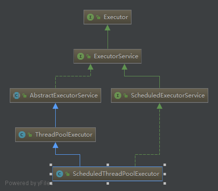
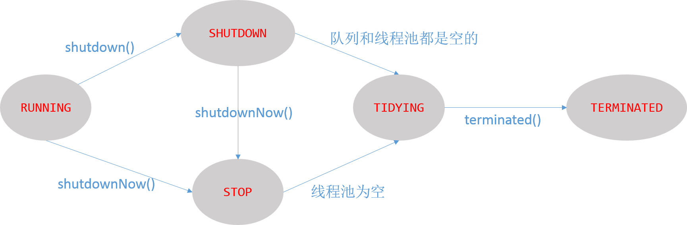

### Executor

Executor家族成员如图所示:

 

* Executor执行者根接口类, 声明execute方法用来提交实现Runnable接口的任务。
* ExecutorService接口继承自Executor接口, 又增加了一个submit()方法用来提交实现Callable接口的任务, 可以有返回值。

* ExecutorService主要的方法介绍: 

  void execute(Runnable command); 提交实现Runnable接口的任务。

  <T> Future<T> submit(Callable<T> task); 提交实现Callable接口的任务, 可以拿到返回值。

  void shutdown(); //执行完已经提交的任务后, 关闭线程池, 线程池会拒绝后续提交的任务。

  boolean awaitTermination(long timeout, TimeUnit unit); 会阻塞当前线程直至线程池关闭或者超时时间已到,  

  通常与shutdown方法搭配使用。

例如:

``` java
ExecutorService service = Executors.newFixedThreadPool(3);
for(int i = 0; i < 2; i++) {
    service.execute(()->{
        //dosomething
    });
}
try {
    //关闭线程池
    service.shutdown();
    //阻塞当前线程, 直到线程池任务全部执行完毕
    service.awaitTermination(20, TimeUnit.SECONDS);
    //dosomething
} catch (InterruptedException e) {
    e.printStackTrace();
}
```

3. ThreadPoolExecutor: 线程池实现类, 核心类, 原理主要在此类实现。
4. ScheduledThreadPoolExecutor继承自ThreadPoolExecutor, 是一个任务调度的线程池实现。
5. Executors: 工具类, 封装了一系列获取ThreadPoolExecutor的静态方法, 以及将Runnalble接口转化为Callable接口的方法。

### ThreadPoolExecutor

#### 工作流程

1. 判断正在执行任务的线程数量是否小于coolPoolSize, 小于则新建线程执行任务, 否则->2 
2. 判断工作队列是否已满, 未满将任务加入队列中, 队满->3 
3. 判断正在执行任务的线程数量是否小于线程池中所允许的最大的线程数量(maximumPoolSize), 小于新建线程处理任务。否则(线程池达到饱和状态)->4
4. 将任务交给reject策略。

#### 默认reject策略的几个实现

线程池默认实现了四个reject策略, 定义在ThreadPoolExecutor的内部类中。

* CallerRunsPolicy策略, 如果线程池处于运行(RUNNING)状态, 则直接调用任务的run方法执行这个任务, 但是没有开启一个新的线程。

``` java
public static class CallerRunsPolicy implements RejectedExecutionHandler {

    public CallerRunsPolicy() { }

    public void rejectedExecution(Runnable r, ThreadPoolExecutor e) {
        if (!e.isShutdown()) {
            r.run();
        }
    }
}
```

+ AbortPolicy策略, 拒绝任务, 直接抛出异常。

``` java
public static class AbortPolicy implements RejectedExecutionHandler {

    public AbortPolicy() { }

    public void rejectedExecution(Runnable r, ThreadPoolExecutor e) {
        throw new RejectedExecutionException("Task " + r.toString() +
                                             " rejected from " +
                                             e.toString());
    }
}
```

* DiscardPolicy策略, 将任务抛弃, 什么都不做。

``` java 
public static class DiscardPolicy implements RejectedExecutionHandler {

    public DiscardPolicy() { }

    public void rejectedExecution(Runnable r, ThreadPoolExecutor e) {
    }
}
```

* DiscardOldestPolicy策略, 抛弃那个最久未被处理的任务, 将此任务再次提交。

``` java
public static class DiscardOldestPolicy implements RejectedExecutionHandler {

    public DiscardOldestPolicy() { }

    public void rejectedExecution(Runnable r, ThreadPoolExecutor e) {
        if (!e.isShutdown()) {
            e.getQueue().poll();
            e.execute(r);
        }
    }
}
```

#### 线程池中五种状态

* RUNNING: 接受新的任务, 并且处理在工作队列中等待的任务。
* SHUTDOWN: 拒绝新的任务, 但是会处理工作队列中等待的任务。
* STOP: 拒绝新的任务并且也不处理工作队列中等待的任务。还会中断正在处理的任务。
* TIDYING: 线程池和任务队列都为空，该状态下线程会执行 terminated()方法。
* TERMINATED：terminated()方法执行完毕。

转化关系如图所示:


#### 构造方法参数解释

``` java
public ThreadPoolExecutor(int corePoolSize, int maximumPoolSize,
                          long keepAliveTime, TimeUnit unit,
                          BlockingQueue<Runnable> workQueue, ThreadFactory threadFactory,
                          RejectedExecutionHandler handler) {

}
```

- corePoolsize: 保留在线程池中线程的基本数量, 即便这些线程是空闲的也不会被销毁。
- maximumPoolSize: 线程池中允许的最大线程数量。
- keepAliveTime: 存活时间, 大于corePoolsize数量的线程, 当它们空闲时在被终止前等待新的任务的最大时间。
- unit: 与keepAliveTime搭配, 指定单位(秒, 毫秒, 分钟等)。
- workQueue: 工作队列, 当线程池中的数量大于corePoolsize时, 用于保存再提交的任务。
- threadFactory: 线程工厂, 用于创建处理任务的线程, 自己可以自定义设置更有意义的线程名字。
- handler: 饱和策略, 线程池提供4种默认实现。

#### Executors提供的几种线程池

**1. FixedThreadPool: 固定线程数量的线程池**

``` java
public static ExecutorService newFixedThreadPool(int nThreads) {
    return new ThreadPoolExecutor(nThreads, nThreads,
                                  0L, TimeUnit.MILLISECONDS,
                                  new LinkedBlockingQueue<Runnable>());
}

public static ExecutorService newFixedThreadPool(int nThreads, 
                                                 ThreadFactory threadFactory) {
    return new ThreadPoolExecutor(nThreads, nThreads,
                                  0L, TimeUnit.MILLISECONDS,
                                  new LinkedBlockingQueue<Runnable>(),
                                  threadFactory);
}
```
说明: <br/>池中保留nThreads个线程, 线程池中最大的线程数量也是nThreads。keepAliveTime=0意味着多余的空闲线程会立即被终止, 使用的工作队列是不带参数的无界队列LinkedBlockingQueue。由上面的工作流程分析可知, maximumPoolSize, keepAliveTime将会是无效的参数设置, 因为当线程池中的线程数量大于corePoolsize时提交的任务都会被加入到工作队列中。

**2. SingleThreadExecutor: 单线程池**

``` java
public static ExecutorService newSingleThreadExecutor() {
    return new FinalizableDelegatedExecutorService(
        new ThreadPoolExecutor(1, 1,0L, TimeUnit.MILLISECONDS,
                               new LinkedBlockingQueue<Runnable>())
    );
}

public static ExecutorService newSingleThreadExecutor(ThreadFactory threadFactory) {
    return new FinalizableDelegatedExecutorService(
        new ThreadPoolExecutor(1, 1, 0L, TimeUnit.MILLISECONDS,
                               new LinkedBlockingQueue<Runnable>(),
                               threadFactory)
    );
}
```
说明:<br/>
与newFixedThreadPool相比只是设置corePoolsize和maximumPoolSize为1。

**3. CachedThreadPool： 缓存线程池** 

``` java
public static ExecutorService newCachedThreadPool() {
    return new ThreadPoolExecutor(0, Integer.MAX_VALUE,
                                  60L, TimeUnit.SECONDS,
                                  new SynchronousQueue<Runnable>());
}

public static ExecutorService newCachedThreadPool(ThreadFactory threadFactory) {
    return new ThreadPoolExecutor(0, Integer.MAX_VALUE,
                                  60L, TimeUnit.SECONDS,
                                  new SynchronousQueue<Runnable>(),
                                  threadFactory);
}
```
说明: <br/>
corePoolsize = 0, maximumPoolSize = Integer.MAX_VALUE。即线程池的容量是无界的, 工作队列为SynchronousQueue, 这是一个没有容量的阻塞队列。keepAliveTime = 60, 因为corePoolsize = 0, 即池中的所有空闲线程只要在60秒内还没有收到新任务将会被终止。将参数整合下, 意思就是每次提交任务, 由于corePoolsize = 0, 将任务添加到队列中。又因为工作队列容量为0,而maximumPoolSize无界, 如果此时线程池中存在空闲线程(60s才终止), 空闲线程执行任务, 如果没有则新建线程执行任务。因此这是一个会按需新建线程的线程池。

#### 使用线程池的好处

* 使用线程池可以对线程统一管理, 合理的分配线程资源。

* 线程的创建和销毁是比较耗时的操作, 频繁创建线程或者销毁线程会对程序的响应速度造成严重的影响, 而线程池的管理策略可以避免线程频繁的创建以及销毁, 线程池中的线程可以被重复利用, 执行多个任务。

* 适用于那种请求数量多但是任务处理的时间比较短的场景。