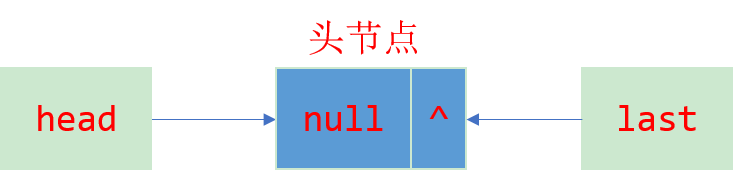
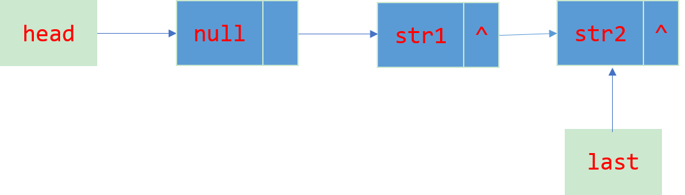
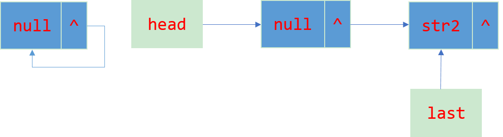

## 基本操作方法
**Queue接口声明的方法**

1. add, remove, element操作会抛出异常。
2. offer, poll, peek不抛异常, 会返回null或者返回false。

**BlockingQueue新增方法**

1. 增加了put, take两个阻塞式操作, 添加/获取队头元素并删除。

2. 以及增加了offer, poll的超时阻塞操作, offer(超时了返回false, 不再阻塞), poll(超时了返回null, 不再阻塞。

注: 

1. 抛出异常是指当队满时向队列插入元素或者队空时删除以及获取元素时的处理方式。
2. 所有的这些方法都是线程安全的，方法内部使用了ReentrantLock。

## LinkedBlockingQueue源码解析

### 属性介绍
``` java

	// 链表结点
	static class Node<E> {
        E item;
        Node<E> next;
        Node(E x) { item = x; }
    }

	// 队列的最大容量(不会扩容, 若初始化没有指定则是int的最大值)
	private final int capacity;

    // 队列里当前元素的数量
    private final AtomicInteger count = new AtomicInteger();

    // 队头(删除元素的一端)
    transient Node<E> head;

    // 队尾(添加元素的一端)
    private transient Node<E> last;

    // take操作所使用的锁
    private final ReentrantLock takeLock = new ReentrantLock();
    private final Condition notEmpty = takeLock.newCondition();

    //put操作所使用的锁
    private final ReentrantLock putLock = new ReentrantLock();
    private final Condition notFull = putLock.newCondition();

```
### 初始化
初始化时若没有指定队列容量, 则默认容量为整型的最大值, 就是一个无界队列了, 这样会有撑爆内存的风险。

Executors工具类创建固定线程池(newFixedThreadPool方法)以及创建单个线程池(newSingleThreadExecutor方法)使用的工作队列的就是无界的LinkedBlockingQueue。

初始化源码如下

``` java

    // 无界队列
	public LinkedBlockingQueue() {
        this(Integer.MAX_VALUE);
    }
    // 指定队列容量
    public LinkedBlockingQueue(int capacity) {
        if (capacity <= 0) throw new IllegalArgumentException();
        this.capacity = capacity;
        // 初始化队列
        last = head = new Node<E>(null);
    }

```

即新建一个节点, 节点不存储内容, 存储的就是一个null值, 相当于一个头结点, 然后让队头队尾都指向它, 也可以明白队头结点所指向的元素是不存储元素的。形态如图所示


### put方法解析
``` java

public void put(E e) throws InterruptedException {
    if (e == null) 
        throw new NullPointerException();

    int c = -1;
    Node<E> node = new Node<E>(e);
    final ReentrantLock putLock = this.putLock;
    //获取当前队列元素的数量
    final AtomicInteger count = this.count;
    //获取put操作的锁
    putLock.lockInterruptibly();
    try {
        //队列已满, 阻塞当前线程操作
        while (count.get() == capacity) {
            notFull.await();
        }
        //已经有空位置存放元素, 入队操作, 很简单, 改变两个指针即可
        enqueue(node);
        // 获取刚刚插入元素前队列的大小
        c = count.getAndIncrement();
        //如果小于最大容量, 唤醒其它的执行put操作阻塞的队列, 因为还有位置存放元素
        if (c + 1 < capacity)
            notFull.signal();
    } finally {
        putLock.unlock();
    }
    /*如果等于0, 也就是说在插入这个元素之前队列为空, 此时已经可以取元素了, 
		  唤醒因队空执行take操作而阻塞的线程
		*/
    if (c == 0)
        signalNotEmpty();
}

//入队操作方法
private void enqueue(Node<E> node) {
    last = last.next = node;
}

```
整个流程还是很清晰简单的, 插入两个元素之后的形态为下图所示


### take方法解析
``` java

public E take() throws InterruptedException {
    E x;
    int c = -1;
    //获取当前队列元素的数量
    final AtomicInteger count = this.count;

    final ReentrantLock takeLock = this.takeLock;
    //获取take操作所需要的锁
    takeLock.lockInterruptibly();
    try {
        //如果队空, 阻塞当前线程
        while (count.get() == 0) {
            notEmpty.await();
        }
        //出队
        x = dequeue();
        //获取出队前的元素数量
        c = count.getAndDecrement();
        //大于1, 还可以出队, 那么唤醒其他执行take操作的线程
        if (c > 1)
            notEmpty.signal();
    } finally {
        takeLock.unlock();
    }
    //已经从队列中取出元素, 队列已有空位置, 唤醒执行put操作的线程
    if (c == capacity)
        signalNotFull();
    return x;
}

private E dequeue() {
    //head也就是头结点不存放元素的
    Node<E> h = head;
    //获取存放第一个元素的节点
    Node<E> first = h.next;
    h.next = h; // help GC
    head = first;
    E x = first.item;
    first.item = null;
    return x;
}
```

删除一个元素之后的形态为下图所示


## ArrayBlockingQueue源码解析

### 属性介绍
``` java
// 存放元素的数组
final Object[] items;

// 队头元素索引
int takeIndex;

// 队尾元素的下一个, 也是put操作所放的位置
int putIndex;

// 队列中元素的数量
int count;

// 可重入锁
final ReentrantLock lock;
private final Condition notEmpty;
private final Condition notFull;

```
### 初始化
``` java
//初始化队列, 默认非公平策略
public ArrayBlockingQueue(int capacity) {
    this(capacity, false);
}

public ArrayBlockingQueue(int capacity, boolean fair) {
    if (capacity <= 0)
        throw new IllegalArgumentException();
    this.items = new Object[capacity];
    //初始化锁
    lock = new ReentrantLock(fair);
    notEmpty = lock.newCondition();
    notFull =  lock.newCondition();
}
```

初始化可以指定策略是公平还是非公平的, 这是基于ReentrantLock的公平锁非公平锁实现的。初始化就是一个空数组, takeIndex = putIndex = 0;


### put方法源码
``` java
// 从队尾插入元素, 队满了则阻塞
public void put(E e) throws InterruptedException {
    // 检查待插入元素是否为null, 会抛出NullPointerException
    checkNotNull(e);
    // 获取锁
    final ReentrantLock lock = this.lock;
    lock.lockInterruptibly();

    try {
        // 如果队满, 则阻塞
        while (count == items.length)
            notFull.await();
        // 进队
        enqueue(e);
    } finally {
        lock.unlock();
    }
}

// 入队方法
private void enqueue(E x) {
    final Object[] items = this.items;
    // 插入元素
    items[putIndex] = x;
    // 插入元素后已经队满, 置putIndex = 0, 循环队列的意味
    if (++putIndex == items.length)
        putIndex = 0;
    count++;
    // 队列已有元素, 唤醒执行take操作被阻塞的线程。
    notEmpty.signal();
}
```


### take方法源码
``` java

//从队头获取元素, 如果队空则被阻塞
public E take() throws InterruptedException {
    //获取锁
    final ReentrantLock lock = this.lock;
    lock.lockInterruptibly();
    try {
        //如果队列为空, 阻塞
        while (count == 0)
            notEmpty.await();
        //获取出队元素
        return dequeue();
    } finally {
        lock.unlock();
    }
}

private E dequeue() {
    final Object[] items = this.items;
    @SuppressWarnings("unchecked")
    //获取队头元素
    E x = (E) items[takeIndex];
    //值队头元素引用为null, 帮助gc
    items[takeIndex] = null;
    //索引走到数组的最后, 重置为0
    if (++takeIndex == items.length)
        takeIndex = 0;
    count--;
    if (itrs != null)
        itrs.elementDequeued();
    //唤醒因执行put操作被阻塞的线程, 因为已经有空位置容纳元素了
    notFull.signal();
    return x;
}

```

## 总结

ArrayBlockingQueue与LinkedBlockingQueue的区别

- ArrayBlockingQueue底层是一个数组, 并且重复利用空间, 是一个循环队列。LinkedBlockingQueue底层是一个链表实现
- ArrayBlockingQueue可以实现公平非公平策略, 依赖于可重入锁ReentrantLock的公平锁和非公平锁实现。所谓公平与非公平策略是指被阻塞的线程可以按照阻塞的先后顺序访问队列。因为在进行操作时，需要先获取锁，获取锁成功后才能往队列添加元素或者从队列取元素。
- ArrayBlockingQueue put操作与take操作用的是同一把锁, 因此读写是互斥的, 而LinkedBlockingQueue put操作与take操作用的是不同的锁, 因此多线程环境下, 一个线程可以执行写操作(put), 另一个线程可以执行读操作(take), 效率相对而言较高。


