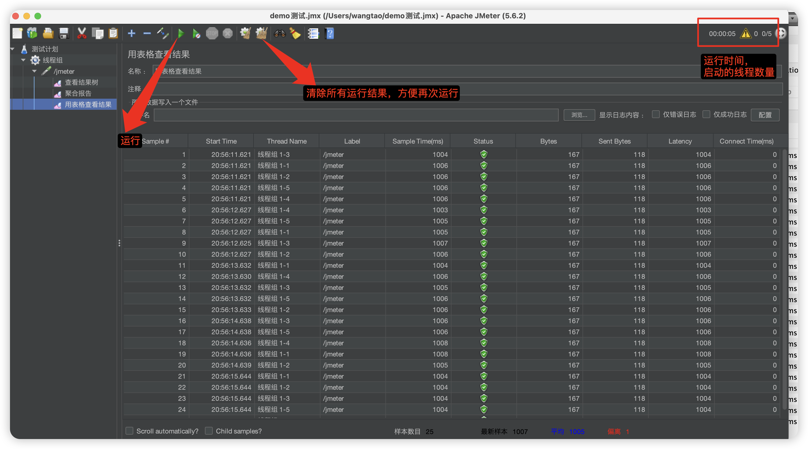

### 运行

```bash
# macos、linux
sh jmeter.sh
# windows
jmeter.bat
```

### 线程组概念


#### 线程数

就是会创建几个线程，模拟多少个虚拟用户。

#### Ramp-Up Period

单位为秒，用于控制线程启动的速度。具体来说，`Ramp-up` 定义了所有线程在多长时间内启动完毕。

**详细含义**：

- 假设你设置了 10 个线程和 20 秒的 `Ramp-up` 时间，那么 JMeter 会在 20 秒内启动所有 10 个线程。也就是说，每 2 秒启动一个线程（20秒/10线程 = 2秒/线程）。
- 如果 `Ramp-up` 时间设置得太短，所有线程可能会在几乎同时启动，这可能会对服务器产生瞬时的高负载。
- 如果 `Ramp-up` 时间设置得比较长，线程会一个接一个地慢慢启动，这样可以逐步增加负载，模拟更真实的用户行为。
- 如果设置为0，则表示立马创建所有的线程。

简而言之，`Ramp-up` 参数用来控制线程启动的平滑度和频率，从而影响模拟的负载模式。

#### 循环次数

每个线程发送请求的次数。

* 注意每个线程都是独立的，不是所有的线程都执行完一轮后，再开启第二轮循环。
* 其次线程发送请求默认情况下是同步的，比如设置循环次数是2，单个线程发送第二次请求时需要第一次请求响应完成后再发送的。
* 勾选永远，则需要用户手动点击stop按钮来停止发送请求。

例子1

接口：后台请求需要1s才能响应数据

线程组配置：


结果：


从图中可以看到

* 3个线程基本上每隔300多ms开始创建然后发送请求，1s内3个线程全部创建完毕。(看前面3个采样，后面的请求线程已经创建好了)
* 每个线程发送下一个请求的间隔基本上是1s多一点，因为接口响应需要1s钟，可以看出单个线程发送请求是同步的，这里体现不出每个线程是独立的，看起来好像是一轮循环完了之后再开启下一轮循环是因为响应时间太长了导致的。

例子2

接口：立马返回，不要睡眠1s才返回

线程组配置：


结果：


可以看到每个线程是独立的，只要自己发起请求的响应完毕之后就可以发送下一个请求了。

不过每个线程创建时还是每隔300多ms，在1s内创建完毕，因为Ramp-Up设置的是1s。

例子3

其它参数情况和例子2一模一样，只是Ramp-Up设置的是0

结果：


可以看到每个线程的启动时间几乎是一样的，同时启动所有线程

#### 调度器

需要循环次数勾选成永远，这样就可以设置一个持续时间了，线程发送请求就不是按照次数满足了就终止了，还是持续发送请求，直到时间满足才终止，当然了每个线程发送请求依然是同步的。

关于启动延时：

不是说延时多久才发送请求，而是延时时间到了之后才会开始创建线程并发送请求，启动延时设置的时间比Ramp-Up要长，此时Ramp-Up参数依然生效的，因为线程是延时时间到了才创建。

### 使用示例

第一步，都是要创建一个线程组，设置线程组参数，测试接口TPS，一般设置调度器，持续跑一段时间

左侧测试计划右键，添加-》线程(用户) -》线程组


第二步，在线程组下面添加http请求

选中刚新建好的线程组右键，添加-》取样器-》HTTP请求


第三步，结果查看

选择刚创建的请求右键，添加-》监听器-》查看结果树、聚合报告、用表格查看结果

具体哪些看实际需要

**查看结果树**

可以看到HTTP响应结果


可切换页签看请求报文、响应报文。

**聚合报告**


如何放在线程组下面，那么每一个请求都会有一条数据，再加上一个总体一条数据。

label：请求名称

#样本：请求次数

平均值：平均响应时间，单位毫秒，响应时间简称RT

中位数：响应时间出现最多的数值

90%：百分之90的请求响应时间

最小值：最小的响应时间

最大值：最大的响应时间

异常：出现异常请求占比

吞吐量：可以理解成接口的QPS或TPS

**用表格查看结果**


可以看到每个样本的具体情况，哪个线程发起的，开始时间，响应时间(Sample Time)

### 图标作用

