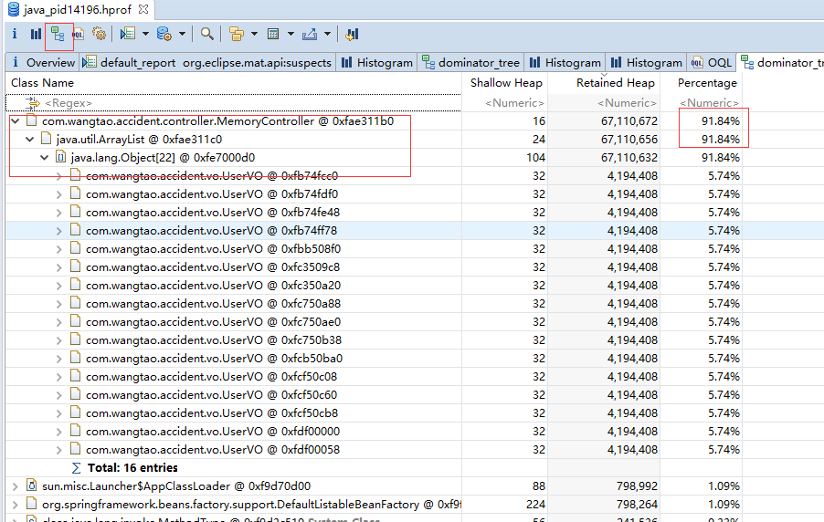
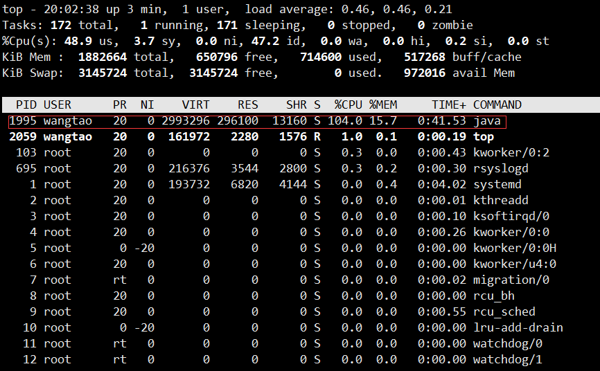
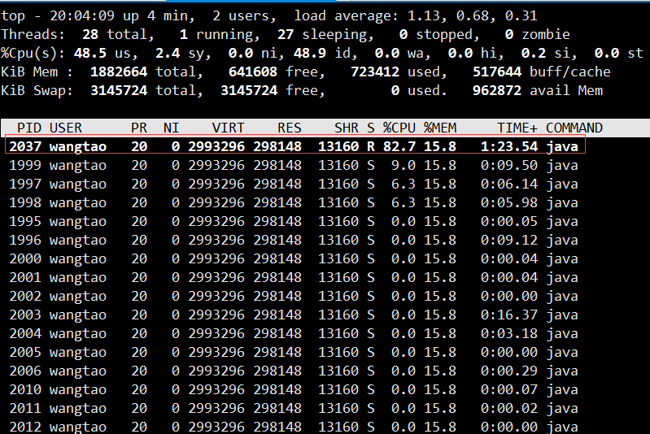

### 堆内存溢出

#### 模拟堆内存溢出

模拟例子如下，主要就是创建特别多的对象，并且不让被回收，有强引用。

```java
@RestController
public class MemoryController {

    private final List<UserVO> userList = new ArrayList<>();

    public static final int COUNT = 100000;

    /**
     * -Xms100m -Xmx100m
     * -XX:+HeapDumpOnOutOfMemoryError
     * -XX:HeapDumpPath=D:\
     *
     * jmap -dump:format=b,file=java_pid1234.hprof 1234
     * 其中1234为进程id
     *
     * jstat -gcutil pid 5000(ms) 显示百分比
     * jstat -gc pid 5000(ms)  显示容量
     */
    @GetMapping("/heap")
    public UserVO heap() {
        Random random = new Random();
        for (int i = 1; i <= COUNT; i++) {
            UserVO userVO = new UserVO();
            userVO.setId(i);
            userVO.setUsername("user-" + i);
            userVO.setAge(random.nextInt(100));
            userVO.setBytes(new Byte[1024 * 1024]);
            userList.add(userVO);
        }
        return userList.get(random.nextInt(COUNT));
    }
}
```

启动程序时加上jvm启动参数，指定堆内存，以及发生内存溢出时自动打印堆信息

```pr
-Xms100m -Xmx100m
-XX:+HeapDumpOnOutOfMemoryError
-XX:HeapDumpPath=D:\
```

以上参数堆dump文件生成的位置在D盘，默认的文件名为java_pidxxx.hprof

当然也可用jmap命令打印堆dump文件，命令如下

```bash
jmap -dump:format=b,file=<name>.hprof <pid>
# 如java进程为1234
jmap -dump:format=b,file=/home/waston/java-pid1234.hprof 1234
```

拿到堆dump文件后，便可以借助MAT工具来分析内存情况

#### 使用MAT分析dump文件

打开软件后，点击File -> Open Heap Dump...打开选择的dump文件


可以看到工具已经帮我们定位到可疑的类，对于简单的情况还是很准确的。

MAT常用两个功能

* 我们可以选择对象数量视图，查看对象的数量以及内存，如下图所示


可以根据对象数量或者占用内存进行排序，找到可疑的对象。然后选中对象右键Merge Shortest Paths To Gc Roots找到对象引用链。

* 选中对象内存视图，查看对象的内存占比，如下图所示




### CPU占用过高

#### 模拟CPU占用过高例子

```java
@RestController
public class LoopController {

    /**
     * 连续执行10分钟，不停创建对象
     */
    @GetMapping("/loop")
    public void loop() {
        Random random = new Random();
        long start = System.currentTimeMillis();
        while (true) {
            int i = random.nextInt(100);
            UserVO userVO = new UserVO();
            userVO.setId(i);
            userVO.setUsername("user-" + i);
            userVO.setAge(random.nextInt(100));
            userVO.setBytes(new Byte[1024]);
            long cost = System.currentTimeMillis() - start;
            if (TimeUnit.MINUTES.toMillis(10) < cost) {
                break;
            }
        }
    }
}
```

CPU占用过高分析

* 使用top命令查看占用CPU过高的进程，一般就是我们的java进程



看到pid=1995的java进程占用CPU过高

* 使用`top -H -p pid`查看指定进程下的线程占用情况，本例为`top -H -p 1995`



看到pid=2037的线程占用很高

* 将线程pid转成16进制，`printf "%x\n" pid`，即`printf "%x\n" 2027`，得到16进制`0x7f5`

* 打印线程快照信息，`jstack 1995 >> thread.txt`

* 在thread.txt中搜索`0x7f5`定位线程调用栈信息

