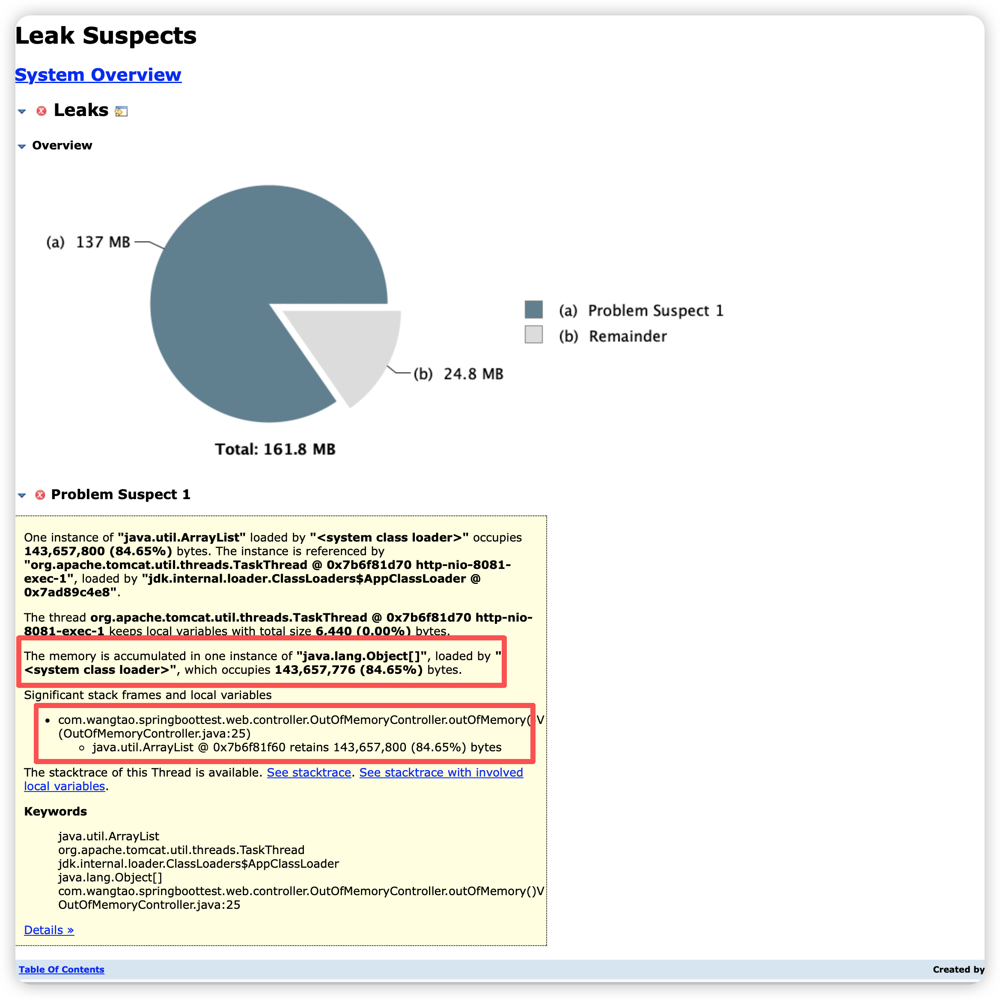
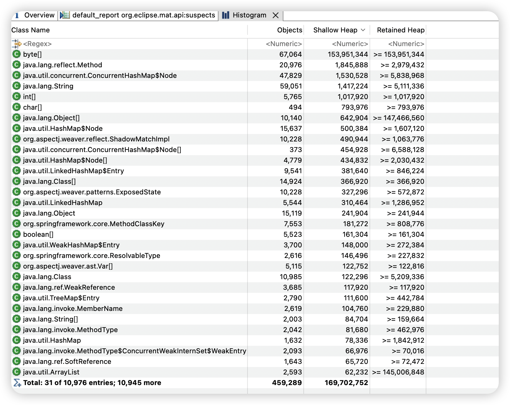
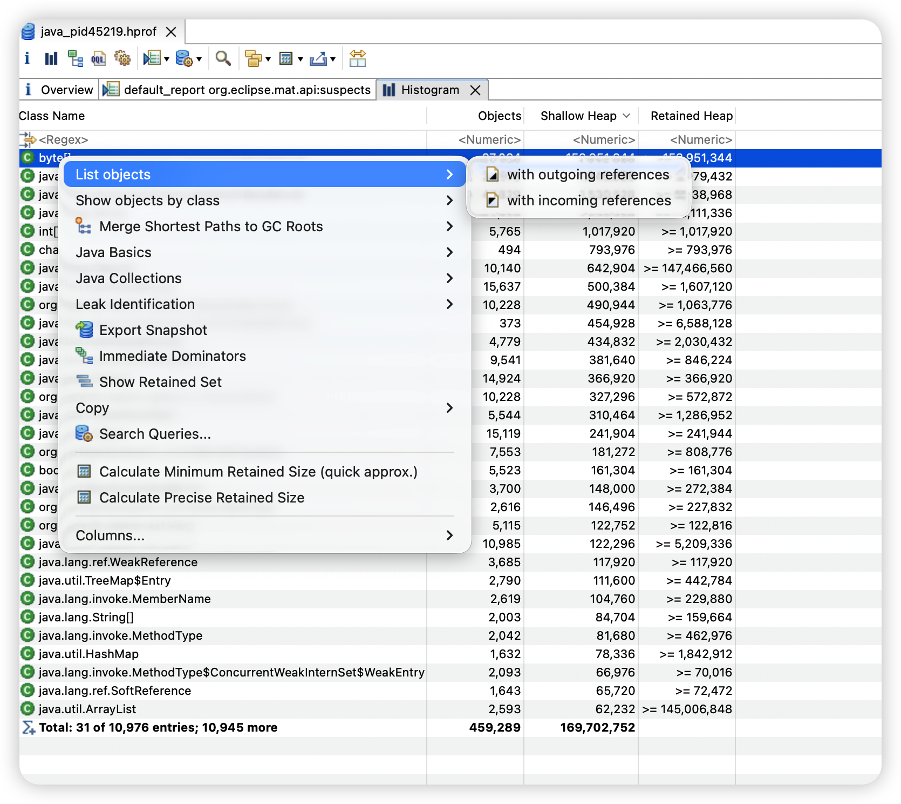
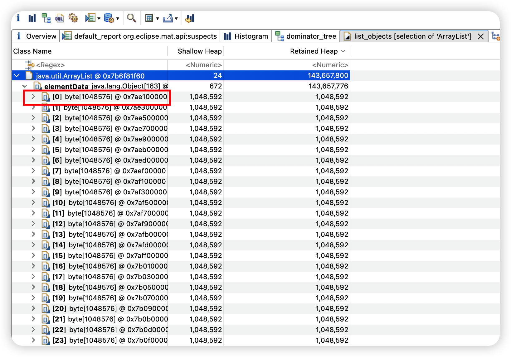
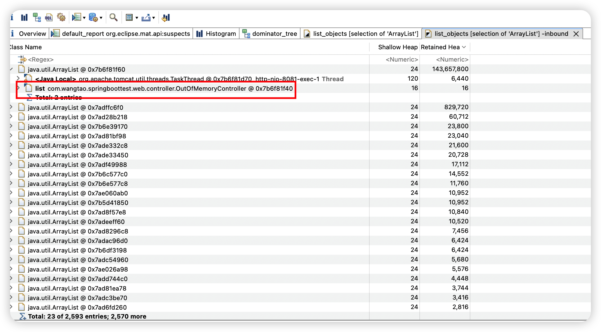
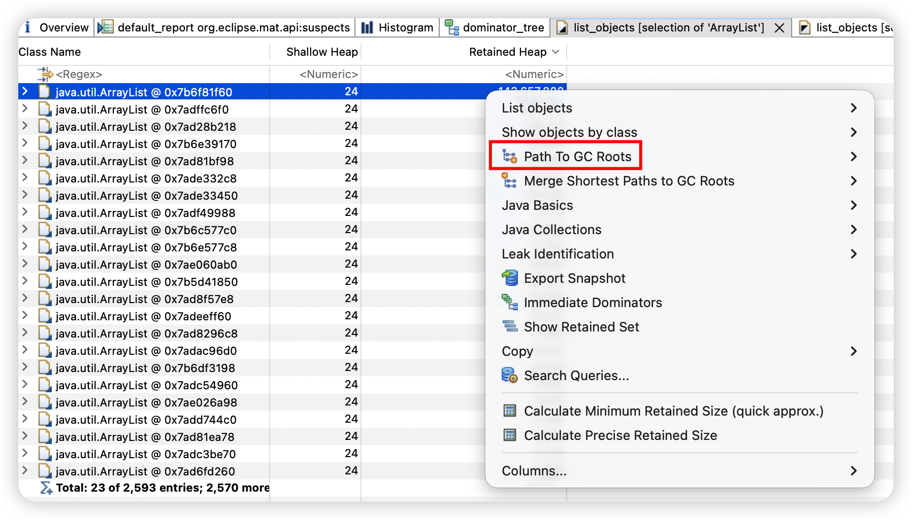
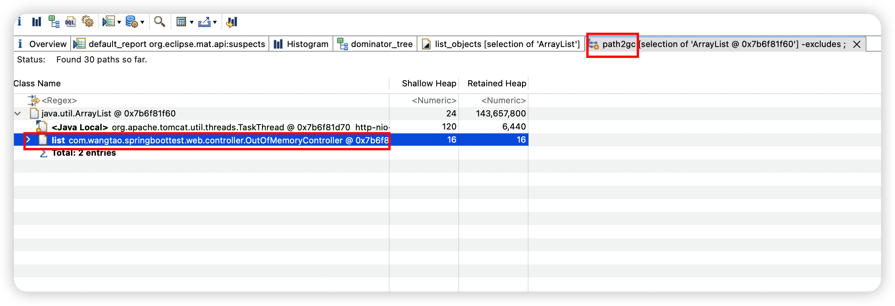
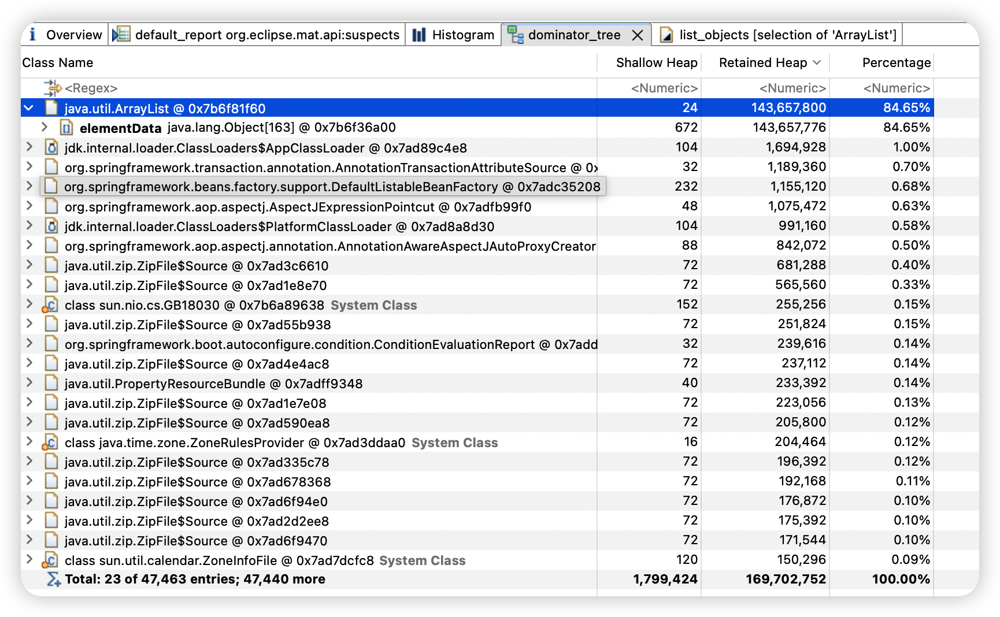
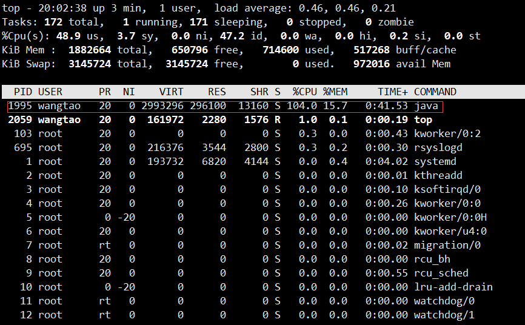
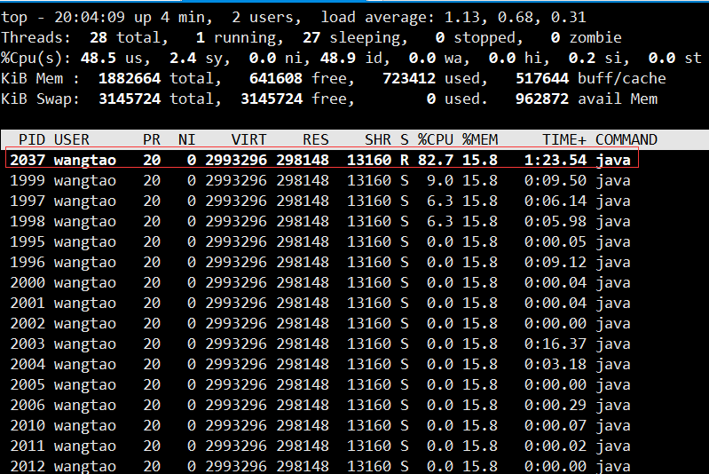

### 堆内存溢出

#### 模拟堆内存溢出

模拟例子如下，主要就是创建特别多的对象，并且不让被回收，有强引用。

```java
@RestController
public class OutOfMemoryController {

    private final List<byte[]> list = new ArrayList<>();

    /**
     * -Xms300m -Xmx300m -XX:+HeapDumpOnOutOfMemoryError -XX:HeapDumpPath=/users/wangtao
     */
    @GetMapping("/outOfMemory")
    public void outOfMemory() {
        final int _1M = 1024 * 1024;
        for (int i = 0; i < 2000; i++) {
            list.add(new byte[_1M]);
        }
    }

    public List<byte[]> getList() {
        return list;
    }
}
```

启动程序时加上jvm启动参数，指定堆内存，以及发生内存溢出时自动打印堆信息

```pr
-Xms300m -Xmx300m
-XX:+HeapDumpOnOutOfMemoryError
-XX:HeapDumpPath=/users/wangtao
```

以上参数堆dump文件生成的位置在/users/wangtao目录中，默认的文件名为java_pidxxx.hprof

当然也可用jmap命令打印堆dump文件，命令如下

```bash
jmap -dump:format=b,file=<name>.hprof <pid>
# 如java进程为1234
jmap -dump:format=b,file=/home/waston/java-pid1234.hprof 1234
```

拿到堆dump文件后，便可以借助MAT工具来分析内存情况

#### 使用MAT分析dump文件

打开软件后，点击File -> Open Heap Dump...打开选择的dump文件



可以看到工具已经帮我们定位到可疑的类，对于简单的情况还是很准确的。

### MAT常用功能

| **功能**          | **重要程度** | **用途**              |
| ----------------- | ------------ | --------------------- |
| Leak Suspects     | ★★★★★        | 自动发现可疑泄漏      |
| Histogram         | ★★★★★        | 查看对象数量/大小     |
| Dominator Tree    | ★★★★★        | 找真正占内存的大对象  |
| Path To GC Roots  | ★★★★★        | 为什么对象无法回收    |
| Thread Overview   | ★★★★         | ThreadLocal、线程泄漏 |
| OQL               | ★★★          | 类 SQL 查询对象       |
| Top Consumers     | ★★★★         | 快速看大内存占用      |
| Duplicate Classes | ★★           | 类加载器泄漏          |
| Component Report  | ★★★          | Spring/Tomcat 分析    |

#### 重要概念

- **Shallow Heap（浅堆）**：对象**自身**占用的内存。不包含它引用的其他对象。
  - 比如一个 `ArrayList` 对象本身，只有几个 int、一个 Object 数组引用等字段，通常很小（24~40 字节左右）。
- **Retained Heap（保留堆）**：当这个对象被 GC 回收时，**能够跟着一起被回收的所有对象**的 Shallow Heap **总和**。
  - 也就是这个对象的 **保留集（Retained Set）** 占用的总内存。

所以，**Retained Heap 才真正反映一个对象“事实上占用了多大内存”**。

Retained Heap 不是随便加的，而是基于**支配树**计算出来的。

在堆的对象引用图里（GC Roots 到各个对象）：

- **支配关系**：如果从 GC Roots 到对象 B 的**所有路径**都必须经过对象 A，那么 A 就**支配** B。
- **保留集**：一个对象的保留集，就是**被它支配的所有对象的集合**（包括它自己）。

因为 A 是 B 到达 GC Roots 的“必经之路”，所以一旦 A 自己不可达了，B 肯定也会变得不可达，会被一起回收。
Retained Heap 就是 A 在支配树里这整个子树上所有对象的 Shallow Heap 总和。

举例如下：

**单引用关系**:

A -> B -> C，则A支配B、A支配C，B支配C

**多引用关系**:

A -> B -> D以及A->C->D，由于B、C都引用D，所以不是唯一路径，但是必须会经过A，所以A是支配B、C、D的，但是B和C都不支配D

A的保留集就是[A、B、C、D]，B的保留集是[B]、C的保留集是[C]、D的保留集是[D]

A的Retained Heap就是A、B、C、D四个对象Shallow Heap总和

#### Histogram(直方图)

主要用来查看某一个类有多少实例数量以及占用的总内存，并且点击列名可以排序。



选择一个类后，右键有很多操作



##### List objects

用于展示这个类所有的实例，找到具体是哪个实例对象占用比较高，可以根据Retained Heap列进行排序

with outgoing references：理解成这个对象引用了谁，展开这个对象时，展示的是这个对象引用了哪些对象

可以揪出到底是什么对象导致的当前对象Retained Heap高。



with incoming references：理解成哪些对象引用了当前对象



可以看到是`OutOfMemoryController`这个对象持有了这个ArrayList对象，导致不能被回收。

或者可以直接查看引用链





#### Dominator Tree(支配树)

以对象实例为维度，展示内存占用以及比率



同样可以右键点击Path To GC Roots查看引用链。

#### 总结

在 MAT 的 **Histogram（直方图）** 或 **Dominator Tree（支配树）** 视图中：

- **按 Retained Heap 倒序排列**，排名最高的往往就是：
  - 占用内存的“真正大户”
  - 内存泄漏的**根对象**（它一直活着，导致它支配的大量对象无法回收）
- 点击这些对象，选择 **Path to GC Roots** 或 **List objects → with incoming references**，去追溯：谁在引用它？它为什么没被释放？
- 有时候导出的内存文件包含了不可达对象，MAT分析时可以排除掉这些对象，避免这些不可达对象进行干扰。Window->Perferences->Memory Analyzer面板中，不要勾选Keep unreachable objects选项即可。

### CPU占用过高

#### 模拟CPU占用过高例子

```java
@RestController
public class LoopController {

    /**
     * 连续执行10分钟，不停创建对象
     */
    @GetMapping("/loop")
    public void loop() {
        Random random = new Random();
        long start = System.currentTimeMillis();
        while (true) {
            int i = random.nextInt(100);
            UserVO userVO = new UserVO();
            userVO.setId(i);
            userVO.setUsername("user-" + i);
            userVO.setAge(random.nextInt(100));
            userVO.setBytes(new Byte[1024]);
            long cost = System.currentTimeMillis() - start;
            if (TimeUnit.MINUTES.toMillis(10) < cost) {
                break;
            }
        }
    }
}
```

CPU占用过高分析

* 使用top命令查看占用CPU过高的进程，一般就是我们的java进程



看到pid=1995的java进程占用CPU过高

* 使用`top -H -p pid`查看指定进程下的线程占用情况，本例为`top -H -p 1995`



看到pid=2037的线程占用很高

* 将线程pid转成16进制，`printf "%x\n" pid`，即`printf "%x\n" 2027`，得到16进制`0x7f5`

* 打印线程快照信息，`jstack 1995 >> thread.txt`

* 在thread.txt中搜索`0x7f5`定位线程调用栈信息

