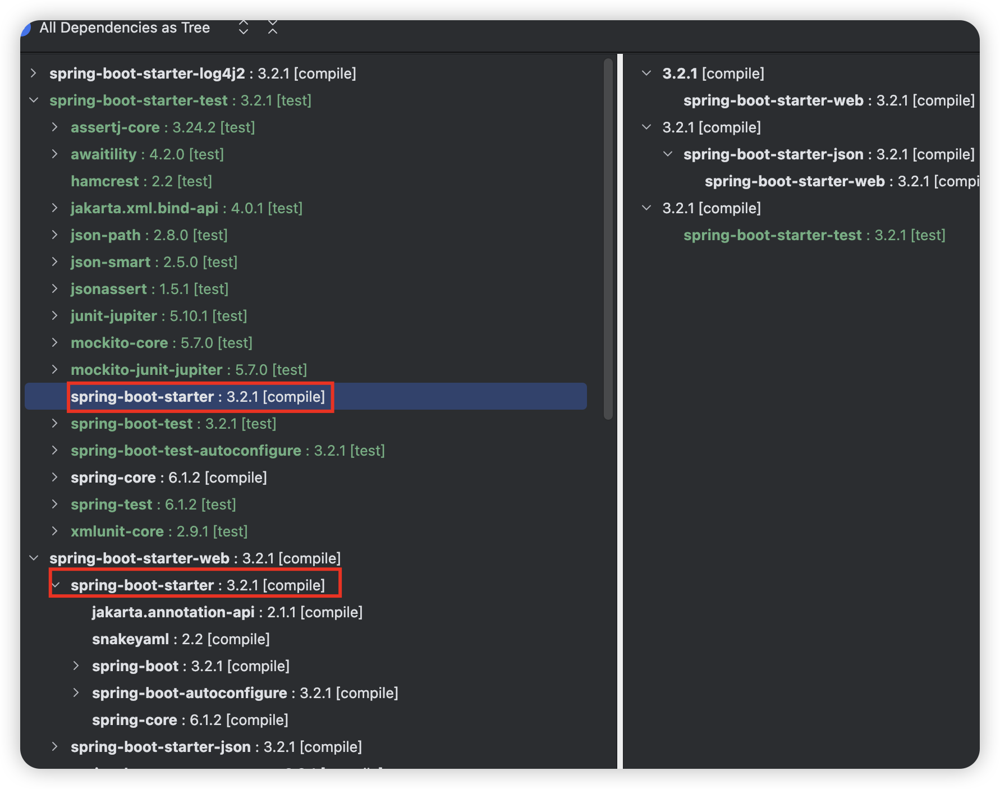

> Maven解决依赖冲突的原则，最短路径优先，路径一样则谁先出现谁优先(pom中的位置)

### 场景一

假设有a、b两个项目，其中a项目依赖commons-lang3-3.13.0、b项目依赖commons-lang3-3.12.0。

此时项目c依赖于a和b，则会出现依赖冲突。

项目c的pom.xml

```xml
<dependencies>
  <dependency>
    <groupId>com.wangtao</groupId>
    <artifactId>project-a</artifactId>
    <version>1.0-SNAPSHOT</version>
  </dependency>
  <dependency>
    <groupId>com.wangtao</groupId>
    <artifactId>project-b</artifactId>
    <version>1.0-SNAPSHOT</version>
  </dependency>
</dependencies>
```

使用maven helper插件分析依赖，如下图所示。


项目b引用的commons-lang3-3.12.0与项目a引用的commons-lang3-3.13.0冲突，且被忽略。commons-lang3-3.13.0胜出。

因为路径长度是一样的(2个层级)，项目a的依赖在pom文件中的位置更靠前。

针对这种场景我们可以借助`<dependencyManagement>`来消除这种红色警告。

**只需要在项目c或者项目c的父pom中`<dependencyManagement>`加入版本声明即可，无需在`<dependencies>`明确声明依赖**

```xml
<dependencyManagement>
  <dependencies>
    <dependency>
      <groupId>org.apache.commons</groupId>
      <artifactId>commons-lang3</artifactId>
      <version>3.15.0</version>
    </dependency>
</dependencyManagement>
```

在maven-helper中点击Reimport按钮刷新下，可以看到红色警告没了，项目a和项目b引用的commons-lang3的版本都是3.15.0了


这种方式在spring boot starter中很常见，第三方的starter都会依赖`spring-boot-autoconfigure`依赖，但是当查看依赖树时发现版本和我们使用的spring boot版本是一致的，因为spring boot的pom中已经在`<dependencyManagement>`标签下声明了版本。

### 场景二

当多个项目a、b依赖**同一个依赖c的同一个版本时**，若是项目a先出现，则项目b的依赖树，只会到依赖c为止

比如spring-boot-starter这个依赖，它下面还依赖了很多别的依赖，比如spring-boot-starter-logging。

pom文件内容如下

```xml
<dependencies>
  <dependency>
    <groupId>org.springframework.boot</groupId>
    <artifactId>spring-boot-starter-web</artifactId>
  </dependency>
  <dependency>
    <groupId>org.springframework.boot</groupId>
    <artifactId>spring-boot-starter-test</artifactId>
    <scope>test</scope>
  </dependency>
</dependencies>
```

其中spring-boot-starter-web、spring-boot-starter-test都依赖了spring-boot-starter


可以看到spring-boot-starter-test中spring-boot-starter不会展开依赖树，只有它自己。

**为什么是spring-boot-starter-web中会展开，还是根据路径最短来确定的。**

当你想排除spring-boot-starter引用的spring-boot-starter-logging依赖，使用log4j2时，只需排除spring-boot-starter-web中的即可，不用担心spring-boot-starter-test还会间接引入spring-boot-starter-logging。

修改后的pom文件内容如下

```xml
<dependencies>
  <dependency>
    <groupId>org.springframework.boot</groupId>
    <artifactId>spring-boot-starter-web</artifactId>
    <exclusions>
      <exclusion>
        <groupId>org.springframework.boot</groupId>
        <artifactId>spring-boot-starter-logging</artifactId>
      </exclusion>
    </exclusions>
  </dependency>
  <dependency>
    <groupId>org.springframework.boot</groupId>
    <artifactId>spring-boot-starter-log4j2</artifactId>
  </dependency>
  <dependency>
    <groupId>org.springframework.boot</groupId>
    <artifactId>spring-boot-starter-test</artifactId>
    <scope>test</scope>
  </dependency>
</dependencies>
```



可以看到spring-boot-starter-web中引用的spring-boot-starter已经没有了spring-boot-starter-logging了。并且整个项目也没有spring-boot-starter-logging依赖了。

这里最好的做法是，显示声明spring-boot-starter依赖，这样路径是最短的，不用担心自己排除的不是那个最短的路径依赖了。

```xml
<dependencies>
  <dependency>
    <groupId>org.springframework.boot</groupId>
    <artifactId>spring-boot-starter-web</artifactId>
  </dependency>
  <!-- 显示声明spring-boot-starter，路径为1了，最短的 -->
  <dependency>
    <groupId>org.springframework.boot</groupId>
    <artifactId>spring-boot-starter</artifactId>
    <exclusions>
      <exclusion>
        <groupId>org.springframework.boot</groupId>
        <artifactId>spring-boot-starter-logging</artifactId>
      </exclusion>
    </exclusions>
  </dependency>
  <dependency>
    <groupId>org.springframework.boot</groupId>
    <artifactId>spring-boot-starter-log4j2</artifactId>
  </dependency>
  <dependency>
    <groupId>org.springframework.boot</groupId>
    <artifactId>spring-boot-starter-test</artifactId>
    <scope>test</scope>
  </dependency>
</dependencies>
```


可以看到spring-boot-starter-web、spring-boot-starter-test中的spring-boot-starter依赖都只有自己了。