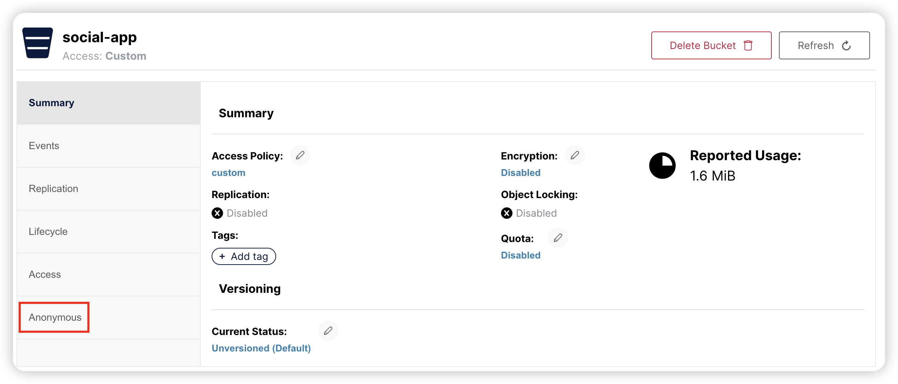
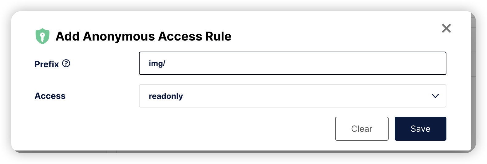

### 安装

使用docker安装单机版

```bash
docker run -dt                                                                         \
  -p 9000:9000                                                                         \
  -p 9001:9001                                                                         \
  -v /Users/wangtao/Developer/docker-compose/minio-20230920/data:/mnt/data             \
  -e "MINIO_ROOT_USER=minio"                                                           \
  -e "MINIO_ROOT_PASSWORD=12345678"                                                    \
  -e "MINIO_VOLUMES=/mnt/data"                                                         \
  --name minio-server                                                                  \
  minio/minio:RELEASE.2023-09-20T22-49-55Z server --console-address ":9001"
```

* MINIO_VOLUMES，数据存储目录
* MINIO_ROOT_USER，root用户名
* MINIO_ROOT_PASSWORD，root用户密码，注意至少要8个字符
* --console-address ":9001"，代表控制台端口为9001，客户端API连接端口默认为9000

### 管理控制台

访问地址：http://127.0.0.1:9001

使用minio/12345678登录即可。

#### Access Keys

通过该菜单创建的访问秘钥会继承当前用户的权限关系，可以在SDK中通过编程方式使用来访问minio服务端，进行一系列操作，当然了前提有这些操作的权限。访问秘钥不能登录管理控制台，因为本质上不是一个用户角色。

#### Identity -》Users

在该菜单中可以创建用户，创建的用户可以登录管理控制台，也可以在SDK中通过编程方式作为身份认证访问minio服务端。

#### Object Browser

在该菜单中可以操作Bucket中的资源，如上传、下载、分享查询链接等操作。

#### Buckets

minio中的所有资源都是以bucket为隔离单位的，默认创建出来的bucket访问权限是私有的，匿名用户无法直接通过bucket + 对象名称来访问资源，即http://127.0.0.1:9000/test/saber.jpg，这里bucket为test。分享的出来的访问链接在此基础上加了很长的query param，用于验证，而且默认只有7天的有效时间。

想要达到以上bucket+对象名称来访问的效果，比如一些静态资源图片等，需要添加一些匿名规则，或者直接将bucket的访问权限改成public，但是这个范围就太大了，因此最合适的方法是添加匿名规则。



然后点击Add Access Rule按钮



输入对象名称前缀为img/，访问权限为readonly。

这样子当前bucket以img/开头的资源(对象名称)都能直接访问了。

### Java API

前置条件，

* 创建一个social-app的bucket

* 一个访问秘钥

  accessKey: LhulnOUakqQPuuPf6u3R

  secretKey: adSFdJU6qojXTQXzYjNYG5BdoLsZ2DBpf7mEjpgi

* 匿名访问规则，prefix = img/    access = readonly

第一步，引入依赖

```xml
<dependency>
  <groupId>io.minio</groupId>
  <artifactId>minio</artifactId>
  <version>8.5.6</version>
</dependency>
<!-- 在SpringBoot中使用时，由于SpringBoot引入的版本较低，与minio不兼容，因此使用高版本覆盖默认的低版本 -->
<dependency>
  <groupId>com.squareup.okhttp3</groupId>
  <artifactId>okhttp</artifactId>
  <version>4.11.0</version>
</dependency>
```

第二步，创建MinioClient

application.yml

```yaml
minio:
  # 必须要加上http
  endpoint: "http://127.0.0.1:9000"
  access-key: LhulnOUakqQPuuPf6u3R
  secret-key: adSFdJU6qojXTQXzYjNYG5BdoLsZ2DBpf7mEjpgi
  default-bucket: social-app
```

MinioProperties.java

```java
@ConfigurationProperties(prefix = "minio")
@ToString
@Setter
@Getter
public class MinioProperties {

    private String endpoint;

    private String accessKey;

    private String secretKey;

    private String defaultBucket;
}
```

MinioConfig.java

```java
@EnableConfigurationProperties({MinioProperties.class})
@Configuration(proxyBeanMethods = false)
public class MinioConfig {

    @Bean
    public MinioClient minioClient(MinioProperties minioProperties) {
        return MinioClient.builder()
                .endpoint(minioProperties.getEndpoint())
                .credentials(minioProperties.getAccessKey(), minioProperties.getSecretKey())
                .build();
    }

    @Bean
    public MinioService minioService(MinioClient minioClient, MinioProperties minioProperties) {
        return new MinioService(minioClient, minioProperties.getDefaultBucket());
    }
}
```

MinioService.java

该类进一步封装了MinioClient中的方法

```java
public class MinioService {

    private final MinioClient minioClient;

    private final String defaultBucket;

    public MinioService(MinioClient minioClient, String defaultBucket) {
        this.minioClient = minioClient;
        this.defaultBucket = defaultBucket;
    }

    /**
     * 根据文件名称创建一个随机名称，以img/开头
     * 
     * @param filename 文件名称
     * @return 对象名称
     */
    public String createImageObjName(String filename) {
        Objects.requireNonNull(filename, "filename is required!");
        int delim = filename.lastIndexOf('.');
        String suffix = "";
        if (delim != -1) {
            suffix = filename.substring(delim);
        }
        return "img/" + UuidUtils.uuid() + suffix;
    }

    public void uploadImage(InputStream obj, String contentType) {
        String objName = UuidUtils.uuid();
        uploadImage(defaultBucket, objName, obj, contentType);
    }

    public void uploadImage(String objName, InputStream obj, String contentType) {
        uploadImage(defaultBucket, objName, obj, contentType);
    }

    /**
     * 上传图片
     * 
     * @param bucket 桶位
     * @param objName 对象名称
     * @param stream 上传的图片资源
     * @param contentType 图片类型, 如image/jpeg、image/gif、image/png
     */
    public void uploadImage(String bucket, String objName, InputStream stream, String contentType) {
        Objects.requireNonNull(bucket, "bucket is required!");
        Objects.requireNonNull(objName, "objName is required!");
        Objects.requireNonNull(objName, "stream is required!");
        try {
            //判断文件存储的桶是否存在
            boolean exists = minioClient.bucketExists(
                    BucketExistsArgs.builder().bucket(bucket).build()
            );
            if (!exists) {
                minioClient.makeBucket(
                        MakeBucketArgs.builder().bucket(bucket).build()
                );
            }
            minioClient.putObject(
                    PutObjectArgs.builder()
                            .bucket(bucket)
                            .object(objName)
                            .stream(stream, -1, ObjectWriteArgs.MAX_PART_SIZE)
                            .contentType(contentType)
                            .build()
            );
        } catch (Exception e) {
            throw new RuntimeException(e);
        }
    }

    /**
     * 获取临时访问地址，默认只有7天有效期
     *
     * @param objName 对象名称
     * @return 临时访问地址
     */
    public String getTmpAccessUrl(String objName) {
        return getTmpAccessUrl(defaultBucket, objName);
    }

    /**
     * 获取临时访问地址，默认只有7天有效期
     *
     * @param bucket 桶位
     * @param objName 对象名称
     * @return 临时访问地址
     */
    public String getTmpAccessUrl(String bucket, String objName) {
        Objects.requireNonNull(bucket, "bucket is required!");
        Objects.requireNonNull(objName, "objName is required!");
        try {
            return minioClient.getPresignedObjectUrl(
                    GetPresignedObjectUrlArgs.builder()
                            .bucket(bucket)
                            .object(objName)
                            .method(Method.GET)
                            .build()
            );
        } catch (Exception e) {
            throw new RuntimeException(e);
        }
    }
}
```

单元测试

```java
@RunWith(SpringRunner.class)
@SpringBootTest
public class MinioServiceTest {

    @Autowired
    public MinioService minioService;

    /**
     * 默认名称
     */
    @Test
    public void testUploadWithDefaultName() throws IOException {
        try (InputStream is = new FileInputStream("saber.jpg")) {
            minioService.uploadImage(is, MediaType.IMAGE_JPEG_VALUE);
        }
    }

    /**
     * 指定对象名称
     * <a href="http://127.0.0.1:9000/social-app/img/saber.jpg"/>
     * 可直接访问
     */
    @Test
    public void testUploadWithName() throws IOException {
        try (InputStream is = new FileInputStream("saber.jpg")) {
            minioService.uploadImage("img/saber.jpg", is, MediaType.IMAGE_JPEG_VALUE);
        }
    }

    /**
     * img-saber.jpg不能直接访问
     * 因为规则是img/
     */
    @Test
    public void testUploadWithName1() throws IOException {
        try (InputStream is = new FileInputStream("saber.jpg")) {
            minioService.uploadImage("img-saber.jpg", is, MediaType.IMAGE_JPEG_VALUE);
        }
    }
}
```

这样子便可以使用minio作为一个图片服务器了

