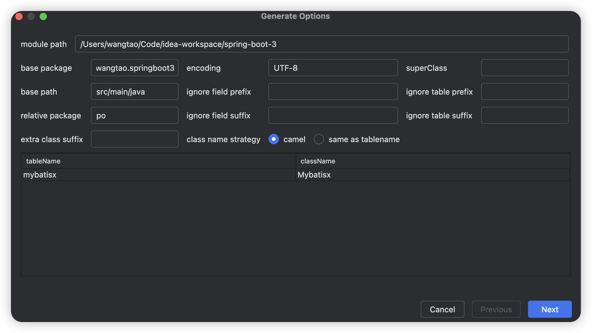
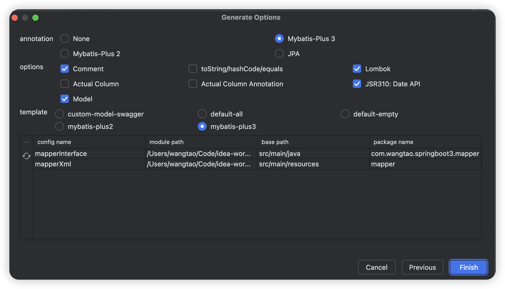
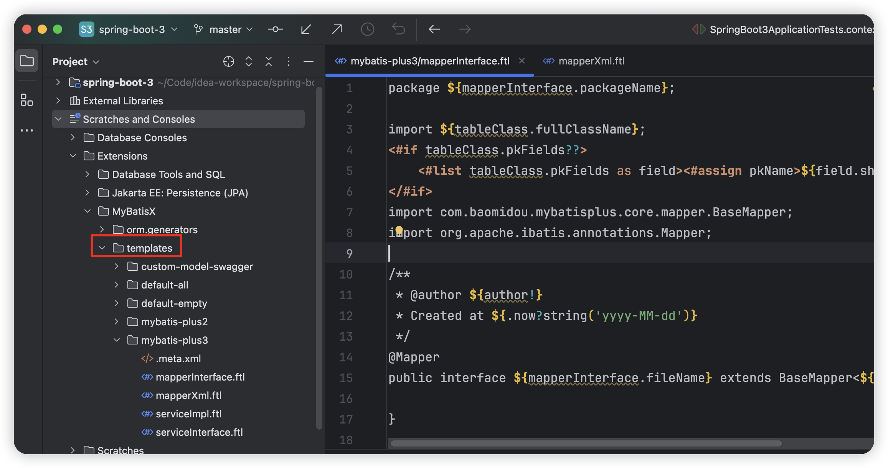

[官方文档](https://baomidou.com/guides/mybatis-x/)

### 基本使用

在Intellij Idea Database工具中选中表(可多选)，右键点击菜单MybatisX-Generator



路径配置

* module path：项目路径
* base path：基本路径，maven标准项目都是src/main/java
* base package：基本包路径，一般是项目的顶层包名
* relative package：相对包名，实体对象所在的包

也就是说实体类最终生成的所在目录为module path + base path + base package + relative package

点击Next



**annotation配置**

代表生成实体类时所使用的注解，基本选择MyBatis-Plus3

* Mybatis-Plus3：在实体类相应位置增加@TableName(类名)、@TableId(主键字段)、@TableField(普通字段)注解。

* JPA，就会使用@Table、@Id、@Column等JPA的注解，这个设计应该是针对只需要生成实体类的，JPA项目可以帮助生成实体类。

* None，不会增加任何注解，适用于纯粹的MyBatis项目，MyBatis本身并不需要这些标识表名、主键字段、普通字段的注解。

**options配置**

* Comment：是否需要生成注释，根据建表的comment生成实体类的注释、字段的注释。
* Lombok：采样Lombok生成getter、setter方法。默认是加上@Data注解。
* Actual Column：字段名是否和表字段名保持一致，不勾选采用小驼峰。
* Actual Column Annotation：是否为普通字段增加@TableField注解。
* JSR310：对于日期类型使用JDK8新增的日期类型，LocalDateTime、LocalDate、LocalTime。
* **Model：是否要生成实体类，需要勾选上，不然不会生成实体类**。

**template配置**

* custom-model-swagger：只生成实体类
* default-all：生成实体类、mapper接口、xml。mapper接口包含一些基础方法，selectByPrimaryKey、insert、update等，纯MyBatis项目使用。
* default-empty：生成实体类、mapper接口、xml。mapper接口不包含任何方法。
* mybatis-plus3：生成实体类、mapper接口、xml、service接口、service实现。mapper接口会继承BaseMapper接口，Mybatis-Plus项目使用。

其中对于某个文件不想要生成，都可以点击左边的-号删除，点击刷新按钮回到初始状态。

**实体类文件不管是哪个模板都会生成，options配置中将Model选项勾上。**

### 自定义文件生成内容

如果对于插件默认的文件模板内容不满意，可以自行调整。找到对应模板文件夹下面的文件修改即可。

注：模板配置文件是全局的，不是单个项目的，修改后需要重启idea才会生效，MyBatisX插件需要加载这些模板。

模板文件夹位置/Users/wangtao/Library/Application Support/JetBrains/IntelliJIdea2024.2/extensions/com.baomidou.plugin.idea.mybatisx/templates

或者

idea项目打开后，使用idea编辑



#### 重置模板内容

如果改乱了，想要回到初始状态，选择对应模板文件夹右键Restore Default Extensions即可

#### 模板文件说明

**关于.meta.xml**

该配置文件是用于配置模板需要生成哪些文件

**关于*.ftl文件**

文件模板

**修改mybatis-plus3模板后的内容**

1. 修改目的，不需要生成service接口以及实现，每次手动删除很麻烦
2. 修改mapper接口文件注释以及mapperXml缩进为2个空格
3. 比较可惜的是如果不是custom-model-swagger模板，没有地方可以修改实体生成格式。

.meta.xml

```xml
<?xml version="1.0" encoding="utf-8" ?>
<templates>
    <!--
    <template>
        <property name="configName" value="serviceInterface"/>
        <property name="configFile" value="serviceInterface.ftl"/>
        <property name="fileName" value="${domain.fileName}Service"/>
        <property name="suffix" value=".java"/>
        <property name="packageName" value="${domain.basePackage}.service"/>
        <property name="encoding" value="${domain.encoding}"/>
        <property name="basePath" value="${domain.basePath}"/>
    </template>
    <template>
        <property name="configName" value="serviceImpl"/>
        <property name="configFile" value="serviceImpl.ftl"/>
        <property name="fileName" value="${domain.fileName}ServiceImpl"/>
        <property name="suffix" value=".java"/>
        <property name="packageName" value="${domain.basePackage}.service.impl"/>
        <property name="encoding" value="${domain.encoding}"/>
        <property name="basePath" value="${domain.basePath}"/>
    </template>
    -->
    <template>
        <property name="configName" value="mapperInterface"/>
        <property name="configFile" value="mapperInterface.ftl"/>
        <property name="fileName" value="${domain.fileName}Mapper"/>
        <property name="suffix" value=".java"/>
        <property name="packageName" value="${domain.basePackage}.mapper"/>
        <property name="encoding" value="${domain.encoding}"/>
        <property name="basePath" value="${domain.basePath}"/>
    </template>
    <template>
        <property name="configName" value="mapperXml"/>
        <property name="configFile" value="mapperXml.ftl"/>
        <property name="fileName" value="${domain.fileName}Mapper"/>
        <property name="suffix" value=".xml"/>
        <property name="packageName" value="mapper"/>
        <property name="encoding" value="${domain.encoding}"/>
        <property name="basePath" value="src/main/resources"/>
    </template>
</templates>

```

去掉了关于service的配置，不要生成service接口和实现。

**mapperInterface.ftl**

```xml
package ${mapperInterface.packageName};

import ${tableClass.fullClassName};
<#if tableClass.pkFields??>
    <#list tableClass.pkFields as field><#assign pkName>${field.shortTypeName}</#assign></#list>
</#if>
import com.baomidou.mybatisplus.core.mapper.BaseMapper;
import org.apache.ibatis.annotations.Mapper;

/**
 * @author ${author!}
 * Created at ${.now?string('yyyy-MM-dd')}
 */
@Mapper
public interface ${mapperInterface.fileName} extends BaseMapper<${tableClass.shortClassName}> {

}
```

修改了注释，以及增加了@Mapper注解

**mapperXml.ftl**

```xml
<?xml version="1.0" encoding="UTF-8"?>
<!DOCTYPE mapper
    PUBLIC "-//mybatis.org//DTD Mapper 3.0//EN"
    "http://mybatis.org/dtd/mybatis-3-mapper.dtd">
<mapper namespace="${mapperInterface.packageName}.${baseInfo.fileName}">

  <resultMap id="BaseResultMap" type="${tableClass.fullClassName}">
    <#list tableClass.pkFields as field>
    <id property="${field.fieldName}" column="${field.columnName}" jdbcType="${field.jdbcType}"/>
    </#list>
    <#list tableClass.baseFields as field>
    <result property="${field.fieldName}" column="${field.columnName}" jdbcType="${field.jdbcType}"/>
    </#list>
  </resultMap>

  <sql id="Base_Column_List">
    <#list tableClass.allFields as field>${field.columnName}<#sep>,<#if field_index%5==4>${"\n    "}</#if></#list>
  </sql>
</mapper>
```

* 调整了缩进格式为2个空格
* <sql>标签每行为5个字段