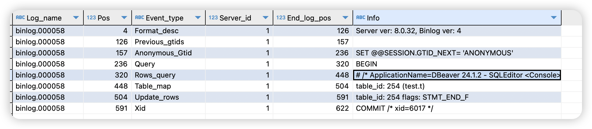

> MySQL v8.0

### 简介

MySQL的binlog是属于服务层，与存储引擎层无关，主要用于备份恢复、主从复制场景。

### 开启binlog

从v8.0开始，MySQL默认开启binlog，文件名前缀为binlog。

如果关闭binlog，则在启动时增加 --skip-log-bin or --disable-log-bin即可。

在选项文件中明确配置binlog

```ini
[mysqld]
# 开启binlog，文件名前缀为binlog。注意key是bin-log不是bin_log
bin-log=binlog
# 行模式，默认为ROW
binlog_format=ROW
# binlog过期时间，单位为秒，默认30天
binlog_expire_logs_seconds=2592000
# 是否将SQL语句写入到binlog文件中，默认关闭，关闭时只能获取到执行SQL的前后数据
binlog_rows_query_log_events=ON
```

bin_log是系统变量，值是ON/OFF，表示binlog是否被开启，无法使用命令行或者配置文件来指定。

bin-log是命令行选项(也可以通过选项文件指定)，后面可以跟一个文件名，当指定了bin-log后，系统变量bin_log会自动赋值为ON，同时还会指定binlog文件的前缀。

注：查看一个参数可以用于哪个地方，可参考官方文档[https://dev.mysql.com/doc/refman/8.4/en/server-option-variable-reference.html](https://dev.mysql.com/doc/refman/8.4/en/server-option-variable-reference.html)，其中大部分系统变量都是可以直接在选项文件中或者命令行指定的(同名key)，bin_log是一个例外。选项文件中通常使用下划线，而命令行使用短横线。

查询相关系统变量

```mysql
-- 主体信息, 是否开启，文件位置
show variables like '%log_bin%';
-- 一系列相关参数
show variables like '%binlog%';
-- 查询具体某一个变量
show variables like 'binlog_format';
```

结果

```tex
log_bin	             ON
log_bin_basename	/var/lib/mysql/binlog
log_bin_index	    /var/lib/mysql/binlog.index
log_bin_trust_function_creators	OFF
log_bin_use_v1_row_events	OFF
sql_log_bin	ON
```

### binlog相关命令

```mysql
-- 查看binlog列表，和show master logs命令等效
show binary logs;
-- 查看目前正在写入的binlog文件以及写入位置
show master status;
-- 查看指定binlog文件的事件，可以看到每个事件对应的位置
show binlog events in 'binlog.000002';
-- 从指定位置开始展示事件(limit可以省略)
show binlog events in 'binlog.000002' from 890 limit 0, 100;
-- 刷新binlog文件，会生成一个新的binlog文件用于接下来的写入
flush binary logs;
-- 删除binlog文件, 删除binlog.000003之前的文件, 删之前可以使用show master status查看正在写的是哪个文件
purge binary logs to 'binlog.000003';
```

### mysqbinlog命令

```bash
# 查看内容，如果binlog_rows_query_log_events开启，ROW模式不仅可以看到前后的数据
# 而且可以看到执行的sql，这些内容都出现在结果文件中的注释部分
# binlog文件为全路径，可以接多个binlog文件，使用空格分隔
mysqlbinlog --database=test --base64-output=decode-rows -vv /usr/local/mysql/data/binlog.000057 > tmp.sql
```

常用选项

* --database，只导出指定数据库的内容
* -v，输出详细信息，包括数据行的前后信息等
* -vv，在-v的基础上增加列的数据类型信息
* --start-position，指定一个开始位置，如--start-position=213，针对指定binlog文件列表的第一个文件
* --stop-position，指定一个结束位置，如--stop-position=416，针对指定binlog文件列表的最后一个文件
* --start-datetime，指定事件开始时间，如--start-datetime=‘2024-07-14 12:30:00’
* --stop-datetime，指定事件结束时间，如--stop-datetime=‘2024-07-14 13:30:00’
* --skip-gtids，忽略gtid信息，如果是在备库执行，为了保持和主库一致，不要启用这个选项
* --raw，返回原始的二进制形式，用于binlog文件本身备份

示例

在一个新的binlog文件执行一个简单修改语句`update t set password = '123456' where id = 1;`

通过`show binary logs`或者`show master status`找到最新的binlog文件为**binlog.000058**。

然后执行`show binlog events in 'binlog.000058';`获取事件信息



Log_name：binlog文件名

Pos：事件的开始位置

End_log_pos：事件的结束位置

Event_type：事件类型，值为Rows_query时，Info列显示的就是具体的执行SQL。需要`binlog_rows_query_log_events`开启。

对于`update t set password = '123456' where id = 1;`这个语句来说，事件范围为[Anonymous_Gtid, Xid]

完整的binlog位置范围便是157-622。


通过mysqlbinlog命令查看具体信息

```bash
# 整个binlog文件
mysqlbinlog --base64-output=decode-rows -vv /usr/local/mysql/data/binlog.000058 > tmp.sql
# 只导出这一个事务的binlog，需求提前分析出binlog位置范围
mysqlbinlog --base64-output=decode-rows -vv --start-position=157 --stop-position=622 /usr/local/mysql/data/binlog.000058 > tmp.sql
```

查询结果(第一个命令)

```mysql
# The proper term is pseudo_replica_mode, but we use this compatibility alias
# to make the statement usable on server versions 8.0.24 and older.
/*!50530 SET @@SESSION.PSEUDO_SLAVE_MODE=1*/;
/*!50003 SET @OLD_COMPLETION_TYPE=@@COMPLETION_TYPE,COMPLETION_TYPE=0*/;
DELIMITER /*!*/;
# at 4
#240714 18:32:19 server id 1  end_log_pos 126 CRC32 0x11dd9580  Start: binlog v 4, server v 8.0.32 created 240714 18:32:19
# Warning: this binlog is either in use or was not closed properly.
# at 126
#240714 18:32:19 server id 1  end_log_pos 157 CRC32 0x837a84c2  Previous-GTIDs
# [empty]
# at 157
#240714 18:32:59 server id 1  end_log_pos 236 CRC32 0xa0cd445a  Anonymous_GTID  last_committed=0    sequence_number=1   rbr_only=yes    original_committed_timestamp=1720953179771558   immediate_commit_timestamp=1720953179771558 transaction_length=465
/*!50718 SET TRANSACTION ISOLATION LEVEL READ COMMITTED*//*!*/;
# original_commit_timestamp=1720953179771558 (2024-07-14 18:32:59.771558 CST)
# immediate_commit_timestamp=1720953179771558 (2024-07-14 18:32:59.771558 CST)
/*!80001 SET @@session.original_commit_timestamp=1720953179771558*//*!*/;
/*!80014 SET @@session.original_server_version=80032*//*!*/;
/*!80014 SET @@session.immediate_server_version=80032*//*!*/;
SET @@SESSION.GTID_NEXT= 'ANONYMOUS'/*!*/;
# at 236
#240714 18:32:59 server id 1  end_log_pos 320 CRC32 0xa9cff858  Query   thread_id=132   exec_time=0 error_code=0
SET TIMESTAMP=1720953179/*!*/;
SET @@session.pseudo_thread_id=132/*!*/;
SET @@session.foreign_key_checks=1, @@session.sql_auto_is_null=0, @@session.unique_checks=1, @@session.autocommit=1/*!*/;
SET @@session.sql_mode=1168113696/*!*/;
SET @@session.auto_increment_increment=1, @@session.auto_increment_offset=1/*!*/;
/*!\C utf8mb4 *//*!*/;
SET @@session.character_set_client=255,@@session.collation_connection=255,@@session.collation_server=255/*!*/;
SET @@session.lc_time_names=0/*!*/;
SET @@session.collation_database=DEFAULT/*!*/;
/*!80011 SET @@session.default_collation_for_utf8mb4=255*//*!*/;
BEGIN
/*!*/;
# at 320
#240714 18:32:59 server id 1  end_log_pos 448 CRC32 0xfa165c8a  Rows_query
# /* ApplicationName=DBeaver 24.1.2 - SQLEditor <Console> */ update t set password = '123456' where id = 1
# at 448
#240714 18:32:59 server id 1  end_log_pos 504 CRC32 0xb1ecc6af  Table_map: `test`.`t` mapped to number 254
# has_generated_invisible_primary_key=0
# at 504
#240714 18:32:59 server id 1  end_log_pos 591 CRC32 0xb66b8c2b  Update_rows: table id 254 flags: STMT_END_F
### UPDATE `test`.`t`
### WHERE
###   @1=1 /* LONGINT meta=0 nullable=0 is_null=0 */
###   @2='zhangsan' /* VARSTRING(80) meta=80 nullable=1 is_null=0 */
###   @3='1234567' /* VARSTRING(128) meta=128 nullable=1 is_null=0 */
### SET
###   @1=1 /* LONGINT meta=0 nullable=0 is_null=0 */
###   @2='zhangsan' /* VARSTRING(80) meta=80 nullable=1 is_null=0 */
###   @3='123456' /* VARSTRING(128) meta=128 nullable=1 is_null=0 */
# at 591
#240714 18:32:59 server id 1  end_log_pos 622 CRC32 0x840cfe2c  Xid = 6017
COMMIT/*!*/;
SET @@SESSION.GTID_NEXT= 'AUTOMATIC' /* added by mysqlbinlog */ /*!*/;
DELIMITER ;
# End of log file
/*!50003 SET COMPLETION_TYPE=@OLD_COMPLETION_TYPE*/;
/*!50530 SET @@SESSION.PSEUDO_SLAVE_MODE=0*/;
```

其中以#240714开头的行，代表具体哪个事件，第36行、37行记录的就是执行SQL

而42行到52行之间的内容就是这个SQL执行前后的数据

### 数据恢复

如果误操作导致数据被修改，便可以通过mysqlbinlog命令拿到前后数据，便可以构造补偿sql来恢复数据。

### 执行binlog里的操作，用于增量备份

那上面那个例子来说，我已经有了`update t set password = '123456' where id = 1`这个语句之前的全量备份，那么我再执行这次操作的binlog内容，便可以得到全量数据。

```bash
mysqlbinlog --start-position=157 --stop-position=622 /usr/local/mysql/data/binlog.000058 | mysql -uroot -p123456
# 或者增加-v可以看到执行过程
mysqlbinlog --start-position=157 --stop-position=622 /usr/local/mysql/data/binlog.000058 | mysql -uroot -p123456 -v
```

这里可以不用增加-vv、--base64-output=decode-rows，加这些东西是为了让人类看的更清晰。

这里主要的点是需要知道binlog的位置范围，使用mysqldump进行逻辑备份时可以指定选项source-data=2(低版本是master-data=2)在备份文件中输出当时备份时候binlog的位置信息。
