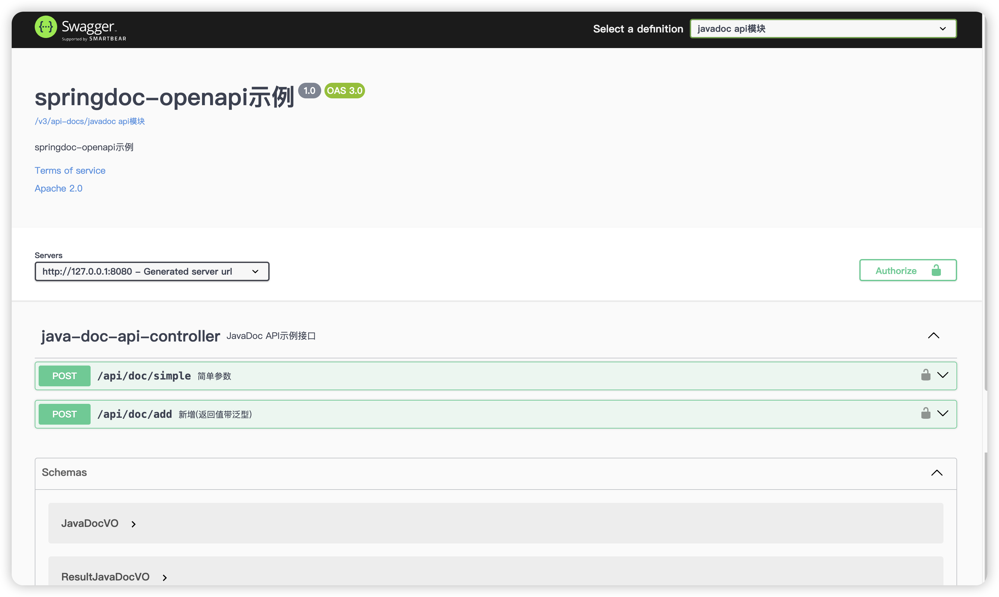

> 基于Springdoc v1.8.0，适配Spring Boot 2.x，若要适配Spring Boot 3，需要使用Springdoc v2.x

### 背景知识

先对一些名词做简要介绍

* **Swagger**: API 文档生成工具和规范的起点。当然Swagger不仅提供了API规范、还提供了**Swagger UI**。

* **OpenAPI**: 一个描述 RESTful API 的规范（现为行业标准），由**Swagger**演变而来，分为**OpenAPI 2.0(Swagger)**和**OpenAPI 3.0**。
* **Springfox**: 一个基于**OpenAPI 2.0 (Swagger 2.0)** 的 Spring 扩展库，用于生成 API 文档，界面采用的**Swagger UI**，已经停更很多年了。
* **Springdoc**: 一个基于OpenAPI 3.0 规范的 Spring 扩展库，用于生成 API 文档，界面采用的**Swagger UI**。支持Spring MVC、Spring Web Flux。

因此目前API文档最好使用OpenAPI 3.0规范。

### 版本选择

目前Springdoc分为1.x和2.x两个版本，和Spring Boot兼容情况如下表所示。

| Springdoc              | Spring Boot |
| ---------------------- | ----------- |
| v1.x(最新版本为v1.8.0) | v1.x、v2.x  |
| v2.x(持续更新中)       | v3.x        |

[Springdoc v1.x官方文档](https://springdoc.org/v1/)

[Springdoc v2.x官方文档](https://springdoc.org/)

### 主要特征

* 支持Spring MVC、Spring Web Flux。
* 界面使用的Swagger UI。
* 支持Swagger注解(需要使用Swagger 3的注解)。
* **支持Java Doc，这点非常好，不用侵入Controller代码，对于返回值包含泛型也能很好的解析，不过需要额外引入依赖。**

### 基本使用

以Spring Boot 2.x和Springdoc 1.x为例子。

#### 第一步，引入相关依赖

Spring MVC项目引入依赖

```xml
<dependency>
  <groupId>org.springdoc</groupId>
  <artifactId>springdoc-openapi-ui</artifactId>
  <version>1.8.0</version>
</dependency>
```

若要支持Java doc注释，需要增加下面依赖

```xml
<dependency>
  <groupId>org.springdoc</groupId>
  <artifactId>springdoc-openapi-javadoc</artifactId>
  <version>1.8.0</version>
</dependency>

<plugins>
  <plugin>
    <groupId>org.apache.maven.plugins</groupId>
    <artifactId>maven-compiler-plugin</artifactId>
    <version>${maven-compiler-plugin.version}</version>
    <configuration>
      <annotationProcessorPaths>
        <path>
          <groupId>com.github.therapi</groupId>
          <artifactId>therapi-runtime-javadoc-scribe</artifactId>
          <version>0.15.0</version>
        </path>
      </annotationProcessorPaths>
    </configuration>
  </plugin>
</plugins>
```

如果Swagger注解和Java注释同时存在，注解优先。

#### 第二步，相关配置

SpringDocConfig.java

```java
@Configuration(proxyBeanMethods = false)
public class SpringdocConfig {

    @Bean
    public OpenAPI openAPI() {
        return new OpenAPI()
            .info(new Info()
                .title("springdoc-openapi示例")
                .version("1.0")
                .description("springdoc-openapi示例")
                .termsOfService("wangtaoj.github.io")
                .license(new License().name("Apache 2.0").url("wangtaoj.github.io"))
            ).addSecurityItem(new SecurityRequirement().addList(HttpHeaders.AUTHORIZATION))
            .components(new Components().addSecuritySchemes(
                HttpHeaders.AUTHORIZATION,
                new SecurityScheme().name(HttpHeaders.AUTHORIZATION).type(SecurityScheme.Type.HTTP).scheme("bearer")
            ));
    }

    /**
     * javadoc api分组
     */
    @Bean
    public GroupedOpenApi javadocApi() {
        return GroupedOpenApi.builder().group("javadoc api模块")
            // 扫描的包
            .packagesToScan("com.wangtao.springdoc.controller.javadoc")
            // 匹配的请求路径
            .pathsToMatch("/**")
            .build();
    }

    /**
     * swagger注解 api分组
     */
    @Bean
    public GroupedOpenApi swaggerAnnotationApi() {
        return GroupedOpenApi.builder().group("swagger注解 api模块")
            .packagesToScan("com.wangtao.springdoc.controller.swagger")
            .pathsToMatch("/**")
            .build();
    }
}
```

注意设置了主界面的一些基本信息展示，并且添加了两个组。springdoc支持给不同模块分组展示，这样子当api很多时不会显得杂乱。

#### 第三步，可选的配置

```yaml
springdoc:
  swagger-ui:
    # 默认开启
    enabled: true
    # 默认为/swagger-ui.html
    path: /swagger-ui.html
    # 按照字母排序(Controller)
    tags-sorter: alpha
    # 按照字母排序(接口方法)
    operations-sorter: alpha
    show-extensions: true
  api-docs:
    # 默认为/v3/api-docs
    path: /v3/api-docs
  # 组配置信息, 也可以使用GroupedOpenApi代码配置
  group-configs:
    - group: default
      paths-to-match: /**
      packages-to-scan: com.wangtao.springdoc.controller
```


### Springdoc默认提供的端点

* /swagger-ui.html：API文档主界面，其实最终都会重定向到/swagger-ui/index.html页面。
* /v3/api-docs/swagger-config：用于查询有哪些分组。
* /v3/api-docs：用于查询所有分组的API JSON描述数据。
* /v3/api-docs/[分组名称]：用于查询指定分组下的API JSON描述数据。

### 结果图

效果图如下



右上角可以选择不同的组，以显示组下面的api。