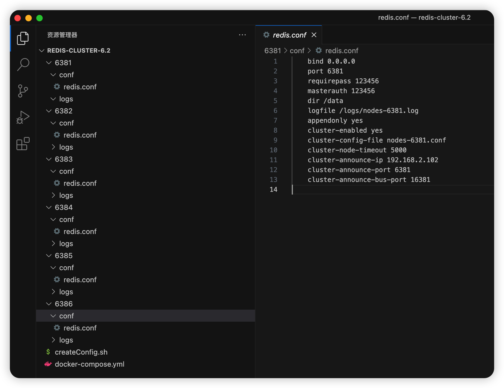

> redis 6.2

### 使用docker搭建redis cluster集群(3主3从)

**所有的操作都在根目录~/Developer/docker-compose/redis-cluster-6.2执行**

#### 创建配置文件

为了方便，写了个shell脚本，懒人必备

createConfig.sh

```bash
for port in $(seq 6381 6386); 
do
    conf_dir=./${port}/conf
    conf_file=${conf_dir}/redis.conf
    log_dir=./${port}/logs
    if [ ! -d ${conf_dir} ]; then
        mkdir -p ${conf_dir}
    fi
    if [ ! -d ${log_dir} ]; then
        mkdir -p ${log_dir}
    fi
    if [ -f ${conf_file} ]; then
        rm -f ${conf_file}
    fi
    touch ${conf_file}
    cat  << EOF > ${conf_file}
bind 0.0.0.0
port ${port}
requirepass 123456
masterauth 123456
dir /data
logfile /logs/nodes-${port}.log
appendonly yes
cluster-enabled yes 
cluster-config-file nodes-${port}.conf
cluster-node-timeout 5000
cluster-announce-ip host.docker.internal
cluster-announce-port ${port}
cluster-announce-bus-port 1${port}
EOF
done

```

然后执行`sh createConfig.sh`即可。最终生成的文件如图所示



配置说明

```tex
# 允许其他机器访问redis服务
bind 0.0.0.0
# 连接端口
port 6381
# 密码
requirepass 123456
# 从节点需要配置主节点的密码, 不然主从同步时从节点无法从主节点同步到数据
masterauth 123456
# 数据根目录, 如rdb快照、aof文件、cluster-config-file指定的文件都在该目录下
dir /data
# 日志文件, 默认输出到控制台
logfile /logs/nodes-6381.log
# 开启aof持久化
appendonly yes
# 开启cluster集群模式
cluster-enabled yes
# 集群配置信息文件名, 记录了每个节点的地址、角色(master/slave)、slot等信息, 由redis自己生成, 位于数据目录下
cluster-config-file nodes-6381.conf
# 集群节点连接超时时间，每个节点都会检查其它节点是否挂了
cluster-node-timeout 5000
# docker所在的宿主机ip
cluster-announce-ip 192.168.2.102
# docker所在的宿主机映射端口
cluster-announce-port 6381
# docker所在的宿主机总线映射端口
cluster-announce-bus-port 16381
```

**注:**

* daemonize不能设置为yes，否则容器将启动不了。

* masterauth, 如果master节点设置了密码，slave节点配置文件必须指定该属性的值为master配置的密码，不然无法主从同步。

* cluster-announce-ip、cluster-announce-port、cluster-announce-bus-port作用，如果不设置这几个字段，cluster-config-file指定的集群配置信息文件将会记录的是容器的ip，如果各个节点不在同一台宿主机中，**那么各集群节点将无法通信**。当然如果在同一宿主机且同一网络下部署集群，那么容器之间是可以通过ip访问的，也就是说集群节点可以相互通信，**redis集群是可以正常工作的**。但是这样会出现一个新问题，客户端连接redis集群时，**返回的拓扑结构也是cluster-config-file配置文件里的ip，即容器ip(即便客户端指定的节点信息是宿主机ip也没用)。**也就是说客户端若无法直接访问集群的容器ip，**则不能连接redis集群**。

  测试现象：

  客户端配置

  ```yml
  spring:
    data:
      redis:
        cluster:
          # 使用宿主机ip
          nodes: 127.0.0.1:6381,127.0.0.1:6382,127.0.0.1:6383,127.0.0.1:6384,127.0.0.1:6385,127.0.0.1:6386
        password: 123456
        connect-timeout: 5000
        timeout: 30000
  ```

  集群部署信息

  部署在同一宿主机同一网络下，且未设置cluster-announce-ip、cluster-announce-port、cluster-announce-bus-port相关字段

  集群节点：172.19.0.101:6381 172.19.0.102:6382 172.19.0.103:6383 172.19.0.104:6384 172.19.0.105:6385 172.19.0.106:6386

  **每个redis节点都会绑定端口到宿主机的对应端口上**

  由于macos docker中，宿主机是不能访问容器的，将会报以下错误。

  ```txt
  connection timed out after 5000 ms: /172.19.0.102:6382
  connection timed out after 5000 ms: /172.19.0.103:6383
  connection timed out after 5000 ms: /172.19.0.101:6381
  connection timed out after 5000 ms: /172.19.0.105:6385
  connection timed out after 5000 ms: /172.19.0.106:6386
  connection timed out after 5000 ms: /172.19.0.104:6384
  ```

  由此可见，客户端连接时会使用cluster-config-file配置文件里的ip、port。

* 集群节点之间是通过另外一个名为总线端口(bus-port)来通信，该端口为port+10000，因此为16381，宿主机映射端口时将宿主机的16381端口与容器的16381端口进行映射，所以cluster-announce-bus-port得值设置16381。这样各集群节点就可以通过宿主机ip+映射端口进行通信了。

* **集群节点之间使用cluster-announce-ip:cluster-announce-bus-port通信，客户端连接集群使用cluster-announce-ip:cluster-announce-port通信。因此我们可以设置cluster-announce-ip的值为host.docker.internal，这样集群节点之间可以借助宿主机来通信，而客户端宿主机则可以配置host.docker.internal指向127.0.0.1，客户端也能连上集群了，这样子可以不用依赖宿主机具体的ip信息了，即便没有网络也能愉快的玩耍。**

* cluster-config-file内容示例

  拿第一行来说明

  ce30a10f22dfea5374588a5a34217d4053dea863：节点唯一标识。

  192.168.2.102:6381@16381：节点ip、port、bus-port，也就是**cluster-announce-ip、cluster-announce-port、cluster-announce-bus-port**配置的值。

  master: 该节点为master。

  0-5460: 该节点分配的hash slot，总共16384个。

  第二行的节点是slave节点，4d8bdde1b80182d3da1c8ac751ce495470a82d14代表master节点标识，然后没有hash slot信息。

  ```tex
  ce30a10f22dfea5374588a5a34217d4053dea863 192.168.2.102:6381@16381 master - 0 1687967066000 1 connected 0-5460
  c71b8b1d7ed8048a1c0794fa9eff89f02c527c30 192.168.2.102:6386@16386 slave 4d8bdde1b80182d3da1c8ac751ce495470a82d14 0 1687967067151 2 connected
  47b577cbb59fae528f10d7928755b41528097d1b 192.168.2.102:6385@16385 slave ce30a10f22dfea5374588a5a34217d4053dea863 0 1687967066147 1 connected
  5d17c4f2a3e2715b868e32b05d7c997fadaa2233 192.168.2.102:6384@16384 slave b6fa28612b4fb1f18cb9a3aec86d0363a4f01713 0 1687967065340 3 connected
  4d8bdde1b80182d3da1c8ac751ce495470a82d14 192.168.2.102:6382@16382 myself,master - 0 1687967065000 2 connected 5461-10922
  b6fa28612b4fb1f18cb9a3aec86d0363a4f01713 192.168.2.102:6383@16383 master - 0 1687967067000 3 connected 10923-16383
  vars currentEpoch 6 lastVoteEpoch 0
  ```

  

#### 编写docker-compose.yml文件

编写docker-compose文件来一键启动6个redis节点

```yaml
services:
  redis-6381:
    image: redis:6.2
    container_name: redis-6381
    ports:
      - 6381:6381
      - 16381:16381
    volumes:
      - ./6381/conf/redis.conf:/etc/redis.conf
      - ./6381/data:/data
      - ./6381/logs:/logs
    command: ["redis-server", "/etc/redis.conf"]
    environment:
      - TZ=Asia/Shanghai
    networks:
      redis-cluster:
        aliases:
          - redis-6381
        ipv4_address: 172.19.0.101
          
  redis-6382:
    image: redis:6.2
    container_name: redis-6382
    ports:
      - 6382:6382
      - 16382:16382
    volumes:
      - ./6382/conf/redis.conf:/etc/redis.conf
      - ./6382/data:/data
      - ./6382/logs:/logs
    command: ["redis-server", "/etc/redis.conf"]
    environment:
      - TZ=Asia/Shanghai
    networks:
      redis-cluster:
        aliases:
          - redis-6382
        ipv4_address: 172.19.0.102
          
  redis-6383:
    image: redis:6.2
    container_name: redis-6383
    ports:
      - 6383:6383
      - 16383:16383
    volumes:
      - ./6383/conf/redis.conf:/etc/redis.conf
      - ./6383/data:/data
      - ./6383/logs:/logs
    command: ["redis-server", "/etc/redis.conf"]
    environment:
      - TZ=Asia/Shanghai
    networks:
      redis-cluster:
        aliases:
          - redis-6383
        ipv4_address: 172.19.0.103
          
  redis-6384:
    image: redis:6.2
    container_name: redis-6384
    ports:
      - 6384:6384
      - 16384:16384
    volumes:
      - ./6384/conf/redis.conf:/etc/redis.conf
      - ./6384/data:/data
      - ./6384/logs:/logs
    command: ["redis-server", "/etc/redis.conf"]
    environment:
      - TZ=Asia/Shanghai
    networks:
      redis-cluster:
        aliases:
          - redis-6384
        ipv4_address: 172.19.0.104
          
  redis-6385:
    image: redis:6.2
    container_name: redis-6385
    ports:
      - 6385:6385
      - 16385:16385
    volumes:
      - ./6385/conf/redis.conf:/etc/redis.conf
      - ./6385/data:/data
      - ./6385/logs:/logs
    command: ["redis-server", "/etc/redis.conf"]
    environment:
      - TZ=Asia/Shanghai
    networks:
      redis-cluster:
        aliases:
          - redis-6385
        ipv4_address: 172.19.0.105
          
  redis-6386:
    image: redis:6.2
    container_name: redis-6386
    ports:
      - 6386:6386
      - 16386:16386
    volumes:
      - ./6386/conf/redis.conf:/etc/redis.conf
      - ./6386/data:/data
      - ./6386/logs:/logs
    command: ["redis-server", "/etc/redis.conf"]
    environment:
      - TZ=Asia/Shanghai
    networks:
      redis-cluster:
        aliases:
          - redis-6386
        ipv4_address: 172.19.0.106

networks:
  redis-cluster:
    name: redis-cluster
    driver: bridge
    ipam:
      config:
        - subnet: 172.19.0.0/16
          gateway: 172.19.0.1
```

启动节点

```bash
# 启动
docker compose run -d
# 查看容器
docker compose ps
```

#### 将各节点加入到集群中

上面还只是启动了6个redis节点，没有加入到共同的集群中。

随意进入一个容器中

```bash
docker compose exec -it redis-6381 /bin/bash
```

使用下面命令创建集群

```bash
redis-cli -a 123456 --cluster create 172.19.0.101:6381 172.19.0.102:6382 172.19.0.103:6383 172.19.0.104:6384 172.19.0.105:6385 172.19.0.106:6386 --cluster-replicas 1
```

其中`--cluster-replicas 1`表示每个master只有1个slave节点。

#### 查看集群信息

连接任意个节点`redis-cli -p 6381`，执行以下命令可查看集群信息

```bash
cluster info
```

结果

```tex
# 集群状态
cluster_state:ok
# 总的hash slot数量
cluster_slots_assigned:16384
# 正常的hash slot数量
cluster_slots_ok:16384
cluster_slots_pfail:0
cluster_slots_fail:0
# 总共节点数
cluster_known_nodes:6
# 分片大小，因为只有3个master，所以为3
cluster_size:3
cluster_current_epoch:6
cluster_my_epoch:1
cluster_stats_messages_ping_sent:1237
cluster_stats_messages_pong_sent:1285
cluster_stats_messages_sent:2522
cluster_stats_messages_ping_received:1280
cluster_stats_messages_pong_received:1237
cluster_stats_messages_meet_received:5
cluster_stats_messages_received:2522
```
查看节点信息

```bash
cluster nodes
```

结果和cluster-config-file指定的文件内容一样

```tex
3369a4635ddca9c23247927b80f52b53cf6e98df 192.168.2.102:6386@16386 slave febb65499a03fb25184a6a1fc90b46e295ff4d97 0 1688036065000 3 connected
4f20c39196e0655ef3ce4ef51ed20489cba3e5f0 192.168.2.102:6381@16381 myself,master - 0 1688036066000 1 connected 0-5460
febb65499a03fb25184a6a1fc90b46e295ff4d97 192.168.2.102:6383@16383 master - 0 1688036066485 3 connected 10923-16383
e13bc519b106c9a50df89091a28fc4663af4c579 192.168.2.102:6382@16382 master - 0 1688036066588 2 connected 5461-10922
128564cd3bab4205b6db0a67871d003f87c744a3 192.168.2.102:6384@16384 slave 4f20c39196e0655ef3ce4ef51ed20489cba3e5f0 0 1688036065487 1 connected
8d838e07718f8181d73993f0d0509632ce6f95cb 192.168.2.102:6385@16385 slave e13bc519b106c9a50df89091a28fc4663af4c579 0 1688036065000 2 connected
vars currentEpoch 6 lastVoteEpoch 0

```

查看hash slot分布情况

```bash
cluster slots
```

结果

代表0-5460属于192.168.2.102:6381节点，192.168.2.102:6384是192.168.2.102:6381从节点

5461-10922属于192.168.2.102:6382节点，192.168.2.102:6385是192.168.2.102:6382从节点

10923-16383属于192.168.2.102:6383节点，192.168.2.102:6386是192.168.2.102:6383从节点

```tex
1) 1) (integer) 0
   2) (integer) 5460
   3) 1) "192.168.2.102"
      2) (integer) 6381
      3) "4f20c39196e0655ef3ce4ef51ed20489cba3e5f0"
   4) 1) "192.168.2.102"
      2) (integer) 6384
      3) "128564cd3bab4205b6db0a67871d003f87c744a3"
2) 1) (integer) 5461
   2) (integer) 10922
   3) 1) "192.168.2.102"
      2) (integer) 6382
      3) "e13bc519b106c9a50df89091a28fc4663af4c579"
   4) 1) "192.168.2.102"
      2) (integer) 6385
      3) "8d838e07718f8181d73993f0d0509632ce6f95cb"
3) 1) (integer) 10923
   2) (integer) 16383
   3) 1) "192.168.2.102"
      2) (integer) 6383
      3) "febb65499a03fb25184a6a1fc90b46e295ff4d97"
   4) 1) "192.168.2.102"
      2) (integer) 6386
      3) "3369a4635ddca9c23247927b80f52b53cf6e98df"
```

### 验证

#### 验证主从是否同步

接下来，往redis中添加数据

还是任意连接一个master节点，因为slave节点不允许新增数据。

进入容器内部

```bash
docker compose exec -it redis-6381 /bin/bash
```

连接redis

```bash
redis-cli -p 6381
auth 123456
```

新增数据

```bash
set username wastonl
```

结果

```tex
(error) MOVED 14315 192.168.2.102:6383
```

表明redis经过hash计算，`username`这个key需要存放到192.168.2.102:6383节点中，因此连接到192.168.2.102:6383节点再进行该操作。

```bash
redis-cli -p 6383
auth 123456
set username wastonl
```

结果就ok了。

然后再去192.168.2.102:6383节点的从节点去查询数据，看看数据数据是否被正确同步到从节点中，可以通过`cluster nodes`查看从节点192.168.2.102:6386。

```bash
get username
```

结果

```tex
(error) MOVED 14315 192.168.2.102:6383
```

**Redis Cluster集群中的从节点，官方默认设置的是不分担读请求的、只作备份和故障转移用,当有请求读向从节点时，会被重定向到对应的主节点来处理。**

需要使用readonly命令才能读取数据，断开连接后，该命令会失效，需要重新使用readonly才能读取数据。

```bash
readonly
get username
```

结果

```tex
"wastonl"
```

#### 验证是否故障转移

如果master挂了，slave节点会被选举成新的master来工作，掌管原来master分配的hash slot。

停掉6381节点(master)

```bash
docker compose stop redis-6381
```

连接6382节点查询集群信息

```bash
cluster info
```

结果

```tex
cluster_state:ok
cluster_slots_assigned:16384
cluster_slots_ok:16384
cluster_slots_pfail:0
cluster_slots_fail:0
cluster_known_nodes:6
cluster_size:3
cluster_current_epoch:7
cluster_my_epoch:2
cluster_stats_messages_ping_sent:1776
cluster_stats_messages_pong_sent:1832
cluster_stats_messages_meet_sent:1
cluster_stats_messages_fail_sent:4
cluster_stats_messages_auth-ack_sent:1
cluster_stats_messages_sent:3614
cluster_stats_messages_ping_received:1832
cluster_stats_messages_pong_received:1777
cluster_stats_messages_fail_received:1
cluster_stats_messages_auth-req_received:1
cluster_stats_messages_received:3611
```

可以看到集群状态还是正常的

```bash
cluster nodes
```

结果

```tcl
28564cd3bab4205b6db0a67871d003f87c744a3 192.168.2.102:6384@16384 master - 0 1688037075078 7 connected 0-5460
8d838e07718f8181d73993f0d0509632ce6f95cb 192.168.2.102:6385@16385 slave e13bc519b106c9a50df89091a28fc4663af4c579 0 1688037073640 2 connected
3369a4635ddca9c23247927b80f52b53cf6e98df 192.168.2.102:6386@16386 slave febb65499a03fb25184a6a1fc90b46e295ff4d97 0 1688037073000 3 connected
e13bc519b106c9a50df89091a28fc4663af4c579 192.168.2.102:6382@16382 myself,master - 0 1688037073000 2 connected 5461-10922
febb65499a03fb25184a6a1fc90b46e295ff4d97 192.168.2.102:6383@16383 master - 0 1688037074666 3 connected 10923-16383
4f20c39196e0655ef3ce4ef51ed20489cba3e5f0 192.168.2.102:6381@16381 master,fail - 1688036983438 1688036982426 1 disconnected
```

可以看到6381节点的状态是fail，而6381节点的从节点6384变成了新的主节点，并且hash slot还是0-5460。

**如果重新启动6381节点，会看到6381节点变成了6384节点的从节点了。**
