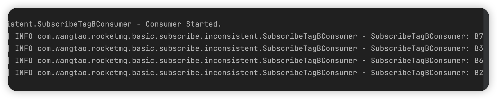
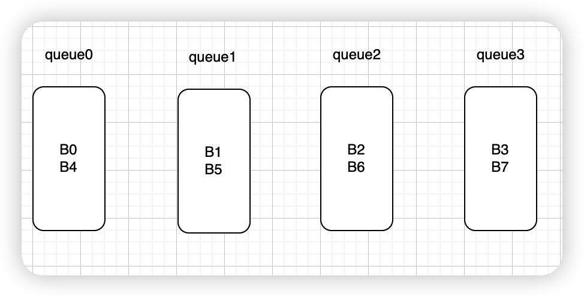

> RocketMQ 4.9.4

### 现象

编写两个消费者，它们属于同一个消费者组，订阅同一个主题，但是不一样的tag。比如消费者1订阅tagA，消费者2订阅tagB。先让消费者1启动，启动完后借助`rocketmq-dashboard`查看此时消费者组的订阅关系是tagA，然后启动消费者2，稍等一会在`rocketma-dashboard`中查看消费者组的订阅关系变成了**tagB**。然后通过生产者向该主题发送8条tagB的消息，**最后发现消费者1没有进行任何的消费，这个很好解释，因为消费者1只要tagA的消息，而消费者2仅仅消费了4条消息，并且通过rocketmq-dashboard查看主题的每一个队列的最大位点和消费者位点是一致的，查看每条消息的状态都是CONSUMED**。

代码如下

```java
@Slf4j
public class SubscribeTagAConsumer {

    public static void main(String[] args) throws Exception {
        // 初始化consumer，并设置consumer group name
        DefaultMQPushConsumer consumer = new DefaultMQPushConsumer(Constant.SUBSCRIBE_INCONSISTENT_CONSUMER);

        // 设置NameServer地址
        consumer.setNamesrvAddr(Constant.NAME_SERVER);
        //订阅一个或多个topic，并指定tag过滤条件
        consumer.subscribe(Constant.SUBSCRIBE_INCONSISTENT_TOPIC, "tagA");
        //注册回调接口来处理从Broker中收到的消息
        consumer.registerMessageListener(new MessageListenerConcurrently() {
            @Override
            public ConsumeConcurrentlyStatus consumeMessage(List<MessageExt> msgs, ConsumeConcurrentlyContext context) {
                for (MessageExt msg : msgs) {
                    log.info("SubscribeTagAConsumer: {}", new String(msg.getBody(), StandardCharsets.UTF_8));
                }
                // 返回消息消费状态，ConsumeConcurrentlyStatus.CONSUME_SUCCESS为消费成功
                return ConsumeConcurrentlyStatus.CONSUME_SUCCESS;
            }
        });
        // 启动Consumer
        consumer.start();
        log.info("Consumer Started.");
    }
}
```

```java
@Slf4j
public class SubscribeTagBConsumer {

    public static void main(String[] args) throws Exception {
        // 初始化consumer，并设置consumer group name
        DefaultMQPushConsumer consumer = new DefaultMQPushConsumer(Constant.SUBSCRIBE_INCONSISTENT_CONSUMER);

        // 设置NameServer地址
        consumer.setNamesrvAddr(Constant.NAME_SERVER);
        //订阅一个或多个topic，并指定tag过滤条件
        consumer.subscribe(Constant.SUBSCRIBE_INCONSISTENT_TOPIC, "tagB");
        //注册回调接口来处理从Broker中收到的消息
        consumer.registerMessageListener(new MessageListenerConcurrently() {
            @Override
            public ConsumeConcurrentlyStatus consumeMessage(List<MessageExt> msgs, ConsumeConcurrentlyContext context) {
                for (MessageExt msg : msgs) {
                    log.info("SubscribeTagBConsumer: {}", new String(msg.getBody(), StandardCharsets.UTF_8));
                }
                // 返回消息消费状态，ConsumeConcurrentlyStatus.CONSUME_SUCCESS为消费成功
                return ConsumeConcurrentlyStatus.CONSUME_SUCCESS;
            }
        });
        // 启动Consumer
        consumer.start();
        log.info("Consumer Started.");
    }
}
```

```java
@Slf4j
public class SubscribeProducer {

    public static void main(String[] args) throws Exception {
        // 初始化一个producer并设置Producer group name
        DefaultMQProducer producer = new DefaultMQProducer("subscribe_producer");
        // 设置NameServer地址
        producer.setNamesrvAddr(Constant.NAME_SERVER);
        // 启动producer
        producer.start();
        for (int i = 0; i < 8; i++) {
            Message msg = new Message(Constant.SUBSCRIBE_INCONSISTENT_TOPIC,
                    "tagB",
                    ("B" + i).getBytes(StandardCharsets.UTF_8)
            );
            // 利用producer进行发送，并同步等待发送结果
            SendResult sendResult = producer.send(msg);
            log.info("{}", sendResult);
        }
        // 一旦producer不再使用，关闭producer
        producer.shutdown();
    }
}
```

依次启动`SubscribeTagAConsumer`、`SubscribeTagBConsumer`、`SubscribeProducer`，在启动生产者之前确保`SubscribeTagBConsumer`订阅关系已经发送给broker，通过`rocketmq-dashboard`查看消费者的订阅关系可以看到，这样确保情况简单点利于分析。

消息发送结果如下所示，用于分析消息分布情况。

消息消费情况

也就是说发送了8条消息，最终只有`SubscribeTagBConsumer`消费了B2、B3、B6、B7这四条消息，而B0、B1、B4、B5没有进行实际的消费。

主题消费者点位情况

可以看到主题每个队列在broker的最大点位和消费者组进度点位一致。

消息消费情况

`rocketmq-dashboard`显示消息B0已经被消费，和实际的消费情况不符。

### 现象解释

#### 消费者组订阅关系

首先broker订阅关系是以消费者组为维度的，每一个消费者组保存了它所有的主题订阅信息。
```java
public class ConsumerGroupInfo {
    /**
     * 消费者组
     */
    private final String groupName;

    /**
     * key: topic
     * value: 详细的订阅关系, 如tag、sql表达式等
     */
    private final ConcurrentMap<String/* Topic */, SubscriptionData> subscriptionTable =
        new ConcurrentHashMap<String, SubscriptionData>();
}
```
每一个消费者启动后会定时向broker发送心跳，将消费者的信息注册到broker中(namesrv不保存消费者相关信息)，其中就包含了订阅关系，也就是说同一个消费者组的消费者后启动的会覆盖掉broker中保存的消费者组订阅关系。

#### 消费者拉取消息

**消费者拉取消息时不是通过消费者客户端自己保存的订阅关系来拉取消息，而是通过broker中保存的订阅关系来拉取消息的。** 也就是说无论是消费者`SubscribeTagAConsumer`还是消费者`SubscribeTagBConsumer`，在broker中拉取的都是tagB的消息。**broker服务端会先进行一次tag过滤，但是由于`consumequeue`文件只保存了tag的hashcode(4字节，因为采用定长存储，所以没有存储tag字符串)，而hashcode存在冲突，所以在消费者客户端会使用tag字符串再进行一次过滤**。

#### 消息在主题中各个队列的分布情况

默认情况下，一个主题会有4个分区，即4个逻辑队列，生产者会依次轮训向各个队列发送消息，根据生产者发送消息结果图，依次代表B0 - B7这8条消息的分布结果，可以用下图来表示。

#### 消费者组负载均衡

默认情况下，消费者是集群消费，也就是说同一个消费者组会按照特定的负载均衡策略来分配主题的各个队列。默认的负载均衡策略是平均分配，目前只有两个消费者，即每个消费者被分配两个队列，可以通过`rocketmq-dashboard`的主题查看消费者分配信息。

可以看到queue0，queue1被分配到了192.168.2.102@42001，queue2，queue3被分配到了192.168.2.102@42007，仅仅通过这个不能判断192.168.2.102@42001是`SubscribeTagAConsumer`还是`SubscribeTagBConsumer`，不过可以通过消费结果可以反推，因为`SubscribeTagBConsumer`消费了B2、B3，这两个消息分布在queue2、queue3中，因此可以断定192.168.2.102@42001是`SubscribeTagAConsumer`，192.168.2.102@42007是`SubscribeTagBConsumer`。可得出

**从这个图便可以得出为何`SubscribeTagAConsumer`没有消费任何消息，而`SubscribeTagBConsumer`仅仅消费了B2、B3、B6、B7。`SubscribeTagAConsumer`确实从broker服务端拉取到了B0、B1、B4、B5这4条消息(broker服务端仍然使用tagA hashcode进行过滤)，但是在消费者客户端使用了tagA字符串进行了过滤，导致它没有消费任何消息。**

#### 消费进度解释

B0 - B7依次发送到4个队列中，也就是队列的下一个位点都是2，而消费者提交位点是在消费消息成功之后，因此queue2、queue3的下一个消费位点是2没有任何问题。然而queue0、queue1中的消息没有被实际消费过，但是queue0、queue1的消费位点居然也是2，**这个是由于消费者从服务端拉取消息时，没有找到任何消息(不包含消费者客户端过滤消息后消息列表为空)也会进行消费者位点的提交，会使用队列的下一个位点来更新消费者组消费位点**。因此虽然第一次拉取到了4条消息，然后在消费者客户端进行了过滤后没有实际消费消息，也没有提交消费进度位点，但是下一次拉取时从服务端找不到任何消息后会更新消费进度位点。

#### 消息消费情况解释

从`rocketmq-dashboard`中查看消息详情时，发现这8条消息的状态都是`CONSUMED`，这里的逻辑是根据该消息在队列中的位点和消费者组在该队列的消费位点比较得来的。
如B0在queue0的位点是0，而消费者组在queue0的位点是2，因此显示的`CONSUMED`状态，其中这里还有`CONSUMED_BUT_FILTERED`，`NOT_CONSUME_YET`、`NOT_ONLINE`等，定义在`TrackType`枚举类中。

- NOT_ONLINE，该消费者组所有的消费者下线会显示这个状态，此时broker没有该消费组的注册信息。
- NOT_CONSUME_YET，消息在队列中的位点 >= 消费者组在该队列的消费进度点位。
- CONSUMED，消息在队列中的位点 < 消费者组在该队列的消费进度点位，且符合对tag的过滤。
- CONSUMED_BUT_FILTERED，消息在队列中的位点 < 消费者组在该队列的消费进度点位，且不符合对tag的过滤。
这里多说一嘴，如果此时停掉`SubscribeTagBConsumer`消费者，等待一会broker的订阅tag信息便会由`SubscribeTagAConsumer`更新成tagA，此时再去查看消息状态时就会变成CONSUMED_BUT_FILTERED。

### 源码简要说明

#### 消费者注册

**消费者客户端逻辑**

`DefaultMQPushConsumerImpl.start()` -> `MQClientInstance.sendHeartbeatToAllBrokerWithLock()` -> `MQClientInstance.sendHeartbeatToAllBroker`

消费者在启动后会立即调用该方法向broker发送心跳，注册消费者的信息到broker中。另外会有定时任务每隔一段时间就会发送心跳方法。

`MQClientInstance.start()` -> `MQClientInstance.startScheduledTask`，该方法开启了许多定时任务，其中就包括了发送心跳的的方法

```java
this.scheduledExecutorService.scheduleAtFixedRate(new Runnable() {

    @Override
    public void run() {
        try {
            MQClientInstance.this.cleanOfflineBroker();
            MQClientInstance.this.sendHeartbeatToAllBrokerWithLock();
        } catch (Exception e) {
            log.error("ScheduledTask sendHeartbeatToAllBroker exception", e);
        }
    }
}, 1000, this.clientConfig.getHeartbeatBrokerInterval(), TimeUnit.MILLISECONDS);
```

其中**默认间隔是30s**，也就是每30s会向broker发送一次心跳。

`sendHeartbeatToAllBroker`方法主要逻辑是封装消费者的信息，比如消费者组名称、订阅信息、消费模式(广播、集群)等，然后把这些信息发送给所有的broker。(生产者只会发送给master broker，因为生产者是写)。

**broker服务端逻辑**

`ClientManageProcessor.processRequest()` -> `ClientManageProcessor.heartBeat()`

先铺垫broker服务端的消费者存储结构。
consumerTable字段结构，用于保存消费者组的消息
ConsumerManager.java
```java
/**
 * key: 消费者组名称
 * value: 消费者组的信息
 */
private final ConcurrentMap<String/* Group */, ConsumerGroupInfo> consumerTable =  
new ConcurrentHashMap<String, ConsumerGroupInfo>(1024);

```

```java
public class ConsumerGroupInfo {
    
    // 消费者组名称
    private final String groupName;

    /**
     * 消费者组的所有的订阅信息(可以订阅多个主题)
     * key: 主题名称
     * value: 订阅信息
     */
    private final ConcurrentMap<String/* Topic */, SubscriptionData> subscriptionTable =
        new ConcurrentHashMap<String, SubscriptionData>();

    /**
     * 消费者组所有消费者客户端连接信息
     */
    private final ConcurrentMap<Channel, ClientChannelInfo> channelInfoTable =
        new ConcurrentHashMap<Channel, ClientChannelInfo>(16);

    // 消费类型, 拉模式还是推模式
    private volatile ConsumeType consumeType;
    // 消费模型, 广播还是集群消费
    private volatile MessageModel messageModel;
    // 消费者启动时从什么位置消费
    private volatile ConsumeFromWhere consumeFromWhere;
    // 最新一次的更新时间
    private volatile long lastUpdateTimestamp = System.currentTimeMillis();
}
```

```java
public class SubscriptionData implements Comparable<SubscriptionData> {
    
    // 是否类过滤模式
    private boolean classFilterMode = false;
    // 主题名称
    private String topic;
    // 子表达式(tag语法或者SQL92过滤)
    private String subString;
    // tag列表
    private Set<String> tagsSet = new HashSet<String>();
    // tag对应的hash code列表
    private Set<Integer> codeSet = new HashSet<Integer>();
    // 版本号，更新时会比较版本号
    private long subVersion = System.currentTimeMillis();
    // tag过滤还是SQL92过滤
    private String expressionType = ExpressionType.TAG;
}
```

**可以看到broker是以消费者组为单位进行存储的，因此同一个消费者组的消费者定义的属性不一样时可能发生覆盖行为，不过从下面的注册过程中可以发现消费者组的基本信息不会进行更新，只会更新订阅信息**。

```java
/**
 * 省略了一些不关注信息
 */
public RemotingCommand heartBeat(ChannelHandlerContext ctx, RemotingCommand request) {
    RemotingCommand response = RemotingCommand.createResponseCommand(null);
    HeartbeatData heartbeatData = HeartbeatData.decode(request.getBody(), HeartbeatData.class);
    ClientChannelInfo clientChannelInfo = new ClientChannelInfo(
        ctx.channel(),
        heartbeatData.getClientID(),
        request.getLanguage(),
        request.getVersion()
    );

    for (ConsumerData data : heartbeatData.getConsumerDataSet()) {
        // 注册消费者信息
        boolean changed = this.brokerController.getConsumerManager().registerConsumer(
            data.getGroupName(),
            clientChannelInfo,
            data.getConsumeType(),
            data.getMessageModel(),
            data.getConsumeFromWhere(),
            data.getSubscriptionDataSet(),
            isNotifyConsumerIdsChangedEnable
        );

        if (changed) {
            log.info("registerConsumer info changed {} {}",
                data.toString(),
                RemotingHelper.parseChannelRemoteAddr(ctx.channel())
            );
        }
    }

}
```

ConsumerManager.java
```java
public boolean registerConsumer(final String group,
                                final ClientChannelInfo clientChannelInfo,
                                ConsumeType consumeType,
                                MessageModel messageModel,
                                ConsumeFromWhere consumeFromWhere,
                                final Set<SubscriptionData> subList,
                                boolean isNotifyConsumerIdsChangedEnable) {

    ConsumerGroupInfo consumerGroupInfo = this.consumerTable.get(group);
    if (null == consumerGroupInfo) {
        ConsumerGroupInfo tmp = new ConsumerGroupInfo(group, consumeType, messageModel, consumeFromWhere);
        ConsumerGroupInfo prev = this.consumerTable.putIfAbsent(group, tmp);
        consumerGroupInfo = prev != null ? prev : tmp;
    }

    boolean r1 = consumerGroupInfo.updateChannel(clientChannelInfo, 
    consumeType, messageModel,consumeFromWhere);
    // 更新订阅信息
    boolean r2 = consumerGroupInfo.updateSubscription(subList);

    if (r1 || r2) {
        if (isNotifyConsumerIdsChangedEnable) {
            this.consumerIdsChangeListener.handle(ConsumerGroupEvent.CHANGE, group, consumerGroupInfo.getAllChannel());
        }
    }

    this.consumerIdsChangeListener.handle(ConsumerGroupEvent.REGISTER, group, subList);

    return r1 || r2;
}
```

```java
public boolean updateSubscription(final Set<SubscriptionData> subList) {
    boolean updated = false;

    for (SubscriptionData sub : subList) {
        SubscriptionData old = this.subscriptionTable.get(sub.getTopic());
        // 第一次新增
        if (old == null) {
            SubscriptionData prev = this.subscriptionTable.putIfAbsent(sub.getTopic(), sub);
            if (null == prev) {
                updated = true;
                log.info("subscription changed, add new topic, group: {} {}",
                    this.groupName,
                    sub.toString());
            }
        } else if (sub.getSubVersion() > old.getSubVersion()) {
            // 更新时需要判断版本号(消费者客户端订阅主题方法时的时间戳)
            if (this.consumeType == ConsumeType.CONSUME_PASSIVELY) {
                log.info("subscription changed, group: {} OLD: {} NEW: {}",
                    this.groupName,
                    old.toString(),
                    sub.toString()
                );
            }

            this.subscriptionTable.put(sub.getTopic(), sub);
        }
    }

    // 删除操作
    Iterator<Entry<String, SubscriptionData>> it = this.subscriptionTable.entrySet().iterator();
    while (it.hasNext()) {
        Entry<String, SubscriptionData> next = it.next();
        String oldTopic = next.getKey();

        boolean exist = false;
        for (SubscriptionData sub : subList) {
            if (sub.getTopic().equals(oldTopic)) {
                exist = true;
                break;
            }
        }

        if (!exist) {
            log.warn("subscription changed, group: {} remove topic {} {}",
                this.groupName,
                oldTopic,
                next.getValue().toString()
            );

            it.remove();
            updated = true;
        }
    }

    this.lastUpdateTimestamp = System.currentTimeMillis();

    return updated;
}

```

于此同时，broker也会检查客户端连接是否存活，而进行相应的操作，逻辑在ClientHousekeepingService类中，因为对netty不熟悉，不清楚触发机制。

**总结**

**broker服务端是以消费者组为单位来保存消费者的信息，消费者客户端每隔30s会发送一次心跳包给broker，其中会携带该消费者的基本信息，如所在的group name，message model，topic订阅关系等。其中topic订阅关系每次都会执行更新操作，但是会比较下订阅信息的创建时间来决定是不是需要更新，因此消费者客户端若没有更新过一个主题的订阅关系，则服务端也就无需更新。发送心跳的另一个作用是告诉broker，我还活着，因为broker每隔一段时间会清理掉不存活的连接信息。消费者下线会触发channel的close事件，若该消费者组所有的消费者下线，则会删除该消费者组的基本信息。**

在上面举了个例子，`SubscribeTagAConsumer`，`SubscribeTagBConsumer`，先后启动之后，后启动的覆盖了先启动的订阅信息，也就是把tag由tagA更新成了tagB。如果两个消费者都活着，那么由于订阅信息的时间戳(subVersion)没有发生变化，即便客户端每30s都会发送一次心跳，服务端也不会再更新订阅信息，**也就是说broker中的该主题的tag一直是tagB**，随后把`SubscribeTagBConsumer`消费者关了，按照这个逻辑因为tagB的subVersion > tagA的subVersion，也不会覆盖。但是通过rocketmq-dashboard查看消费者组的订阅关系，**发现tag变成了tagA**，这个就非常有意思了，很神奇。**这是由于`SubscribeTagBConsumer`下线后，消费者客户端主题队列负载均衡就会发生变化，会修改subVersion为当前的时间戳，那么发送心跳后broker就能更新订阅关系了。

#### 拉取消息的两次tag过滤

首先broker获取消息时会先根据tag的hash code进行一次过滤，因为message queue逻辑文件记录了消息的物理位置(Commit Log)以及tag的hash code，记录hash code的原因是message queue的每一条记录是定长的，所以只记录一个4字节的hash code。众所知周，hash code存在冲突，因此需要在消费者客户端使用tag字符串再进行一次过滤。

broker拉取消息的逻辑在PullMessageProcessor的processRequest方法中。这里主要弄明白broker是用的自己保存的消费者组信息，而不是消费者客户端单独的订阅信息。

```java
SubscriptionData subscriptionData = null;
ConsumerFilterData consumerFilterData = null;
if (hasSubscriptionFlag) {
    try {
        subscriptionData = FilterAPI.build(
            requestHeader.getTopic(), requestHeader.getSubscription(), requestHeader.getExpressionType()
        );
        if (!ExpressionType.isTagType(subscriptionData.getExpressionType())) {
            consumerFilterData = ConsumerFilterManager.build(
                requestHeader.getTopic(), requestHeader.getConsumerGroup(), requestHeader.getSubscription(),
                requestHeader.getExpressionType(), requestHeader.getSubVersion()
            );
            assert consumerFilterData != null;
        }
    } catch (Exception e) {
        log.warn("Parse the consumer's subscription[{}] failed, group: {}", requestHeader.getSubscription(),
            requestHeader.getConsumerGroup());
        response.setCode(ResponseCode.SUBSCRIPTION_PARSE_FAILED);
        response.setRemark("parse the consumer's subscription failed");
        return response;
    }
} else {
    ConsumerGroupInfo consumerGroupInfo =
        this.brokerController.getConsumerManager().getConsumerGroupInfo(requestHeader.getConsumerGroup());
    if (null == consumerGroupInfo) {
        log.warn("the consumer's group info not exist, group: {}", requestHeader.getConsumerGroup());
        response.setCode(ResponseCode.SUBSCRIPTION_NOT_EXIST);
        response.setRemark("the consumer's group info not exist" + FAQUrl.suggestTodo(FAQUrl.SAME_GROUP_DIFFERENT_TOPIC));
        return response;
    }

    if (!subscriptionGroupConfig.isConsumeBroadcastEnable()
        && consumerGroupInfo.getMessageModel() == MessageModel.BROADCASTING) {
        response.setCode(ResponseCode.NO_PERMISSION);
        response.setRemark("the consumer group[" + requestHeader.getConsumerGroup() + "] can not consume by broadcast way");
        return response;
    }

    subscriptionData = consumerGroupInfo.findSubscriptionData(requestHeader.getTopic());
    if (null == subscriptionData) {
        log.warn("the consumer's subscription not exist, group: {}, topic:{}", requestHeader.getConsumerGroup(), requestHeader.getTopic());
        response.setCode(ResponseCode.SUBSCRIPTION_NOT_EXIST);
        response.setRemark("the consumer's subscription not exist" + FAQUrl.suggestTodo(FAQUrl.SAME_GROUP_DIFFERENT_TOPIC));
        return response;
    }

    if (subscriptionData.getSubVersion() < requestHeader.getSubVersion()) {
        log.warn("The broker's subscription is not latest, group: {} {}", requestHeader.getConsumerGroup(),
            subscriptionData.getSubString());
        response.setCode(ResponseCode.SUBSCRIPTION_NOT_LATEST);
        response.setRemark("the consumer's subscription not latest");
        return response;
    }
}
```

查阅processRequest方法代码，发现是支持使用客户端自己的订阅关系，通过`hasSubscriptionFlag`变量来控制，因此主要搞清楚这个变量的值。

```java
final boolean hasSubscriptionFlag = PullSysFlag.hasSubscriptionFlag(requestHeader.getSysFlag());
```

通过`hasSubscriptionFlag`变量的赋值代码，得知是消费者客户端传的sysFlag值。

客户端拉取消息代码逻辑在`DefaultMQPushConsumerImpl`的`pullMessage`方法中

```java
int sysFlag = PullSysFlag.buildSysFlag(  
    commitOffsetEnable, // commitOffset  
    true, // suspend  
    subExpression != null, // subscription  
    classFilter // class filter  
);
```

```java
public static int buildSysFlag(final boolean commitOffset, final boolean suspend,
        final boolean subscription, final boolean classFilter) {
    int flag = 0;

    if (commitOffset) {
        flag |= FLAG_COMMIT_OFFSET;
    }

    if (suspend) {
        flag |= FLAG_SUSPEND;
    }

    if (subscription) {
        flag |= FLAG_SUBSCRIPTION;
    }

    if (classFilter) {
        flag |= FLAG_CLASS_FILTER;
    }

    return flag;
}

/**
 * 是否有SubscriptionFlag, 只要buildSysFlag方法参数中subscription传true
 * 该方法就返回true
 */
public static boolean hasSubscriptionFlag(final int sysFlag) {  
    return (sysFlag & FLAG_SUBSCRIPTION) == FLAG_SUBSCRIPTION;  
}
```

到现在只要弄清楚`subExpression != null`的值是true还是false即可

```java
String subExpression = null;
boolean classFilter = false;
SubscriptionData sd = this.rebalanceImpl.getSubscriptionInner().get(pullRequest.getMessageQueue().getTopic());
if (sd != null) {
    // 取决于isPostSubscriptionWhenPull，因为没有使用类模式过滤
    if (this.defaultMQPushConsumer.isPostSubscriptionWhenPull() && !sd.isClassFilterMode()) {
        subExpression = sd.getSubString();
    }

    classFilter = sd.isClassFilterMode();
}
```

而`postSubscriptionWhenPull`属性默认为false，因此`subExpression != null`为false。
即`hasSubscriptionFlag`为false，也就是默认情况下，使用broker保存的订阅信息来获取消息。

**客户端过滤**

客户端收到消息后，会使用tag字符串再进行一次过滤，还是体现在`DefaultMQPushConsumerImpl`的`pullMessage`方法中，收到服务端返回后，会进行回调`PullCallback`。

```java
 PullCallback pullCallback = new PullCallback() {
    @Override
    public void onSuccess(PullResult pullResult) {
        if (pullResult != null) {
            // 处理结果, 这里会进行一次过滤
            pullResult = DefaultMQPushConsumerImpl.this.pullAPIWrapper.processPullResult(pullRequest.getMessageQueue(), pullResult,
                subscriptionData);

            switch (pullResult.getPullStatus()) {
                case FOUND:
                    // doSomthing
                case NO_NEW_MSG:
                    // doSomthing
                ...


    }


    @Override
    public void onException(Throwable e) {
        if (!pullRequest.getMessageQueue().getTopic().startsWith(MixAll.RETRY_GROUP_TOPIC_PREFIX)) {
            log.warn("execute the pull request exception", e);
        }

        if (e instanceof MQBrokerException && ((MQBrokerException) e).getResponseCode() == ResponseCode.FLOW_CONTROL) {
            DefaultMQPushConsumerImpl.this.executePullRequestLater(pullRequest, PULL_TIME_DELAY_MILLS_WHEN_BROKER_FLOW_CONTROL);
        } else {
            DefaultMQPushConsumerImpl.this.executePullRequestLater(pullRequest, pullTimeDelayMillsWhenException);
        }
    }
}
```

```java
public PullResult processPullResult(final MessageQueue mq, final PullResult pullResult,
    final SubscriptionData subscriptionData) {
    PullResultExt pullResultExt = (PullResultExt) pullResult;

    this.updatePullFromWhichNode(mq, pullResultExt.getSuggestWhichBrokerId());
    if (PullStatus.FOUND == pullResult.getPullStatus()) {
        ByteBuffer byteBuffer = ByteBuffer.wrap(pullResultExt.getMessageBinary());
        List<MessageExt> msgList = MessageDecoder.decodes(byteBuffer);

        // 根据tag本身过滤
        List<MessageExt> msgListFilterAgain = msgList;
        if (!subscriptionData.getTagsSet().isEmpty() && !subscriptionData.isClassFilterMode()) {
            msgListFilterAgain = new ArrayList<MessageExt>(msgList.size());
            for (MessageExt msg : msgList) {
                if (msg.getTags() != null) {
                    if (subscriptionData.getTagsSet().contains(msg.getTags())) {
                        msgListFilterAgain.add(msg);
                    }
                }
            }
        }

        if (this.hasHook()) {
            FilterMessageContext filterMessageContext = new FilterMessageContext();
            filterMessageContext.setUnitMode(unitMode);
            filterMessageContext.setMsgList(msgListFilterAgain);
            this.executeHook(filterMessageContext);
        }

        for (MessageExt msg : msgListFilterAgain) {
            String traFlag = msg.getProperty(MessageConst.PROPERTY_TRANSACTION_PREPARED);
            if (Boolean.parseBoolean(traFlag)) {
                msg.setTransactionId(msg.getProperty(MessageConst.PROPERTY_UNIQ_CLIENT_MESSAGE_ID_KEYIDX));
            }
            MessageAccessor.putProperty(msg, MessageConst.PROPERTY_MIN_OFFSET,
                Long.toString(pullResult.getMinOffset()));
            MessageAccessor.putProperty(msg, MessageConst.PROPERTY_MAX_OFFSET,
                Long.toString(pullResult.getMaxOffset()));
            msg.setBrokerName(mq.getBrokerName());
        }

        // 重新赋值
        pullResultExt.setMsgFoundList(msgListFilterAgain);
    }

    pullResultExt.setMessageBinary(null);

    return pullResult;
}
```

#### 消费进度提交

集群消费时，消费进度会保存到broker中，并持久化到broker的磁盘中，文件为`consumerOffset.json`，而广播消费则是保存在消费者客户端自己的机器上，因为广播消费每个消费者都有自己的进度，不是消费者组共享的。这里只讨论集群消费模式

**保存的进度偏移量是下一个要消费的偏移量，比如消费了队列中第0, 1两个位置的消息，保存的数值是2，代表下一次消费偏移量为2这个位置的消息。**

消费者会先把消息进度偏移量提交到本地，然后后台任务每隔一段时间把本地的消费进度提交到broker中保存。

集群模式的消费进度管理类为`RemoteBrokerOffsetStore`。
```java
/**
 * key: 队列
 * value: 进度偏移量
 */
private ConcurrentMap<MessageQueue, AtomicLong> offsetTable =  
new ConcurrentHashMap<MessageQueue, AtomicLong>();
```

更新指定队列的消费进度

```java
@Override
public void updateOffset(MessageQueue mq, long offset, boolean increaseOnly) {
    if (mq != null) {
        AtomicLong offsetOld = this.offsetTable.get(mq);
        if (null == offsetOld) {
            offsetOld = this.offsetTable.putIfAbsent(mq, new AtomicLong(offset));
        }

        if (null != offsetOld) {
            if (increaseOnly) {
                // cas更新
                MixAll.compareAndIncreaseOnly(offsetOld, offset);
            } else {
                offsetOld.set(offset);
            }
        }
    }
}
```


并发模式消费消息: `ConsumeMessageConcurrentlyService.ConsumeRequest.run()`
消费者提交消费进度的位置大概有两处
- 拉取到消息进行了消费(无论是否消费成功)，消费不成功时是通过重试队列来进行重试的，所以也要把当前队列的偏移量更新
- 没有拉取到消息

先看第一种
```java
public void processConsumeResult(
        final ConsumeConcurrentlyStatus status,
        final ConsumeConcurrentlyContext context,
        final ConsumeRequest consumeRequest) {

    /*
     * 消费成功的最后一条消息的数组索引, 目前context里默认是Integer.MAX_VALUE
     * 只要自己编写的消费逻辑没有修改该值, 那么就是Integer.MAX_VALUE
     */
    int ackIndex = context.getAckIndex();

    if (consumeRequest.getMsgs().isEmpty())
        return;

    switch (status) {
        case CONSUME_SUCCESS:
            // 重置为实际消息列表的大小, 只要自己不调用context.setAckIndex()方法修改值, 那么就是全部消费成功了
            if (ackIndex >= consumeRequest.getMsgs().size()) {
                ackIndex = consumeRequest.getMsgs().size() - 1;
            }
            int ok = ackIndex + 1;
            int failed = consumeRequest.getMsgs().size() - ok;
            this.getConsumerStatsManager().incConsumeOKTPS(consumerGroup, consumeRequest.getMessageQueue().getTopic(), ok);
            this.getConsumerStatsManager().incConsumeFailedTPS(consumerGroup, consumeRequest.getMessageQueue().getTopic(), failed);
            break;
        case RECONSUME_LATER:
            ackIndex = -1;
            this.getConsumerStatsManager().incConsumeFailedTPS(consumerGroup, consumeRequest.getMessageQueue().getTopic(),
                consumeRequest.getMsgs().size());
            break;
        default:
            break;
    }

    switch (this.defaultMQPushConsumer.getMessageModel()) {
        case BROADCASTING:
            for (int i = ackIndex + 1; i < consumeRequest.getMsgs().size(); i++) {
                MessageExt msg = consumeRequest.getMsgs().get(i);
                log.warn("BROADCASTING, the message consume failed, drop it, {}", msg.toString());
            }
            break;
        case CLUSTERING:
            List<MessageExt> msgBackFailed = new ArrayList<MessageExt>(consumeRequest.getMsgs().size());
            for (int i = ackIndex + 1; i < consumeRequest.getMsgs().size(); i++) {
                MessageExt msg = consumeRequest.getMsgs().get(i);
                boolean result = this.sendMessageBack(msg, context);
                if (!result) {
                    msg.setReconsumeTimes(msg.getReconsumeTimes() + 1);
                    msgBackFailed.add(msg);
                }
            }

            if (!msgBackFailed.isEmpty()) {
                consumeRequest.getMsgs().removeAll(msgBackFailed);

                this.submitConsumeRequestLater(msgBackFailed, consumeRequest.getProcessQueue(), consumeRequest.getMessageQueue());
            }
            break;
        default:
            break;
    }

    // 移除消息, 并返回最小的索引值(这里并没有判断是消费成功还是失败)
    long offset = consumeRequest.getProcessQueue().removeMessage(consumeRequest.getMsgs());
    if (offset >= 0 && !consumeRequest.getProcessQueue().isDropped()) {
        // 更新消费进度偏移量
        this.defaultMQPushConsumerImpl.getOffsetStore().updateOffset(consumeRequest.getMessageQueue(), offset, true);
    }
}

```

```java
public long removeMessage(final List<MessageExt> msgs) {
    long result = -1;
    final long now = System.currentTimeMillis();
    try {
        this.treeMapLock.writeLock().lockInterruptibly();
        this.lastConsumeTimestamp = now;
        try {
            if (!msgTreeMap.isEmpty()) {
                // 最大的偏移量+1(即全部消费完了)
                result = this.queueOffsetMax + 1;
                int removedCnt = 0;
                for (MessageExt msg : msgs) {
                    MessageExt prev = msgTreeMap.remove(msg.getQueueOffset());
                    if (prev != null) {
                        removedCnt--;
                        msgSize.addAndGet(0 - msg.getBody().length);
                    }
                }
                msgCount.addAndGet(removedCnt);
                // 如果不为空, 取最小的(之前的肯定是已经消费过了，消费失败的也发送到重试队列了)
                if (!msgTreeMap.isEmpty()) {
                    result = msgTreeMap.firstKey();
                }
            }
        } finally {
            this.treeMapLock.writeLock().unlock();
        }
    } catch (Throwable t) {
        log.error("removeMessage exception", t);
    }

    return result;
}
```

**这里是拿最小的偏移量去更新，是因为并发消费模式，A线程在消费偏移量为8的消息，B线程在消费为7的消息，如果A线程消费的快，它更新进度时如果提交的是9(8+1)，且已经同步到broker中，B线程消费7的消息非常慢，然后突然宕机(还未执行将消息发送到重试队列中)，那么重启时将从偏移量为9的位置进行消费，即偏移量为7的消息将丢失。而如果提交最小的偏移量，本地队列中就是7,8两个偏移量，删除了8之后最小的就是7，那么发生以上情况还是从7的位置进行消费，这样消息不会丢失。**

再看第二种没有拉取到消息时

```java
PullCallback pullCallback = new PullCallback() {
    @Override
    public void onSuccess(PullResult pullResult) {
        if (pullResult != null) {
            pullResult = DefaultMQPushConsumerImpl.this.pullAPIWrapper.processPullResult(pullRequest.getMessageQueue(), pullResult,
                subscriptionData);

            switch (pullResult.getPullStatus()) {
                case FOUND:
                    // doSomething
                    break;
                case NO_NEW_MSG:
                case NO_MATCHED_MSG:
                    pullRequest.setNextOffset(pullResult.getNextBeginOffset());
                    // 使用服务端返回过来的队列中的下一个偏移量来修正消息进度偏移量
                    DefaultMQPushConsumerImpl.this.correctTagsOffset(pullRequest);

                    DefaultMQPushConsumerImpl.this.executePullRequestImmediately(pullRequest);
                    break;
            }
        }
    }
}
```

```java
private void correctTagsOffset(final PullRequest pullRequest) {
    // 如果本地消费者客户端已经没有堆积的消息时
    if (0L == pullRequest.getProcessQueue().getMsgCount().get()) {
        this.offsetStore.updateOffset(pullRequest.getMessageQueue(), pullRequest.getNextOffset(), true);
    }
}
```

这里可以对应上面的消费进度解释章节，是它的一个作用，用于修正进度。

**定时任务发送消费进度给broker**

`MQClientInstance.start()`  -> `MQClientInstance.startScheduledTask()`

```java
this.scheduledExecutorService.scheduleAtFixedRate(new Runnable() {

    @Override
    public void run() {
        try {
            MQClientInstance.this.persistAllConsumerOffset();
        } catch (Exception e) {
            log.error("ScheduledTask persistAllConsumerOffset exception", e);
        }
    }
}, 1000 * 10, this.clientConfig.getPersistConsumerOffsetInterval(), TimeUnit.MILLISECONDS);
```

默认间隔为5s，实际还是调用OffsetStore接口的`persistAll`方法来发送给broker持久化的。