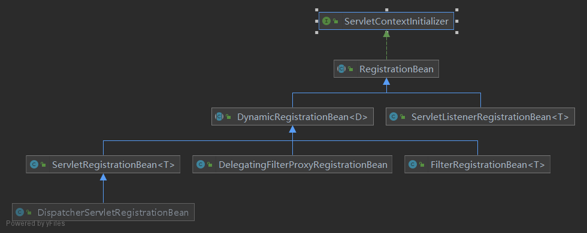

### 如何使用

在Spring Boot中注册`Servlet`、`Filter`办法主要有3种，下面来看下具体例子，例子都采用`Filter`，`Servlet`同理。

第一种，使用`FilterRegistrationBean`、`ServletRegistrationBean`

```java
@Configuration
public class AppConfig {

    @Bean
    public FilterRegistrationBean<FirstFilter> firstFilter() {
        ServletRegistrationBean
        FilterRegistrationBean<FirstFilter> filterRegistrationBean = new FilterRegistrationBean<>();
        filterRegistrationBean.setFilter(new FirstFilter());
        // 默认为/*
        filterRegistrationBean.addUrlPatterns("/*");
        // 设置Filter的执行顺序(默认为最低优先级)
        filterRegistrationBean.setOrder(1);
        return filterRegistrationBean;
    }
}
```

此种方式最为灵活，可以设置过滤器的**映射路径**以及**执行顺序**。

第二种，使用原生注解`@WebFilter`、`@WebServlet` + `@ServletComponentScan`

要想使用原生注解注册`Filter`以及`Servlet`，需要加上`@ServletComponentScan`开启扫描

```java
/**
 * 启动类开启扫描, 默认扫描路径为当前类所在的包路径
 */
@ServletComponentScan
@SpringBootApplication
public class Application {

    public static void main(String[] args) {
        SpringApplication.run(Application.class, args);
    }
}
```

```java
@WebFilter("/*")
public class FirstFilter implements Filter {
    @Override
    public void doFilter(ServletRequest request, ServletResponse response, FilterChain chain) throws IOException, ServletException {
        System.out.println("=============FirstFilter===============");
        chain.doFilter(request, response);
    }
}
```

该方式可以指定**映射路径**，但是不能指定**执行顺序**，即便在类上增加`@Order注解`或者实现`Ordered`接口，Spring Boot在注册时也不会使用，采用的默认顺序，即`Ordered.LOWEST_PRECEDENCE`，优先级最低。

第三种，使用`@Component`注解

对于Spring容器中管理的`Filter`、`Servlet`类型的bean，Spring Boot同时会把它们注册到`Servlet` 容器中

```java
@Component
@Order(1)
public class FirstFilter implements Filter {
    @Override
    public void doFilter(ServletRequest request, ServletResponse response, FilterChain chain) throws IOException, ServletException {
        System.out.println("=============FirstFilter===============");
        chain.doFilter(request, response);
    }
}
```

这种方式虽然简单，但无法指定**映射路径**，不过可以指定**执行顺序**，映射路径默认就是/*，可以在类上使用`@Order`注解或者实现`Ordered`接口来指定执行顺序。

### 使用总结

| 方式                                  | 映射路径 | 执行顺序 |
| ------------------------------------- | -------- | -------- |
| `FilterRegistrationBean`              | yes      | yes      |
| `@WebFilter`+ `@ServletComponentScan` | yes      | no       |
| `@Component`                          | no       | yes      |

### 注册原理

首先明确一点，无论是`@WebFilter`还是`@Component`方式注册，Spring Boot最终的处理形式还是会把它们处理成`FilterRegistrationBean`(对于`Filter`而言，`Servlet`则是`ServletRegistrationBean`)

Spring Boot注册`Filter`、`Servlet`、`Listener`分别依赖于`FilterRegistrationBean`、`ServletRegistrationBean`、`ServletListenerRegistrationBean`。

它们之间共同实现的顶层接口为`ServletContextInitializer`，下面是整个体系的一个类图



```java
@FunctionalInterface
public interface ServletContextInitializer {

	/**
	 * servlet3.0对于ServletContext接口增加了addFilter、addServlet、addListener
	 * 方法，以至于可以动态注册Filter、Servlet、Listener
	 */
	void onStartup(ServletContext servletContext) throws ServletException;

}
```

```java
/**
 * 实现了Ordered接口，这样注册Filter、Servlet时可以指定顺序
 */
public abstract class RegistrationBean implements ServletContextInitializer, Ordered {

	private static final Log logger = LogFactory.getLog(RegistrationBean.class);

    /**
     * 默认最低优先级
     */
	private int order = Ordered.LOWEST_PRECEDENCE;

	private boolean enabled = true;

	@Override
	public final void onStartup(ServletContext servletContext) throws ServletException {
		String description = getDescription();
		if (!isEnabled()) {
			logger.info(StringUtils.capitalize(description) + " was not registered (disabled)");
			return;
		}
		register(description, servletContext);
	}

	
	protected abstract String getDescription();


	protected abstract void register(String description, ServletContext servletContext);

	
	public void setEnabled(boolean enabled) {
		this.enabled = enabled;
	}


	public boolean isEnabled() {
		return this.enabled;
	}

	public void setOrder(int order) {
		this.order = order;
	}

	@Override
	public int getOrder() {
		return this.order;
	}
}
```

那么Spring Boot调用`ServletContextInitializer.onStartup`方法的时机在哪呢？答案是`TomcatStarter`类，Spring Boot启动时会触发`TomcatStarter`类中的`onStartup`方法

```java
class TomcatStarter implements ServletContainerInitializer {

	private static final Log logger = LogFactory.getLog(TomcatStarter.class);

	private final ServletContextInitializer[] initializers;

	private volatile Exception startUpException;

	TomcatStarter(ServletContextInitializer[] initializers) {
		this.initializers = initializers;
	}

	@Override
	public void onStartup(Set<Class<?>> classes, ServletContext servletContext) throws ServletException {
        /*
         * debug跟踪，里面有一个ServletWebServerApplicationContext返回的
         * ServletContextInitializer实现, 具体方法为
         * getSelfInitializer以及selfInitialize方法
         * 具体注册逻辑便委托给了selfInitialize方法
         *
         * 注意: initializers中的对象并没有在Spring容器中
         */
        for (ServletContextInitializer initializer : this.initializers) {
            initializer.onStartup(servletContext);
        }
	}
}
```

```java
private void selfInitialize(ServletContext servletContext) throws ServletException {
		prepareWebApplicationContext(servletContext);
		registerApplicationScope(servletContext);
		WebApplicationContextUtils.registerEnvironmentBeans(getBeanFactory(), servletContext);
        // 从Spring容器中获取所有的ServletContextInitializer实例，调用onStartup方法完成注册
		for (ServletContextInitializer beans : getServletContextInitializerBeans()) {
			beans.onStartup(servletContext);
		}
	}
```

```java
/**
 * 重点关注ServletContextInitializerBeans类
 * 这是一个Collection<ServletContextInitializer>实现
 */
protected Collection<ServletContextInitializer> getServletContextInitializerBeans() {
	// 那么接下来就是查看构造方法做了些啥
    return new ServletContextInitializerBeans(getBeanFactory());
}
```

```java
public ServletContextInitializerBeans(ListableBeanFactory beanFactory,
			Class<? extends ServletContextInitializer>... initializerTypes) {
    this.initializers = new LinkedMultiValueMap<>();
    this.initializerTypes = (initializerTypes.length != 0) ? Arrays.asList(initializerTypes)
        : Collections.singletonList(ServletContextInitializer.class);
    /*
     * 寻找容器中所有的ServletContextInitializer并添加到initializers
     */
    addServletContextInitializerBeans(beanFactory);
    /**
     * 寻找容器中所有的Filter、Servlet、Listener bean
     * 并转换成对应的FilterRegistrationBean、ServletRegistrationBean
     * ServletListenerRegistrationBean。并添加到initializers
     * 该方法会获取order值，用于注册顺序
     * 
     * 从这里便解释了为啥使用@Component注解也能生效的原因
     */
    addAdaptableBeans(beanFactory);
    List<ServletContextInitializer> sortedInitializers = this.initializers.values().stream()
        .flatMap((value) -> value.stream().sorted(AnnotationAwareOrderComparator.INSTANCE))
        .collect(Collectors.toList());
    this.sortedList = Collections.unmodifiableList(sortedInitializers);
    logMappings(this.initializers);
}
```

走到这里，便收集了所有的`ServletContextInitializer`实例，接下来就是调用每一个实例的`onStartup`方法，挑选`FilterRegistrationBean`类来看下时如何注册`Filter`的。

```java
public class FilterRegistrationBean<T extends Filter> extends AbstractFilterRegistrationBean<T> {

	private T filter;

	public FilterRegistrationBean() {
	}
	
	public FilterRegistrationBean(T filter, ServletRegistrationBean<?>... servletRegistrationBeans) {
		super(servletRegistrationBeans);
		Assert.notNull(filter, "Filter must not be null");
		this.filter = filter;
	}

	@Override
	public T getFilter() {
		return this.filter;
	}

	public void setFilter(T filter) {
		Assert.notNull(filter, "Filter must not be null");
		this.filter = filter;
	}

}
```

该类非常简单，也没有重写`onStartup`方法，因此找父类`AbstractFilterRegistrationBean`，发现它也没有重写`onStartup`，于是继续往上找`RegistrationBean`

```java
@Override
public final void onStartup(ServletContext servletContext) throws ServletException {
    String description = getDescription();
    if (!isEnabled()) {
        logger.info(StringUtils.capitalize(description) + " was not registered (disabled)");
        return;
    }
    // 核心逻辑, 从子类找
    register(description, servletContext);
}
```

`DynamicRegistrationBean`类

```java
@Override
protected final void register(String description, ServletContext servletContext) {
    // 注册到servletContext中
    D registration = addRegistration(description, servletContext);
    if (registration == null) {
        logger.info(StringUtils.capitalize(description) + " was not registered (possibly already registered?)");
        return;
    }
    // 配置映射路径等参数
    configure(registration);
}
```

`AbstractFilterRegistrationBean`类

```java
@Override
protected Dynamic addRegistration(String description, ServletContext servletContext) {
    // 最终调用servletContext.addFilter完成注册
    Filter filter = getFilter();
    return servletContext.addFilter(getOrDeduceName(filter), filter);
}
```

所以到最后还是调用的`servlet3.0`新增的api完成最终的注册

### `@ServletComponentScan`注册过程

从上面分析完，我们不难猜到该注解实际上就是扫描`@WebFilter`、`@WebServlet`、`@WebListener`注解的类，然后把这些类包装成对应的`RegistrationBean`注册到Spring 容器即可。下面来看下具体实现

首先肯定要分析该注解

```java
/**
 * 下面三个属性都不配的话，取该注解所在类的包路径
 */
@Target(ElementType.TYPE)
@Retention(RetentionPolicy.RUNTIME)
@Documented
@Import(ServletComponentScanRegistrar.class)
public @interface ServletComponentScan {

    /**
     * 扫描包路径
     */ 
	@AliasFor("basePackages")
	String[] value() default {};

	/**
     * 扫描包路径
     */ 
	@AliasFor("value")
	String[] basePackages() default {};

	/**
     * 扫描包路径，只是用类来替代，取类的包名作为路径
     */ 
	Class<?>[] basePackageClasses() default {};

}
```

可以看到该类导入了`ServletComponentScanRegistrar`

```java
class ServletComponentScanRegistrar implements ImportBeanDefinitionRegistrar {

	private static final String BEAN_NAME = "servletComponentRegisteringPostProcessor";

    /**
     * 唯一的作用就是向容器中注册一个servletComponentRegisteringPostProcessor bean
     * 它是一个
     */
	@Override
	public void registerBeanDefinitions(AnnotationMetadata importingClassMetadata, BeanDefinitionRegistry registry) {
		Set<String> packagesToScan = getPackagesToScan(importingClassMetadata);
		// 如果存在，合并扫描的路径
        if (registry.containsBeanDefinition(BEAN_NAME)) {
			updatePostProcessor(registry, packagesToScan);
		}
		else {
            // 不存在注册servletComponentRegisteringPostProcessor
			addPostProcessor(registry, packagesToScan);
		}
	}

	private void updatePostProcessor(BeanDefinitionRegistry registry, Set<String> packagesToScan) {
		BeanDefinition definition = registry.getBeanDefinition(BEAN_NAME);
		ValueHolder constructorArguments = definition.getConstructorArgumentValues().getGenericArgumentValue(Set.class);
		@SuppressWarnings("unchecked")
		Set<String> mergedPackages = (Set<String>) constructorArguments.getValue();
		mergedPackages.addAll(packagesToScan);
		constructorArguments.setValue(mergedPackages);
	}

	private void addPostProcessor(BeanDefinitionRegistry registry, Set<String> packagesToScan) {
		GenericBeanDefinition beanDefinition = new GenericBeanDefinition();
		beanDefinition.setBeanClass(ServletComponentRegisteringPostProcessor.class);
		beanDefinition.getConstructorArgumentValues().addGenericArgumentValue(packagesToScan);
		beanDefinition.setRole(BeanDefinition.ROLE_INFRASTRUCTURE);
		registry.registerBeanDefinition(BEAN_NAME, beanDefinition);
	}

	private Set<String> getPackagesToScan(AnnotationMetadata metadata) {
		AnnotationAttributes attributes = AnnotationAttributes
				.fromMap(metadata.getAnnotationAttributes(ServletComponentScan.class.getName()));
		String[] basePackages = attributes.getStringArray("basePackages");
		Class<?>[] basePackageClasses = attributes.getClassArray("basePackageClasses");
		Set<String> packagesToScan = new LinkedHashSet<>(Arrays.asList(basePackages));
		for (Class<?> basePackageClass : basePackageClasses) {
			packagesToScan.add(ClassUtils.getPackageName(basePackageClass));
		}
		if (packagesToScan.isEmpty()) {
			packagesToScan.add(ClassUtils.getPackageName(metadata.getClassName()));
		}
		return packagesToScan;
	}
}
```

接下来看`ServletComponentRegisteringPostProcessor`

```java
class ServletComponentRegisteringPostProcessor implements BeanFactoryPostProcessor, ApplicationContextAware {

	private static final List<ServletComponentHandler> HANDLERS;

	static {
        // 分别用于处理Servlet、Filter、Listener
        // 转换成对应的RegistrationBean
		List<ServletComponentHandler> servletComponentHandlers = new ArrayList<>();
		servletComponentHandlers.add(new WebServletHandler());
		servletComponentHandlers.add(new WebFilterHandler());
		servletComponentHandlers.add(new WebListenerHandler());
		HANDLERS = Collections.unmodifiableList(servletComponentHandlers);
	}

	private final Set<String> packagesToScan;

	private ApplicationContext applicationContext;

	ServletComponentRegisteringPostProcessor(Set<String> packagesToScan) {
		this.packagesToScan = packagesToScan;
	}

	@Override
	public void postProcessBeanFactory(ConfigurableListableBeanFactory beanFactory) throws BeansException {
		if (isRunningInEmbeddedWebServer()) {
            // 扫描bean以及注册
			ClassPathScanningCandidateComponentProvider componentProvider = createComponentProvider();
			for (String packageToScan : this.packagesToScan) {
				scanPackage(componentProvider, packageToScan);
			}
		}
	}

	private void scanPackage(ClassPathScanningCandidateComponentProvider componentProvider, String packageToScan) {
		for (BeanDefinition candidate : componentProvider.findCandidateComponents(packageToScan)) {
			if (candidate instanceof AnnotatedBeanDefinition) {
				for (ServletComponentHandler handler : HANDLERS) {
					handler.handle(((AnnotatedBeanDefinition) candidate),
							(BeanDefinitionRegistry) this.applicationContext);
				}
			}
		}
	}

	private boolean isRunningInEmbeddedWebServer() {
		return this.applicationContext instanceof WebApplicationContext
				&& ((WebApplicationContext) this.applicationContext).getServletContext() == null;
	}

	private ClassPathScanningCandidateComponentProvider createComponentProvider() {
		ClassPathScanningCandidateComponentProvider componentProvider = new ClassPathScanningCandidateComponentProvider(
				false);
		componentProvider.setEnvironment(this.applicationContext.getEnvironment());
		componentProvider.setResourceLoader(this.applicationContext);
		for (ServletComponentHandler handler : HANDLERS) {
			componentProvider.addIncludeFilter(handler.getTypeFilter());
		}
		return componentProvider;
	}

	Set<String> getPackagesToScan() {
		return Collections.unmodifiableSet(this.packagesToScan);
	}

	@Override
	public void setApplicationContext(ApplicationContext applicationContext) throws BeansException {
		this.applicationContext = applicationContext;
	}

}
```

```java
class WebFilterHandler extends ServletComponentHandler {

	WebFilterHandler() {
		super(WebFilter.class);
	}

    /**
     * 完成转换并注册
     * 该类并未处理@Order注解或者Ordered接口，因此使用的FilterRegistrationBean默认值
     * 即最低优先级
     */
	@Override
	public void doHandle(Map<String, Object> attributes, AnnotatedBeanDefinition beanDefinition,
			BeanDefinitionRegistry registry) {
		BeanDefinitionBuilder builder = BeanDefinitionBuilder.rootBeanDefinition(FilterRegistrationBean.class);
		builder.addPropertyValue("asyncSupported", attributes.get("asyncSupported"));
		builder.addPropertyValue("dispatcherTypes", extractDispatcherTypes(attributes));
		builder.addPropertyValue("filter", beanDefinition);
		builder.addPropertyValue("initParameters", extractInitParameters(attributes));
		String name = determineName(attributes, beanDefinition);
		builder.addPropertyValue("name", name);
		builder.addPropertyValue("servletNames", attributes.get("servletNames"));
		builder.addPropertyValue("urlPatterns", extractUrlPatterns(attributes));
		registry.registerBeanDefinition(name, builder.getBeanDefinition());
	}
}
```


