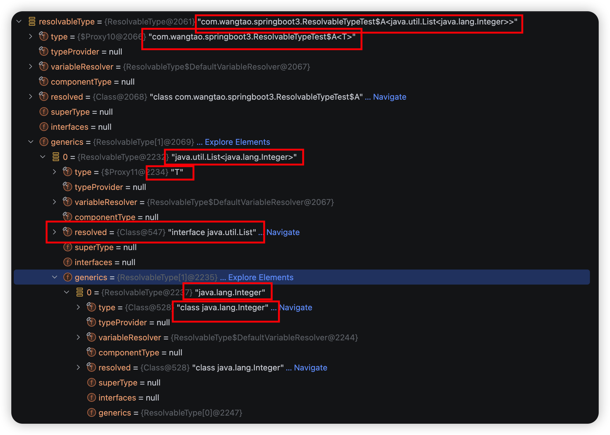

### 背景

`ResolvableType` 是 Spring 框架提供的一个封装类，专门用来在运行时解析和处理复杂的泛型类型信息，解决了 Java 反射 API 在泛型处理上的不便。它可以看作是对 `java.lang.reflect.Type` 系列接口的更高层抽象，尤其是在处理嵌套泛型、通配符、类型变量时优势明显。

java 泛型在编译后会被擦除，常规反射只能拿到原始类型，比如 `List<String>` 在运行时只是 `List`。虽然可以通过 `ParameterizedType` 等接口获取一些泛型信息，但操作繁琐，且缺乏递归解析、类型变量替换等能力。

`ResolvableType` 能轻松做到：

- 获取字段、方法参数、返回值上的完整泛型结构
- 在继承层次中解析某个泛型接口的实际类型参数
- 处理多层嵌套泛型如 `Map<String, List<Integer>>`

在Spring的事件机制中被广泛使用。

### Java原生使用

对于以下泛型类型，没有子类的帮助下，是无法获取具体的运行时类型的

```java
public class ApplicationListener<T> {

    void onApplicationListener(T event) {}

    public static void main(String[] args) {
        // 没有办法拿到listener对象实际的运行时泛型类型
        ApplicationListener<String> listener = new ApplicationListener<>();
    }
}
```

如果在有子类的情况下，便可以借助Class.getGenericSuperclass或者getGenericInterfaces方法来获取到实际的泛型类型了。

```java
public abstract class ApplicationListener<T> {

    abstract void onApplicationListener(T event);

    static class StringApplicationListener extends ApplicationListener<String> {

        @Override
        void onApplicationListener(String event) {

        }
    }

    public static void main(String[] args) {
        ApplicationListener<String> listener = new StringApplicationListener();
        Type superclass = listener.getClass().getGenericSuperclass();
        if (superclass instanceof ParameterizedType) {
            ParameterizedType parameterizedType = (ParameterizedType)superclass;
            Type[] actualTypeArguments = parameterizedType.getActualTypeArguments();
            // true
            System.out.println(actualTypeArguments[0] instanceof Class<?>);
            // class java.lang.String
            System.out.println(actualTypeArguments[0]);
        }
    }
}
```

### ResolvableType API使用

#### 创建 ResolvableType 实例

表格中只例举了常用几个

| 方法                                                        | 说明                              |
| ----------------------------------------------------------- | --------------------------------- |
| forClass(Class<?>)                                          | 包装一个原始类                    |
| forType(Type)                                               | 包装任意 `java.lang.reflect.Type` |
| forInstance(Object)                                         | 根据实例创建                      |
| forClass(Class<?> baseType, Class<?> implementationClass)   | 基于实现类推导泛型                |
| ResolvableType forClassWithGenerics(Class<?>, Class<?>... ) | 包含泛型                          |

使用示例
```java
package com.wangtao.springboottest;

import org.junit.jupiter.api.Assertions;
import org.junit.jupiter.api.Test;
import org.springframework.core.ResolvableType;

public class ResolvableTypeTest {

    public static class PayloadEvent<T> {

    }

    public static class StringPayloadEvent extends PayloadEvent<String> {

    }

    @Test
    public void testCreateApi() {
        ResolvableType type = ResolvableType.forClass(PayloadEvent.class);
        Assertions.assertEquals("com.wangtao.springboottest.ResolvableTypeTest$PayloadEvent<?>", type.toString());
        // 指定泛型
        type = ResolvableType.forClassWithGenerics(PayloadEvent.class, String.class);
        Assertions.assertEquals("com.wangtao.springboottest.ResolvableTypeTest$PayloadEvent<java.lang.String>", type.toString());

        // 基于实现类构建泛型
        type = ResolvableType.forClass(PayloadEvent.class, StringPayloadEvent.class);
        Assertions.assertEquals("com.wangtao.springboottest.ResolvableTypeTest$PayloadEvent<java.lang.String>", type.toString());
        // 上面底层就是这个
        type = ResolvableType.forClass(StringPayloadEvent.class).as(PayloadEvent.class);
        Assertions.assertEquals("com.wangtao.springboottest.ResolvableTypeTest$PayloadEvent<java.lang.String>", type.toString());

        StringPayloadEvent event = new StringPayloadEvent();
        // 类似forClass
        type = ResolvableType.forInstance(event);
        Assertions.assertEquals("com.wangtao.springboottest.ResolvableTypeTest$StringPayloadEvent", type.toString());
    }
}


```

#### 核心方法与解析能力

| 方法                                           | 说明                                                         |
| ---------------------------------------------- | ------------------------------------------------------------ |
| Class<?> resolve()                             | 返回擦除后的原生类型                                         |
| Type getType()                                 | 返回Java Type实例                                            |
| ResolvableType getGeneric(int... indexes)      | 递归获取指定位置的泛型参数                                   |
| ResolvableType[] getGenerics()                 | 获取泛型参数数组                                             |
| ResolvableType getSuperType()                  | 父类对应的 `ResolvableType`，已包含子类绑定的实参            |
| ResolvableType[]  getInterfaces()              | 接口数组（同样绑定好实参）                                   |
| ResolvableType as(Class<?> type)               | 将当前类型向上转型到指定父类或接口，保留泛型绑定             |
| boolean isAssignableFrom(ResolvableType other) | 类型兼容性判断，支持泛型(扩展Class.isAssignableFrom)         |
| boolean isInstance(Object obj)                 | 判断对象是不是当前类型的实例，支持泛型(扩展Class.isInstance) |

使用示例

```java
package com.wangtao.springboottest;

import org.junit.jupiter.api.Assertions;
import org.junit.jupiter.api.Test;
import org.springframework.core.ResolvableType;

import java.util.Arrays;
import java.util.List;

public class ResolvableTypeTest {

    public static class PayloadEvent<T> {

    }

    public static class StringPayloadEvent extends PayloadEvent<String> {

    }

    @Test
    public void testGetApi() {
        // 指定泛型
        ResolvableType type = ResolvableType.forClassWithGenerics(PayloadEvent.class, String.class);
        Assertions.assertEquals("com.wangtao.springboottest.ResolvableTypeTest$PayloadEvent<java.lang.String>", type.toString());
        // 获取Java Type类型
        Assertions.assertEquals("com.wangtao.springboottest.ResolvableTypeTest$PayloadEvent<java.lang.String>", type.getType().toString());
        // 获取原始类型
        Assertions.assertEquals(PayloadEvent.class, type.resolve());
        // 获取第一个位置的泛型参数
        Assertions.assertEquals("java.lang.String", type.getGeneric(0).toString());
        // 构造一个嵌套的泛型结构(List<PayloadEvent<String>>)
        type = ResolvableType.forClassWithGenerics(List.class, type);
        Assertions.assertEquals("java.util.List<com.wangtao.springboottest.ResolvableTypeTest$PayloadEvent<java.lang.String>>", type.toString());
        // 递归获取，先获取第一个位置的泛型参数, 从这个结果泛型参数中继续获取第一个位置的泛型参数
        Assertions.assertEquals("java.lang.String", type.getGeneric(0, 0).toString());
        type = ResolvableType.forClassWithGenerics(PayloadEvent.class, String.class);
        // 获取泛型参数列表
        ResolvableType[] genericArr = type.getGenerics();
        Assertions.assertEquals("[java.lang.String]", Arrays.toString(genericArr));

        type = ResolvableType.forClass(StringPayloadEvent.class);
        // 获取父类型(会保留具体的泛型参数)
        Assertions.assertEquals("com.wangtao.springboottest.ResolvableTypeTest$PayloadEvent<java.lang.String>", type.getSuperType().toString());

        // 向上转型到父类型(会保留具体的泛型参数)
        type = type.as(PayloadEvent.class);
        Assertions.assertEquals("com.wangtao.springboottest.ResolvableTypeTest$PayloadEvent<java.lang.String>", type.toString());
    }
}
```

### 一些注意的点

#### 关于getType

在以下场景中，getType拿到的类型仍然是T，需要自己手动去构建

```java
public static class A<T> {

}

public static class B<T> extends A<T> {

}

public static class C extends B<List<Integer>> {

}

@Test
public void testApi() {
    ResolvableType resolvableType = ResolvableType.forClass(C.class).as(A.class);
    // com.wangtao.springboot3.ResolvableTypeTest$A<java.util.List<java.lang.Integer>>
    System.out.println(resolvableType);
    // com.wangtao.springboot3.ResolvableTypeTest$A<T>
    System.out.println(resolvableType.getType().getTypeName());
	// T
    System.out.println(resolvableType.getGeneric(0).getType().getTypeName());
}
```

as方法通过子类一层一层调用Class.getGenericSuperclass或者getGenericInterfaces去获取type属性，在这个例子中就是

调用C.class的getGenericSuperclass获取到type为`ResolvableTypeTest$B<java.util.List<java.lang.Integer>>`，然后再调用B.class的getGenericSuperclass获取到type为`ResolvableTypeTest$A<T>`，因为B定义时没有特化泛型，所以获取不到。但是可以通过C中的特化泛型来帮助我们解析。`ResolvableType.toString()`显示时才能看到完整的类型字符串。



```java
 @Override
public String toString() {
    if (isArray()) {
        return getComponentType() + "[]";
    }
    if (this.resolved == null) {
        return "?";
    }
    if (this.type instanceof TypeVariable) {
        TypeVariable<?> variable = (TypeVariable<?>) this.type;
        if (this.variableResolver == null || this.variableResolver.resolveVariable(variable) == null) {
            // Don't bother with variable boundaries for toString()...
            // Can cause infinite recursions in case of self-references
            return "?";
        }
    }
    StringBuilder result = new StringBuilder(this.resolved.getName());
    if (hasGenerics()) {
        result.append('<');
        result.append(LettuceStrings.arrayToDelimitedString(getGenerics(), ", "));
        result.append('>');
    }
    return result.toString();
}
```

可以看到`toString`正是通过`resolved` + `generics`计算出来的。

ResolvableType类中有一个resolveType方法可以帮助我们解析type属性，但是访问权限是默认的，外部无法访问。可以通过下面方案来解析出泛型变量具体运行时类型。

```java
public Type getType(ResolvableType resolvableType) {
    Type type = resolvableType.getType();
    if (type instanceof TypeVariable<?>) {
        Class<?> resolved = resolvableType.resolve();
        if (resolved == null) {
            throw new RuntimeException("无法解析泛型");
        }
        if (resolvableType.hasGenerics()) {
            type = ResolvableType.forClassWithGenerics(resolved, resolvableType.getGenerics()).getType();
        } else {
            type = resolved;
        }
    }
    return type;
}
```


