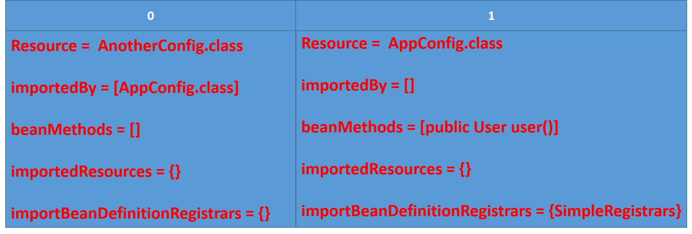

### 声明

> 源码基于Spring 5.0.8

### 1. 简介

自从Spring Boot流行，基于注解的配置逐渐取代了XML配置。因为突然而来的兴趣从而阅读了Spring 对`Configuration`注解的解析流程。

### 2. 原理介绍

解析`@Configuration`的入口是`ConfigurationClassPostProcessor`。`ConfigurationClassPostProcessor`实现了`BeanDefinitionRegistryPostProcessor`接口，使得Spring在初始过程中动态的向容器注册bean。Spring会在容器初始过程中执行`BeanDefinitionRegistryPostProcessor`接口的`postProcessBeanDefinitionRegistry`方法。

```java
@Override
public void postProcessBeanDefinitionRegistry(BeanDefinitionRegistry registry) {
    /*
     * 省略边角代码
     */
    // 核心处理逻辑
    processConfigBeanDefinitions(registry);
}
```

因为接下来的逻辑相当的复杂，因此在继续往下分析之前，先总体介绍下工作流程以及相关类。Spring将整个工作过程分为两个阶段。**解析阶段**以及**注册阶段**。解析阶段由`ConfigurationClassParser`这个类负责，然后将解析结果交给`ConfigurationClassBeanDefinitionReader`注册到容器中。其中在解析阶段会将解析的信息保存到`ConfigurationClass`这个类中。主要将解析以下内容

* 首先判断这个配置类需不需要解析，对应条件注解`@Conditional`以及各种变体，如`@ConditionalOnClass`等。
* 以同样逻辑解析配置类中的内部类，当然这些内部类得是一个配置类。
* 解析配置类上的`@PropertySource`注解，将外部属性保存到全局环境`Environment`对象中。
* 处理配置类上的`@ComponentScan`注解，相当于开启`@Component`注解扫描。
* 解析配置类上的`@Import`注解。
* 解析配置类上的`@ImportResource`注解，这个注解用于导入以前的XML方式配置的bean。
* 解析配置类中的`@Bean`方法。
* 以同样逻辑继续解析配置类的超类。
* 解析完成后将该配置类加入到结果集合中。

`@Import`注解可用来导入外部的注解配置或者可以动态的注册bean。主要分为3大类

1. 导入类实现了`ImportSelector`接口或者子接口`DeferredImportSelector`。`selectImports`方法将会返回一个字符串数组。值为类的完全限定名。`ImportSelector`和`DeferredImportSelector`主要区别在于`selectImports`执行顺序。一个在解析过程中执行，一个在配置类解析完成后执行。这样`selectImports`选择的类将会在配置类后面，注册bean的顺序也会按照这个顺序注册。Spring Boot中的自动配置类`AutoConfigurationImportSelector`就实现了`DeferredImportSelector`接口，再根据条件注解判断用户自己有没有配置，没有配置才去装配bean。
2. 导入类实现了`ImportBeanDefinitionRegistrar`,用于动态注入bean。
3. 配置类，相当于引入另外一个配置类。

Spring将单个配置类解析得到的信息全部保存在`ConfigurationClass`类中，最后得到一个`LinkedHashMap`，键和值都是`ConfigurationClass`。下面介绍`ConfigurationClass`这个类的结构。

```java
final class ConfigurationClass {
    // 配置类的元数据
    private final AnnotationMetadata metadata;
	// 配置类的.class文件表示
	private final Resource resource;
    // bean的名字
	private String beanName;
	// 记录该配置类被哪些别的配置类导入过
	private final Set<ConfigurationClass> importedBy = new LinkedHashSet<>(1);
    // 配置类中所有被@Bean标记的方法
	private final Set<BeanMethod> beanMethods = new LinkedHashSet<>();
	// @ImportResource
	private final Map<String, Class<? extends BeanDefinitionReader>> importedResources =
			new LinkedHashMap<>();
	// @Import中的第二种
	private final Map<ImportBeanDefinitionRegistrar, AnnotationMetadata>                                              importBeanDefinitionRegistrars = new LinkedHashMap<>();
	// 用来存放哪些bean方法可以被跳过
	final Set<String> skippedBeanMethods = new HashSet<>();
}
```

接下来举一个例子，看下最后保存的结果。

```java
public class User {
    
}

@Configuration
public class AnotherConfig {
    
}

public class SimpleRegistrars implements ImportBeanDefinitionRegistrar {
    
}

@Configuration
@Import({AnotherConfig.class, SimpleRegistrars.class})
public class AppConfig {
	
    @Bean
    public User user() {
        retur new User();
    }
}
```

以`AppConfig`为解析起点将会得到以下结果。



### 3. 源码解析

继续看`processConfigBeanDefinitions`方法

```java
public void processConfigBeanDefinitions(BeanDefinitionRegistry registry) {
    List<BeanDefinitionHolder> configCandidates = new ArrayList<>();
	// 从容器中拿到所有已经注册过的bean
    String[] candidateNames = registry.getBeanDefinitionNames();
	
    // 筛选出配置，不是所有的bean都是一个配置类的。
    for (String beanName : candidateNames) {
        BeanDefinition beanDef = registry.getBeanDefinition(beanName);
        // 已经解析过了, 跳过
        if (ConfigurationClassUtils.isFullConfigurationClass(beanDef) ||
            ConfigurationClassUtils.isLiteConfigurationClass(beanDef)) {
            if (logger.isDebugEnabled()) {
                logger.debug("Bean definition has already been processed "
                            + "as a configuration class: " + beanDef);
            }
        }
        /*
         * 判断是不是一个配置类
         * 判断规则如下
         * 1. 类上有没有@Configuration
         * 2. 类上有没有@Component、@ComponentScan、@Import、@ImportResource
         * 3. 类中有没有定义@Bean 方法
         * 三个条件满足任意一个即可，可见Spring并没有强制要求配置类一定要有@Configuration
         * 值得注意的是@Bean方法注册的bean不能作为配置类，因为其注册的BeanDefinition
         * 没有beanClassName, 通过工厂方法生成。checkConfigurationClassCandidate方法开头存在
         * 以下判断
         * String className = beanDef.getBeanClassName();
		 * if (className == null || beanDef.getFactoryMethodName() != null) {
		 *	return false;
		 * }
         */
        else if (ConfigurationClassUtils.checkConfigurationClassCandidate(
            beanDef, this.metadataReaderFactory)) {
            configCandidates.add(new BeanDefinitionHolder(beanDef, beanName));
        }
    }

    // Return immediately if no @Configuration classes were found
    if (configCandidates.isEmpty()) {
        return;
    }

    // Sort by previously determined @Order value, if applicable
    configCandidates.sort((bd1, bd2) -> {
        int i1 = ConfigurationClassUtils.getOrder(bd1.getBeanDefinition());
        int i2 = ConfigurationClassUtils.getOrder(bd2.getBeanDefinition());
        return Integer.compare(i1, i2);
    });

    // Detect any custom bean name generation strategy supplied through the enclosing application context
    SingletonBeanRegistry sbr = null;
    if (registry instanceof SingletonBeanRegistry) {
        sbr = (SingletonBeanRegistry) registry;
        if (!this.localBeanNameGeneratorSet) {
            BeanNameGenerator generator = (BeanNameGenerator) sbr.getSingleton(CONFIGURATION_BEAN_NAME_GENERATOR);
            if (generator != null) {
                this.componentScanBeanNameGenerator = generator;
                this.importBeanNameGenerator = generator;
            }
        }
    }

    if (this.environment == null) {
        this.environment = new StandardEnvironment();
    }

    // 准备解析配置类
    ConfigurationClassParser parser = new ConfigurationClassParser(
        this.metadataReaderFactory, this.problemReporter, this.environment,
        this.resourceLoader, this.componentScanBeanNameGenerator, registry);
    Set<BeanDefinitionHolder> candidates = new LinkedHashSet<>(configCandidates);
    Set<ConfigurationClass> alreadyParsed = new HashSet<>(configCandidates.size());
    do {
        // 解析目前所有的配置类，将结果保存到configurationClasses字段中
        parser.parse(candidates);
        // 校验，诸如配置类不能是final, bean 方法不能是private、final等。
        parser.validate();
		// 获取解析结果
        Set<ConfigurationClass> configClasses = new LinkedHashSet<>
            (parser.getConfigurationClasses());
        configClasses.removeAll(alreadyParsed);

        if (this.reader == null) {
            this.reader = new ConfigurationClassBeanDefinitionReader(
                registry, this.sourceExtractor, this.resourceLoader, this.environment,
                this.importBeanNameGenerator, parser.getImportRegistry());
        }
        // 注册bean
        this.reader.loadBeanDefinitions(configClasses);
        alreadyParsed.addAll(configClasses);

        candidates.clear();
        // 从新注册的bean里挑选新的配置类，开始一轮新的的解析、注册流程。
        if (registry.getBeanDefinitionCount() > candidateNames.length) {
            String[] newCandidateNames = registry.getBeanDefinitionNames();
            Set<String> oldCandidateNames = new HashSet<>(Arrays.asList(candidateNames));
            Set<String> alreadyParsedClasses = new HashSet<>();
            for (ConfigurationClass configurationClass : alreadyParsed) {
                alreadyParsedClasses.add(configurationClass
                                         .getMetadata().getClassName());
            }
            for (String candidateName : newCandidateNames) {
                if (!oldCandidateNames.contains(candidateName)) {
                    BeanDefinition bd = registry.getBeanDefinition(candidateName);
                    if (ConfigurationClassUtils.checkConfigurationClassCandidate(
                            bd, this.metadataReaderFactory) &&
                        !alreadyParsedClasses.contains(bd.getBeanClassName())) {
                        candidates.add(new BeanDefinitionHolder(bd, candidateName));
                    }
                }
            }
            candidateNames = newCandidateNames;
        }
    }
    while (!candidates.isEmpty());

    // Register the ImportRegistry as a bean in order to support ImportAware @Configuration classes
    if (sbr != null && !sbr.containsSingleton(IMPORT_REGISTRY_BEAN_NAME)) {
        sbr.registerSingleton(IMPORT_REGISTRY_BEAN_NAME, parser.getImportRegistry());
    }

    if (this.metadataReaderFactory instanceof CachingMetadataReaderFactory) {
        // Clear cache in externally provided MetadataReaderFactory; this is a no-op
        // for a shared cache since it'll be cleared by the ApplicationContext.
        ((CachingMetadataReaderFactory) this.metadataReaderFactory).clearCache();
    }
}
```

接下将分析解析阶段以及注册阶段。

####  3.1 解析阶段

解析类: `ConfigurationClassParser`

```java
public void parse(Set<BeanDefinitionHolder> configCandidates) {
	// 用于记录Import注解引入的类, 这个类需要实现DeferredImportSelector接口
    this.deferredImportSelectors = new LinkedList<>();

    for (BeanDefinitionHolder holder : configCandidates) {
        BeanDefinition bd = holder.getBeanDefinition();
        try {
            if (bd instanceof AnnotatedBeanDefinition) {
                parse(((AnnotatedBeanDefinition) bd).getMetadata(), holder.getBeanName());
            }
            else if (bd instanceof AbstractBeanDefinition && ((AbstractBeanDefinition) bd).hasBeanClass()) {
                parse(((AbstractBeanDefinition) bd).getBeanClass(), holder.getBeanName());
            }
            else {
                parse(bd.getBeanClassName(), holder.getBeanName());
            }
        }
        catch (BeanDefinitionStoreException ex) {
            throw ex;
        }
        catch (Throwable ex) {
            throw new BeanDefinitionStoreException(
                "Failed to parse configuration class [" + bd.getBeanClassName() + "]", ex);
        }
    }
	// 执行DeferredImportSelector接口的selectImports方法
    // 这里就体现了DeferredImportSelector 与 ImportSelector接口的执行顺序问题
    processDeferredImportSelectors();
}

/**
 * 上面所有的parse方法最终都会调用这个方法。
 * Spring 将条件注解分为两种类型
 * 1. ConfigurationPhase.PARSE_CONFIGURATION
 *    这个条件注解在解析阶段就生效，如果条件不满足将不再解析这个配置类，相当于作废
 * 2. ConfigurationPhase.REGISTER_BEAN
 *    如果条件不满足，不会影响Spring解析这个配置类，但是在向容器中注册bean的时候生效。
 *    如果条件不满足，那么自身，以及Import注解引入的类，以及bean 方法等都不会被注入到容器中。
 *    唯一不影响的只有@PropertySource注解引入的属性配置，依然会加入到全局环境中。
 *    所以其实解析后的只有@PropertySource有效，其他的解析内容到真正注册的时候其实都没用了。
 */
protected void processConfigurationClass(ConfigurationClass configClass) throws IOException {
    // 判断条件是否满足，只有ConfigurationPhase.PARSE_CONFIGURATION的条件才生效
    if (this.conditionEvaluator.shouldSkip(configClass.getMetadata(),      
                                           ConfigurationPhase.PARSE_CONFIGURATION)) {
        return;
    }
	
    // 判断这个类是否之前已经解析了
    // 因为可能有多个类导入了同一个类等特殊情况
    ConfigurationClass existingClass = this.configurationClasses.get(configClass);
    if (existingClass != null) {
        // 如果这个类是别的类导入进来的
        if (configClass.isImported()) {
            if (existingClass.isImported()) {
                // 将导入这个类的类加入到importedBy集合中 
                existingClass.mergeImportedBy(configClass);
            }
            return;
        }
        else {
            // 删除掉，重新解析这个新的类
            this.configurationClasses.remove(configClass);
            this.knownSuperclasses.values().removeIf(configClass::equals);
        }
    }

    // Recursively process the configuration class and its superclass hierarchy.
    SourceClass sourceClass = asSourceClass(configClass);
    do {
        // 开始真正解析工作
        sourceClass = doProcessConfigurationClass(configClass, sourceClass);
    }
    while (sourceClass != null);
	// 解析完成，加入到结果集合中
    this.configurationClasses.put(configClass, configClass);
}

```

```java
protected final SourceClass doProcessConfigurationClass(ConfigurationClass configClass, SourceClass sourceClass)
			throws IOException {

		// 处理成员类
		processMemberClasses(configClass, sourceClass);

		// 处理@PropertySource引入的外部属性配置, 加入到全局环境对象
		for (AnnotationAttributes propertySource : AnnotationConfigUtils.attributesForRepeatable(
				sourceClass.getMetadata(), PropertySources.class,
				org.springframework.context.annotation.PropertySource.class)) {
			if (this.environment instanceof ConfigurableEnvironment) {
				processPropertySource(propertySource);
			}
			else {
				logger.warn("Ignoring @PropertySource annotation on [" + sourceClass.getMetadata().getClassName() +
						"]. Reason: Environment must implement ConfigurableEnvironment");
			}
		}

		/*
		 * 处理包扫描，将扫描的结果直接注册到容器中。主要借助ClassPathBeanDefinitionScanner
		 * 来完成。可参考这篇文章[Spring包扫描机制详解]
		 * 地址: https://www.cnblogs.com/wt20/p/10990697.html
		 */
		Set<AnnotationAttributes> componentScans = AnnotationConfigUtils
            .attributesForRepeatable(sourceClass.getMetadata(), 
            ComponentScans.class, ComponentScan.class);
		// 因为会直接注册了，所以检测条件注解用的是ConfigurationPhase.REGISTER_BEAN
    	if (!componentScans.isEmpty() && !this.conditionEvaluator
        	.shouldSkip(sourceClass.getMetadata(), 
                    ConfigurationPhase.REGISTER_BEAN)) {
			for (AnnotationAttributes componentScan : componentScans) {
				// The config class is annotated with @ComponentScan -> perform the scan immediately
				Set<BeanDefinitionHolder> scannedBeanDefinitions =
						this.componentScanParser.parse(
                    componentScan, sourceClass.getMetadata().getClassName());
				// Check the set of scanned definitions for any further config classes and parse recursively if needed
				for (BeanDefinitionHolder holder : scannedBeanDefinitions) {
					BeanDefinition bdCand = holder.getBeanDefinition().getOriginatingBeanDefinition();
					if (bdCand == null) {
						bdCand = holder.getBeanDefinition();
					}
                    // 作为一个新的配置类解析
					if (ConfigurationClassUtils.checkConfigurationClass
                        Candidate(bdCand, this.metadataReaderFactory)) {
						parse(bdCand.getBeanClassName(), holder.getBeanName());
					}
				}
			}
		}

		// 处理@Import注解
		processImports(configClass, sourceClass, getImports(sourceClass), true);

		// 处理@ImportResource
		AnnotationAttributes importResource =
				AnnotationConfigUtils.attributesFor(sourceClass.getMetadata(), ImportResource.class);
		if (importResource != null) {
			String[] resources = importResource.getStringArray("locations");
			Class<? extends BeanDefinitionReader> readerClass = importResource.getClass("reader");
			for (String resource : resources) {
				String resolvedResource = this.environment.resolveRequiredPlaceholders(resource);
				configClass.addImportedResource(resolvedResource, readerClass);
			}
		}

		// 处理 @Bean 方法
		Set<MethodMetadata> beanMethods = retrieveBeanMethodMetadata(sourceClass);
		for (MethodMetadata methodMetadata : beanMethods) {
			configClass.addBeanMethod(new BeanMethod(methodMetadata, configClass));
		}

		// Process default methods on interfaces
		processInterfaces(configClass, sourceClass);

		// 处理父类
		if (sourceClass.getMetadata().hasSuperClass()) {
			String superclass = sourceClass.getMetadata().getSuperClassName();
			if (superclass != null && !superclass.startsWith("java") &&
					!this.knownSuperclasses.containsKey(superclass)) {
				this.knownSuperclasses.put(superclass, configClass);
				// Superclass found, return its annotation metadata and recurse
				return sourceClass.getSuperClass();
			}
		}
		// No superclass -> processing is complete
		return null;
	}
```

#### 3.2 注册阶段

注册类: `ConfigurationClassBeanDefinitionReader`

```java
public void loadBeanDefinitions(Set<ConfigurationClass> configurationModel) {
    TrackedConditionEvaluator trackedConditionEvaluator = new TrackedConditionEvaluator();
    for (ConfigurationClass configClass : configurationModel) {
        loadBeanDefinitionsForConfigurationClass(configClass, 
                                                 trackedConditionEvaluator);
    }
}

private void loadBeanDefinitionsForConfigurationClass(
			ConfigurationClass configClass, TrackedConditionEvaluator trackedConditionEvaluator) {

    // 判断条件注解， 接下面
    if (trackedConditionEvaluator.shouldSkip(configClass)) {
        // 如果不满足，将从容器中删除，如果存在的话
        String beanName = configClass.getBeanName();
        if (StringUtils.hasLength(beanName) && this.registry.containsBeanDefinition(beanName)) {
            this.registry.removeBeanDefinition(beanName);
        }
        this.importRegistry.removeImportingClass(configClass.getMetadata().getClassName());
        return;
    }
	// 如果是被导入进来的，需要注册自己。
    // 如果不是被导入进来的，在解析前就已经在容器里了。
    if (configClass.isImported()) {
        registerBeanDefinitionForImportedConfigurationClass(configClass);
    }
    // 注册 @Bean方法
    // 这里值得注意的是，如果两个@Bean方法注册的Bean的名字一样，并且不是在同一个配置类中
    // 将会进行覆盖。具体细节看这个方法吧
    for (BeanMethod beanMethod : configClass.getBeanMethods()) {
        loadBeanDefinitionsForBeanMethod(beanMethod);
    }
	// 注册外部引入的XML文件定义的bean
    loadBeanDefinitionsFromImportedResources(configClass.getImportedResources());
    // 处理@Import注解中的第二种情况, 即被导入类实现了ImportBeanDefinitionRegistrar接口
    loadBeanDefinitionsFromRegistrars(configClass.getImportBeanDefinitionRegistrars());
}
```

```java
/**
 * 前面说过条件注解可以分阶段生效，如果配置类上面的条件是注册阶段才生效，即使不满足这个条件也会进行
 * 解析。而到了现在注册阶段，将会生效。使得不会被注册到容器中
 */
public boolean shouldSkip(ConfigurationClass configClass) {
    		// 拿缓存
			Boolean skip = this.skipped.get(configClass);
			if (skip == null) {
                // 如果这个配置类是从别的配置类导入进来的，要先检查这些配置类的条件注解
				if (configClass.isImported()) {
					boolean allSkipped = true;
                    // 遍历所有导入过这个配置类的其他类
					for (ConfigurationClass importedBy : configClass.getImportedBy()) {
						// 只要有一个导入过这个配置的其他类是有效的，那么前提条件通过，接下
                        // 来还要判断自己本身的条件
                        // 先将标记改为false
                        if (!shouldSkip(importedBy)) {
							allSkipped = false;
							break;
						}
					}
                    // 如果所有导入过这个配置的其他类都是无效的，那么这个类也无效
					if (allSkipped) {
						skip = true;
					}
				}
                // 判断自身条件
				if (skip == null) {
					skip = conditionEvaluator.shouldSkip(configClass.getMetadata(), ConfigurationPhase.REGISTER_BEAN);
				}
				this.skipped.put(configClass, skip);
			}
			return skip;
		}
	}
```

### 总结

本文对源码关键地方进行了分析，但是很多细节并没有深究。尽管如此，也是弄清楚了整个工作流程，方便以后碰到问题或者有疑惑时可以快速定位到代码查看具体的处理细节。不得不说整个逻辑真的太复杂了，Spring 考虑的太全面了。

