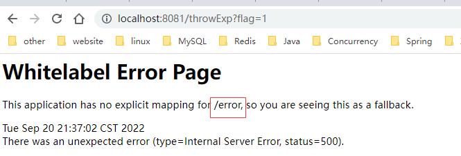
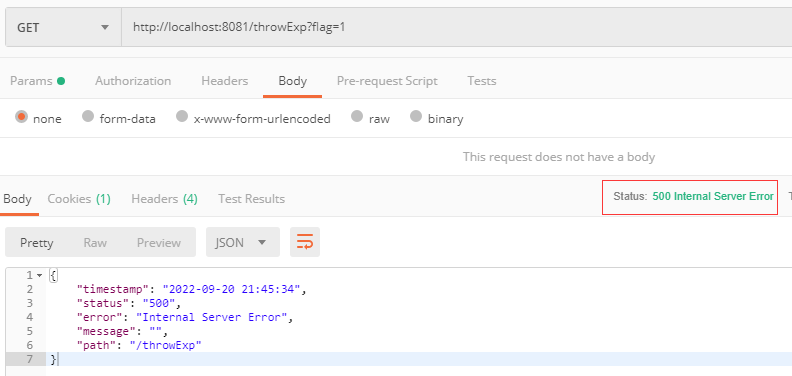

### 声明

> 源码基于SpringBoot 2.3.12

### 前置知识

[Tomcat异常处理机制](Tomcat异常处理机制.md)

### 使用例子

#### 原理简要介绍

先来看下Spring Boot中默认的处理行为，如果`DispatcherServlet`执行发生异常，**内部如果没有处理掉（比如没有被自定义的全局异常处理器处理掉）**，而交给tomcat处理时，最终会转发到/error请求。Spring Boot在启动tomcat容器时，注册了一个状态码为0，路径为/error的错误页面，而状态码为0时可以匹配所有的状态码，因此最终的错误处理又回到了Spring Boot，更准确的说回到了`DispatherServlet`，而处理/error的控制器为`BasicErrorController`。该控制器根据请求的`Accept`请求头响应两种格式，即html和ajax数据。

#### 默认行为

编写一个404，500的例子，来看看默认的一个效果。记得不要在项目中使用全局异常处理器来处理抛出来的异常，否则就不会走到tomcat的异常处理了，也就不会转发到/error请求了，因为全局异常处理器已经在`DispatcherServlet`内部将结果处理好了并且返回给了客户端。也就是说`DispatcherServlet`执行完后没有将异常继续往外抛了。

```java
@RestController
public class ExceptionController {
    
    @GetMapping("/throwExp")
    public void throwExp(Integer flag) {
        if (flag != null && flag == 1) {
            throw new IllegalArgumentException("不合法的参数: " + flag);
        }
    }

    @PostMapping("/methodNotAllowed")
    public String methodNotAllowed() {
        return "methodNotAllowed";
    }
}
```

浏览器中输入`http://localhost:8081/throwExp?flag=1`将会得到以下页面



如果在postman中执行`http://localhost:8081/throwExp?flag=1`将会得到以下结果



可以看到Spring Boot会根据请求的Accept返回不同的数据格式。

对于404就不演示了，效果是一样的，只不过状态码不一样而已。

#### 支持配置的属性

属性配置类为`ErrorProperties`，嵌套在`ServerProperties`类中

```java
public class ErrorProperties {

	/**
	 * 配置错误的处理路径，默认/error
	 */
	@Value("${error.path:/error}")
	private String path = "/error";

	/**
	 * 是否包含异常属性(异常类的名称)
	 */
	private boolean includeException;

	/**
	 * 是否需要包含异常调用栈
	 * 默认值NEVER，不包含
	 */
	private IncludeStacktrace includeStacktrace = IncludeStacktrace.NEVER;

	/**
	 * 是否需要包含message属性(如果又异常，则为e.getMessage)
	 */
	private IncludeAttribute includeMessage = IncludeAttribute.NEVER;

	/**
	 * MVC的@Validated校验的错误信息
	 */
	private IncludeAttribute includeBindingErrors = IncludeAttribute.NEVER;

    /**
     * 是否生成默认错误页面
     */
	private final Whitelabel whitelabel = new Whitelabel();
}

public static class Whitelabel {

   /**
	* Whether to enable the default error page displayed in browsers in case of a
	* server error.
	*/
    private boolean enabled = true;

    public boolean isEnabled() {
        return this.enabled;
    }

    public void setEnabled(boolean enabled) {
        this.enabled = enabled;
    }
}
```

修改下默认配置来看看结果如何

```yaml
server:
  port: 8081
  error:
  	# 展示异常调用栈
    include-stacktrace: always
    # 展示异常类型信息
    include-exception: true
    # 展示错误信息
    include-message: always
```

再次在postman中执行`http://localhost:8081/throwExp?flag=1`将会得到以下结果

```json
{
    "timestamp": "2022-09-20 22:07:08",
    "status": "500",
    "error": "Internal Server Error",
    "exception": "java.lang.IllegalArgumentException",
    "trace": "java.lang.IllegalArgumentException: 不合法的参数: 1...省略后面信息，太长了",
    "message": "不合法的参数: 1",
    "path": "/throwExp"
}
```

#### 自定义错误页面

Spring Boot在返回错误页面时，会先根据响应状态码去寻找视图，如果找不到，则寻找一个beanName=error的一个默认视图，也就是我们看到的默认错误页面，该错误页面由ErrorProperties类中的`whitelabel`属性控制，默认是开启的。该逻辑可在`BasicErrorController`的`errorHtml`方法中找到。

寻找视图逻辑如下：

优先根据响应状态码查找，如果查不到，则查询4xx或者5xx这个通用配置(根据响应状态码是4开头还是5开头来决定是4xx还是5xx)。视图名称会拼一个error/，如果error/404、error/500、error/4xx、error/5xx。然后这个视图所在的位置取决于项目有没有依赖模板技术，如thymeleaf。

* 如存在thymeleaf模板依赖，则根目录为templates，最终路径为templates/error/500.html

* 如不存在模板技术依赖，则根目录为静态资源目录public或static，最终路径为static/error/500.html

如果经过以上步骤还是没有找到对应视图，则寻找默认的beanName=error的视图。

以thymeleaf为例，先引入相关依赖

```xml
<dependency>
    <groupId>org.springframework.boot</groupId>
    <artifactId>spring-boot-starter-thymeleaf</artifactId>
</dependency>
```

在项目resources目录新建一个templates目录，这是thymeleaf模板页面默认存放的位置。然后新建一个error目录，在error目录下新建一个500.html

Spring Boot在模型中给我们放了一些有用的属性，如上面JSON返回数据所示，诸如timestamp，status，message，exception，trace，path等，当然了有些属性是需要配置才会包含的，如上节配置所示。

500.html文件内容如下:

```html
<!DOCTYPE html>
<html lang="en" xmlns:th="http://www.thymeleaf.org">
<head>
    <meta charset="utf-8"/>
    <meta http-equiv="X-UA-Compatible" content="IE=edge"/>
    <meta name="viewport" content="width=device-width, initial-scale=1"/>
    <title>自定义错误页面</title>
</head>
<body>
    <div>
        <span>状态码：</span>
        <span th:text="${status}"></span>
    </div>
    <div>
        <span>错误原因：</span>
        <span th:text="${message}"></span>
    </div>
    <div>
        <span>异常类：</span>
        <span th:text="${exception}"></span>
    </div>
    <div>
        <span>请求路径：</span>
        <span th:text="${path}"></span>
    </div>
</body>
</html>
```

在浏览器中再次访问`http://localhost:8081/throwExp?flag=1`将会得到以下结果

状态码： 500

错误原因： 不合法的参数: 1

异常类： java.lang.IllegalArgumentException

请求路径： /throwExp

#### 总结

主要介绍了SpringBoot中错误处理机制的简要原理，以及一些使用例子和配置。当然了，也可以完全自己写一个控制器来处理/error请求，只需实现一个`ErrorController`接口即可，SpringBoot便不会再配置`BasicErrorController`类了。

### 源码介绍

SpringBoot中关于错误处理的自动配置类为`ErrorMvcAutoConfiguration`该类主要做了以下几件事。

* 往tomcat容器中注册了一个状态码为0，路径为/error的一个错误页面，这使得tomcat返回错误页面时会转发到/error请求中，最后又回到了SpringMVC的`DispatcherServlet`中。
* 注册了一个`BasicErrorController`处理器，用于处理/error请求。该处理器还会根据Accept请求头来决定返回html页面还是JSON格式数据。
* 注册了一个beanName为error的时一个视图，用于兜底，将这个视图代表的页面返回给客户端(浏览器)

#### 注册错误页面

Spring Boot中对外开放的注册错误页面的接口为`ErrorPageRegistrar`

```java
@FunctionalInterface
public interface ErrorPageRegistrar {

	/**
	 * Register pages as required with the given registry.
	 * @param registry the error page registry
	 */
	void registerErrorPages(ErrorPageRegistry registry);
}
```

如果我们想要往servlet容器中注册错误页面，只需要实现该接口编写注册逻辑，然后将实现类放到Spring容器中即可。下面来看看`ErrorMvcAutoConfiguration`这个自动配置类是如何做的。

```java
/**
 * 定义了一个静态内部类实现了ErrorPageRegistrar接口
 */
static class ErrorPageCustomizer implements ErrorPageRegistrar, Ordered {

    private final ServerProperties properties;

    private final DispatcherServletPath dispatcherServletPath;

    protected ErrorPageCustomizer(ServerProperties properties, DispatcherServletPath dispatcherServletPath) {
        this.properties = properties;
        this.dispatcherServletPath = dispatcherServletPath;
    }

    @Override
    public void registerErrorPages(ErrorPageRegistry errorPageRegistry) {
        /*
         * 创建一个错误页面对象，里面包含了异常类、状态码、错误路径3个主要属性
         * 这里只传了错误路径这个属性，默认值为/error
         * 可通过server.error.path配置
         */
        ErrorPage errorPage = new ErrorPage(
            this.dispatcherServletPath.getRelativePath(this.properties.getError().getPath()));
        // 借助errorPageRegistry添加错误页面
        errorPageRegistry.addErrorPages(errorPage);
    }

    @Override
    public int getOrder() {
        return 0;
    }

}

```

```java
/*
 * 放入Spring容器中
 * 其中DispatcherServletPath实现类为DispatcherServletRegistrationBean
 * 用于注册DispatcherServlet，该bean由DispatcherServletAutoConfiguration配置类导入
 */
@Bean
public ErrorPageCustomizer errorPageCustomizer(DispatcherServletPath dispatcherServletPath) {
    return new ErrorPageCustomizer(this.serverProperties, dispatcherServletPath);
}
```

从代码中可以看到，真正的注册则交给了`registerErrorPages`方法的`ErrorPageRegistry`对象来实现，从名字上看起来很相似，一个是`ErrorPageRegistrar`，另外一个是`ErrorPageRegistry`，不要搞混淆了。往Spring容器中配置了`ErrorPageRegistrar`类型的bean之后，在哪里真正注册到tomcat容器中呢？正常思路肯定是Spring Boot在创建tomcat容器时来注册的，具体的类为`TomcatServletWebServerFactory`，该类负责创建内嵌tomcat容器。其中`TomcatServletWebServerFactory`间接实现了`ErrorPageRegistry`接口

```java
/**
 * 逻辑很简单，就是保存到errorPages列表中
 */
@Override
public void addErrorPages(ErrorPage... errorPages) {
    Assert.notNull(errorPages, "ErrorPages must not be null");
    this.errorPages.addAll(Arrays.asList(errorPages));
}


/**
 * 创建tomcat web server
 */
@Override
public WebServer getWebServer(ServletContextInitializer... initializers) {
    if (this.disableMBeanRegistry) {
        Registry.disableRegistry();
    }
    Tomcat tomcat = new Tomcat();
    File baseDir = (this.baseDirectory != null) ? this.baseDirectory : createTempDir("tomcat");
    tomcat.setBaseDir(baseDir.getAbsolutePath());
    Connector connector = new Connector(this.protocol);
    connector.setThrowOnFailure(true);
    tomcat.getService().addConnector(connector);
    customizeConnector(connector);
    tomcat.setConnector(connector);
    tomcat.getHost().setAutoDeploy(false);
    configureEngine(tomcat.getEngine());
    for (Connector additionalConnector : this.additionalTomcatConnectors) {
        tomcat.getService().addConnector(additionalConnector);
    }
    // 该方法会执行注册错误页面逻辑， 内部会调用configureContext方法
    prepareContext(tomcat.getHost(), initializers);
    return getTomcatWebServer(tomcat);
}

protected void configureContext(Context context, ServletContextInitializer[] initializers) {
    // ...略
    // 获取错误列表，addErrorPages方法负责添加
    for (ErrorPage errorPage : getErrorPages()) {
        org.apache.tomcat.util.descriptor.web.ErrorPage tomcatErrorPage = new org.apache.tomcat.util.descriptor.web.ErrorPage();
        // 设置错误路径，也就是/error
        tomcatErrorPage.setLocation(errorPage.getPath());
        // 设置状态码，前面配置时没有给值，getStatusCode()会给一个默认值0
        tomcatErrorPage.setErrorCode(errorPage.getStatusCode());
        // 设置异常类型, 前面配置时没有给值，为null
        tomcatErrorPage.setExceptionType(errorPage.getExceptionName());
        context.addErrorPage(tomcatErrorPage);
    }
   
}

```

到这里，执行流程就比较清晰了，当`registerErrorPages`执行时，便会调用`ErrorPageRegistry`接口中的`addErrorPages`方法来保存`ErrorPage`列表。`TomcatServletWebServerFactory`在创建servlet容器时便可以拿到`ErrorPage`列表进行真正的注册了。不过还有最后一个疑问，那就是`ErrorPageRegistrar`接口中的`registerErrorPages`方法何时调用的，答案是`ErrorPageRegistrarBeanPostProcessor`，它实现了`BeanPostProcessor`接口。也就是说Spring在创建``TomcatServletWebServerFactory``实例时，经过该处理器后，会执行所有的`ErrorPageRegistrar`接口实现的`registerErrorPages`方法，而它自己就是`registerErrorPages`方法的参数。

```java
public class ErrorPageRegistrarBeanPostProcessor implements BeanPostProcessor, BeanFactoryAware {

	private ListableBeanFactory beanFactory;

	private List<ErrorPageRegistrar> registrars;

	@Override
	public Object postProcessBeforeInitialization(Object bean, String beanName) throws BeansException {
        /*
         * 如果bean是ErrorPageRegistry类型，这执行ErrorPageRegistrar.registerErrorPages
         * TomcatServletWebServerFactory就是一个ErrorPageRegistry
         */
		if (bean instanceof ErrorPageRegistry) {
			postProcessBeforeInitialization((ErrorPageRegistry) bean);
		}
		return bean;
	}

	@Override
	public Object postProcessAfterInitialization(Object bean, String beanName) throws BeansException {
		return bean;
	}

	private void postProcessBeforeInitialization(ErrorPageRegistry registry) {
		for (ErrorPageRegistrar registrar : getRegistrars()) {
			// 执行所有的ErrorPageRegistrar
            registrar.registerErrorPages(registry);
		}
	}

    /**
     * 从容器中获取所有的ErrorPageRegistrar接口实现
     */
	private Collection<ErrorPageRegistrar> getRegistrars() {
		if (this.registrars == null) {
			// Look up does not include the parent context
			this.registrars = new ArrayList<>(
					this.beanFactory.getBeansOfType(ErrorPageRegistrar.class, false, false).values());
			this.registrars.sort(AnnotationAwareOrderComparator.INSTANCE);
			this.registrars = Collections.unmodifiableList(this.registrars);
		}
		return this.registrars;
	}

}

```

#### BasicErrorController处理器

先来看注册，逻辑很简单，也即是往Spring容器中注入一个实例而已。还是`ErrorMvcAutoConfiguration`自动配置类。

```java
/**
 * 用于从请求中获取错误相关的属性，作为BasicErrorController构造方法的参数
 */
@Bean
@ConditionalOnMissingBean(value = ErrorAttributes.class, search = SearchStrategy.CURRENT)
public DefaultErrorAttributes errorAttributes() {
    return new DefaultErrorAttributes();
}

/**
 * 用于获取错误页面视图，作为BasicErrorController构造方法的参数
 * 主要是根据错误码获取自定义视图，如果没有则使用默认的error视图
 * 在使用例子中自定义错误页面章节中已经介绍过逻辑了
 */
@Configuration(proxyBeanMethods = false)
static class DefaultErrorViewResolverConfiguration {

    private final ApplicationContext applicationContext;

    private final ResourceProperties resourceProperties;

    DefaultErrorViewResolverConfiguration(ApplicationContext applicationContext,
                                          ResourceProperties resourceProperties) {
        this.applicationContext = applicationContext;
        this.resourceProperties = resourceProperties;
    }

    @Bean
    @ConditionalOnBean(DispatcherServlet.class)
    @ConditionalOnMissingBean(ErrorViewResolver.class)
    DefaultErrorViewResolver conventionErrorViewResolver() {
        return new DefaultErrorViewResolver(this.applicationContext, this.resourceProperties);
    }

}

/**
 * 如果容器存在ErrorController实现，就不再配置了
 */
@Bean
@ConditionalOnMissingBean(value = ErrorController.class, search = SearchStrategy.CURRENT)
public BasicErrorController basicErrorController(ErrorAttributes errorAttributes,
                                                 ObjectProvider<ErrorViewResolver> errorViewResolvers) {
    return new BasicErrorController(errorAttributes, this.serverProperties.getError(),
                                    errorViewResolvers.orderedStream().collect(Collectors.toList()));
}
```

接下来就是`BasicErrorController`本身的处理逻辑了，它是如何处理/error请求的。

```java
/**
 * 处理/error请求
 */
@Controller
@RequestMapping("${server.error.path:${error.path:/error}}")
public class BasicErrorController extends AbstractErrorController {
    
    /**
     * 返回html
     * Accept请求头包含text/html时执行该方法
     * 浏览器发起请求一般会携带该请求头
     */
    @RequestMapping(produces = MediaType.TEXT_HTML_VALUE)
	public ModelAndView errorHtml(HttpServletRequest request, HttpServletResponse response) {
		// ...略
	}
    
    /**
     * 返回JSON格式数据
     */
    @RequestMapping
	public ResponseEntity<Map<String, Object>> error(HttpServletRequest request) {
		// ...略
	}
}
```

先来看返回JSON格式数据方法

```java
@RequestMapping
public ResponseEntity<Map<String, Object>> error(HttpServletRequest request) {
    // 获取响应状态码
    HttpStatus status = getStatus(request);
    if (status == HttpStatus.NO_CONTENT) {
        return new ResponseEntity<>(status);
    }
    // 获取响应体，从请求头中获取各种各样的信息，上面例子中已经见过
    Map<String, Object> body = getErrorAttributes(request, getErrorAttributeOptions(request, MediaType.ALL));
    // 返回响应体以及响应状态码
    return new ResponseEntity<>(body, status);
}

protected HttpStatus getStatus(HttpServletRequest request) {
    // 从请求中获取状态码，该值由tomcat容器转发/error时放置的，参考前置知识的文章
    Integer statusCode = (Integer) request.getAttribute(RequestDispatcher.ERROR_STATUS_CODE);
    if (statusCode == null) {
        return HttpStatus.INTERNAL_SERVER_ERROR;
    }
    try {
        return HttpStatus.valueOf(statusCode);
    }
    catch (Exception ex) {
        return HttpStatus.INTERNAL_SERVER_ERROR;
    }
}

protected Map<String, Object> getErrorAttributes(HttpServletRequest request, ErrorAttributeOptions options) {
    WebRequest webRequest = new ServletWebRequest(request);
    return this.errorAttributes.getErrorAttributes(webRequest, options);
}
```

```java
/**
 * DefaultErrorAttributes.java
 * 从请求中获取异常，message，等信息。大部分信息都是tomcat转发/error时放置的
 * 其中exception、trace、message默认不包含
 */
@Override
public Map<String, Object> getErrorAttributes(WebRequest webRequest, ErrorAttributeOptions options) {
    Map<String, Object> errorAttributes = getErrorAttributes(webRequest, options.isIncluded(Include.STACK_TRACE));
    if (Boolean.TRUE.equals(this.includeException)) {
        options = options.including(Include.EXCEPTION);
    }
    if (!options.isIncluded(Include.EXCEPTION)) {
        errorAttributes.remove("exception");
    }
    if (!options.isIncluded(Include.STACK_TRACE)) {
        errorAttributes.remove("trace");
    }
    if (!options.isIncluded(Include.MESSAGE) && errorAttributes.get("message") != null) {
        errorAttributes.put("message", "");
    }
    if (!options.isIncluded(Include.BINDING_ERRORS)) {
        errorAttributes.remove("errors");
    }
    return errorAttributes;
}
```

再来看看返回html的执行逻辑，相对复杂点，因为包含了寻找一个视图的逻辑

```java
@RequestMapping(produces = MediaType.TEXT_HTML_VALUE)
public ModelAndView errorHtml(HttpServletRequest request, HttpServletResponse response) {
    // 获取状态码
    HttpStatus status = getStatus(request);
    // 获取请求中异常相关的属性，同JSON格式
    Map<String, Object> model = Collections
        .unmodifiableMap(getErrorAttributes(request, getErrorAttributeOptions(request, MediaType.TEXT_HTML)));
    // 设置响应的状态码
    response.setStatus(status.value());
    // 寻找一个合适的视图
    ModelAndView modelAndView = resolveErrorView(request, response, status, model);
    // 返回数据和视图，上面逻辑没有找到则使用默认视图
    return (modelAndView != null) ? modelAndView : new ModelAndView("error", model);
}

protected ModelAndView resolveErrorView(
    HttpServletRequest request, 
    HttpServletResponse response,
    HttpStatus status,
    Map<String, Object> model) {
    /*
     * ErrorMvcAutoConfiguration自动配置类只注册了一个DefaultErrorViewResolver
     * 见开头
     */
    for (ErrorViewResolver resolver : this.errorViewResolvers) {
        ModelAndView modelAndView = resolver.resolveErrorView(request, status, model);
        if (modelAndView != null) {
            return modelAndView;
        }
    }
    return null;
}
```

```java
/**
 * DefaultErrorViewResolver.java
 */
@Override
public ModelAndView resolveErrorView(HttpServletRequest request, HttpStatus status, Map<String, Object> model) {
    // 现根据状态码找
    ModelAndView modelAndView = resolve(String.valueOf(status.value()), model);
    if (modelAndView == null && SERIES_VIEWS.containsKey(status.series())) {
        // 根据状态码是4开头还是5开头寻找4xx或5xx
        modelAndView = resolve(SERIES_VIEWS.get(status.series()), model);
    }
    return modelAndView;
}

private ModelAndView resolve(String viewName, Map<String, Object> model) {
    // 拼上前缀
    String errorViewName = "error/" + viewName;
    // 根据模板寻找视图，如thymeleaf
    TemplateAvailabilityProvider provider = this.templateAvailabilityProviders.getProvider(errorViewName,
                                                                                           this.applicationContext);
    if (provider != null) {
        return new ModelAndView(errorViewName, model);
    }
    // 找不到，则从静态资源目录查找(/static, /public)
    return resolveResource(errorViewName, model);
}

/**
 * TemplateAvailabilityProviders.java
 */
public TemplateAvailabilityProvider getProvider(
    String view, 
    ApplicationContext applicationContext) {
    Assert.notNull(applicationContext, "ApplicationContext must not be null");
    return getProvider(view, applicationContext.getEnvironment(), applicationContext.getClassLoader(),
                       applicationContext);
}

public TemplateAvailabilityProvider getProvider(String view, Environment environment, ClassLoader classLoader,
                                                ResourceLoader resourceLoader) {
    Assert.notNull(view, "View must not be null");
    Assert.notNull(environment, "Environment must not be null");
    Assert.notNull(classLoader, "ClassLoader must not be null");
    Assert.notNull(resourceLoader, "ResourceLoader must not be null");
    Boolean useCache = environment.getProperty("spring.template.provider.cache", Boolean.class, true);
    if (!useCache) {
        // 视图存在则返回
        return findProvider(view, environment, classLoader, resourceLoader);
    }
    TemplateAvailabilityProvider provider = this.resolved.get(view);
    if (provider == null) {
        synchronized (this.cache) {
            provider = findProvider(view, environment, classLoader, resourceLoader);
            provider = (provider != null) ? provider : NONE;
            this.resolved.put(view, provider);
            this.cache.put(view, provider);
        }
    }
    return (provider != NONE) ? provider : null;
}

/**
 * 以themeleaf模板技术为例
 */
private TemplateAvailabilityProvider findProvider(
    String view, 
    Environment environment, 
    ClassLoader classLoader,
    ResourceLoader resourceLoader) {
    for (TemplateAvailabilityProvider candidate : this.providers) {
        if (candidate.isTemplateAvailable(view, environment, classLoader, resourceLoader)) {
            return candidate;
        }
    }
    return null;
}

/**
 * ThymeleafTemplateAvailabilityProvider.java
 */
public class ThymeleafTemplateAvailabilityProvider implements TemplateAvailabilityProvider {

	@Override
	public boolean isTemplateAvailable(
        String view, 
        Environment environment, 
        ClassLoader classLoader,
        ResourceLoader resourceLoader) {
        /* 
         * view 形如 error/500
         * 如果存在thymeleaf依赖，寻找/templates/view + .html文件是否存在
         * 比如是500错误，则是/templates/error/500.html
         */
		if (ClassUtils.isPresent("org.thymeleaf.spring5.SpringTemplateEngine", classLoader)) {
			String prefix = environment.getProperty("spring.thymeleaf.prefix", ThymeleafProperties.DEFAULT_PREFIX);
			String suffix = environment.getProperty("spring.thymeleaf.suffix", ThymeleafProperties.DEFAULT_SUFFIX);
			return resourceLoader.getResource(prefix + view + suffix).exists();
		}
		return false;
	}
}
```

经过上面逻辑还是没有找到合适的视图，则使用的就是默认视图了。回到`BasicErrorController`最初的方法

```java
@RequestMapping(produces = MediaType.TEXT_HTML_VALUE)
public ModelAndView errorHtml(HttpServletRequest request, HttpServletResponse response) {
    // ...略
    // 返回数据和视图，上面逻辑没有找到则使用默认视图
    return (modelAndView != null) ? modelAndView : new ModelAndView("error", model);
}
```

这个默认的error视图，还是由`ErrorMvcAutoConfiguration`自动配置类配置的，如下所示

```java
@Configuration(proxyBeanMethods = false)
@ConditionalOnProperty(prefix = "server.error.whitelabel", name = "enabled", matchIfMissing = true)
@Conditional(ErrorTemplateMissingCondition.class)
protected static class WhitelabelErrorViewConfiguration {

    private final StaticView defaultErrorView = new StaticView();

    /**
     * 视图的bean的名字必须为error
     */
    @Bean(name = "error")
    @ConditionalOnMissingBean(name = "error")
    public View defaultErrorView() {
        return this.defaultErrorView;
    }

    /**
     * 配置一个根据视图名称寻找视图的解析器
     * 上面代码视图名称给的是error，然后又配置了一个bean名称为error的view实例
     * 刚好能对上
     */
    @Bean
    @ConditionalOnMissingBean
    public BeanNameViewResolver beanNameViewResolver() {
        BeanNameViewResolver resolver = new BeanNameViewResolver();
        resolver.setOrder(Ordered.LOWEST_PRECEDENCE - 10);
        return resolver;
    }
}

/**
 * 默认视图的内容，这个就是我们默认看到的页面样子了
 */
private static class StaticView implements View {

    private static final MediaType TEXT_HTML_UTF8 = new MediaType("text", "html", StandardCharsets.UTF_8);

    private static final Log logger = LogFactory.getLog(StaticView.class);

    @Override
    public void render(Map<String, ?> model, HttpServletRequest request, HttpServletResponse response)
        throws Exception {
        if (response.isCommitted()) {
            String message = getMessage(model);
            logger.error(message);
            return;
        }
        response.setContentType(TEXT_HTML_UTF8.toString());
        StringBuilder builder = new StringBuilder();
        Object timestamp = model.get("timestamp");
        Object message = model.get("message");
        Object trace = model.get("trace");
        if (response.getContentType() == null) {
            response.setContentType(getContentType());
        }
        builder.append("<html><body><h1>Whitelabel Error Page</h1>").append(
            "<p>This application has no explicit mapping for /error, so you are seeing this as a fallback.</p>")
            .append("<div id='created'>").append(timestamp).append("</div>")
            .append("<div>There was an unexpected error (type=").append(htmlEscape(model.get("error")))
            .append(", status=").append(htmlEscape(model.get("status"))).append(").</div>");
        if (message != null) {
            builder.append("<div>").append(htmlEscape(message)).append("</div>");
        }
        if (trace != null) {
            builder.append("<div style='white-space:pre-wrap;'>").append(htmlEscape(trace)).append("</div>");
        }
        builder.append("</body></html>");
        response.getWriter().append(builder.toString());
    }

    private String htmlEscape(Object input) {
        return (input != null) ? HtmlUtils.htmlEscape(input.toString()) : null;
    }

    private String getMessage(Map<String, ?> model) {
        Object path = model.get("path");
        String message = "Cannot render error page for request [" + path + "]";
        if (model.get("message") != null) {
            message += " and exception [" + model.get("message") + "]";
        }
        message += " as the response has already been committed.";
        message += " As a result, the response may have the wrong status code.";
        return message;
    }

    @Override
    public String getContentType() {
        return "text/html";
    }
}
```

### 扩展

经过上面介绍，基本上搞清楚了Spring Boot中错误处理机制了。不过要想进入到`BasicErrorController`，必须要先进入tomcat处理错误，然后转发到/error才行，默认情况下，没有配置全局异常处理时，`DispatcherServlet`执行发生错误时，会抛给tomcat处理，这样子会进入到`BasicErrorController`，当在项目中配置了全局异常处理器，并且异常被异常处理器处理掉了，也就不会抛给tomcat了，也就是说不会转发到/error请求。如下所示

```java
@Slf4j
@ControllerAdvice
public class GlobalExceptionHandler {

    /**
     * 处理所有的异常
     */
    @ExceptionHandler(Exception.class)
    @ResponseBody
    public Result<?> handleException(HttpServletRequest request, Exception e) {
        log.error("{} encounter a error.", request.getServletPath(), e);
        return Result.error(e.getMessage());
    }
}
```

上面配置中，`DispatcherServlet`处理请求时发生的异常都会被处理掉，如拦截器中发生的异常，Controller方法发生的异常。**这里有一个特殊的情况，也就是404请求，`DispatcherServlet`执行请求时，如果找不到对应的处理器来执行时，默认情况下不会抛出异常，而是通过`reponse.sendError(404)`处理的，这会使得tomcat处理错误页面，于是又会转发/error请求，最终又回到了`BasicErrorController`**

404这里还有一个小插曲，由于Spring Boot默认配置了一个/**的静态资源处理器，所以返回404实际上不是找不到处理器报到的404，而是找不到静态资源然后报的404.

```java
/**
 * DispatcherServlet.java
 */
protected void doDispatch(HttpServletRequest request, HttpServletResponse response) throws Exception {
	// 省略无关代码	
	// 找不到处理器(不是这里报404)			
    mappedHandler = getHandler(processedRequest);
    if (mappedHandler == null) {
        noHandlerFound(processedRequest, response);
        return;
    }
}

protected void noHandlerFound(HttpServletRequest request, HttpServletResponse response) throws Exception {
    // 默认为false，不抛异常
    if (this.throwExceptionIfNoHandlerFound) {
        throw new NoHandlerFoundException(
            request.getMethod(), 
            getRequestUri(request),
            new ServletServerHttpRequest(request).getHeaders()
        );
    }
    else {
        response.sendError(HttpServletResponse.SC_NOT_FOUND);
    }
}
```

实际在静态资源处理器里报的

```java
/**
 * 省略了无关代码
 */
public class ResourceHttpRequestHandler {
    @Override
	public void handleRequest(HttpServletRequest request, HttpServletResponse response)
			throws ServletException, IOException {

		// 找不到静态资源，报404
		Resource resource = getResource(request);
		if (resource == null) {
			logger.debug("Resource not found");
			response.sendError(HttpServletResponse.SC_NOT_FOUND);
			return;
		}
    }
}
```

然后对于其它4开头的错误请求，`DispatcherServlet`执行请求时会抛出异常，如果没有被配置的全局异常处理器处理时，会被`DefaultHandlerExceptionResolver`异常处理器处理掉，配置的全局异常处理器优先级更高。

以405为例，即不支持的方法请求，如POST方法使用GET方式请求

```java
@Override
@Nullable
protected ModelAndView doResolveException(
    HttpServletRequest request, 
    HttpServletResponse response, 
    @Nullable Object handler, 
    Exception ex) {
    // 已省略其它异常处理代码
    if (ex instanceof HttpRequestMethodNotSupportedException) {
        return handleHttpRequestMethodNotSupported(
            (HttpRequestMethodNotSupportedException) ex, request, response, handler);
    }
}

protected ModelAndView handleHttpRequestMethodNotSupported(
    HttpRequestMethodNotSupportedException ex,
    HttpServletRequest request,、
    HttpServletResponse response,
    @Nullable Object handler) throws IOException {

    String[] supportedMethods = ex.getSupportedMethods();
    if (supportedMethods != null) {
        response.setHeader("Allow", StringUtils.arrayToDelimitedString(supportedMethods, ", "));
    }
    // 最终通过response.sendError(405)方法处理
    response.sendError(HttpServletResponse.SC_METHOD_NOT_ALLOWED, ex.getMessage());
    return new ModelAndView();
}
```

这里说一句为啥不抛异常，而使用`response.sendError()`处理的原因，因为如果抛了异常，那么tomcat默认会将状态码设置为500，而不管`response.setStatus()`方法设置的值。

**现在基本是前后端分离，因此项目中可以使用全局异常处理方式+自定义/error的组合来统一整个系统请求发生错误时返回给前端的格式**。比如全局异常处理处理Controller接口中发生的业务异常，而/error则可以用来处理404，过滤器中发生的异常。过滤器中的异常不会被全局异常处理，因为过滤器执行时不会经过`DispatcherServlet`。

