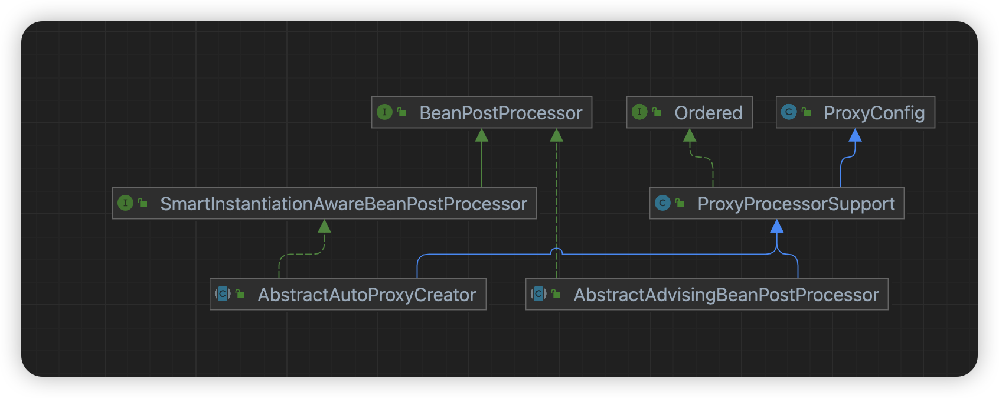
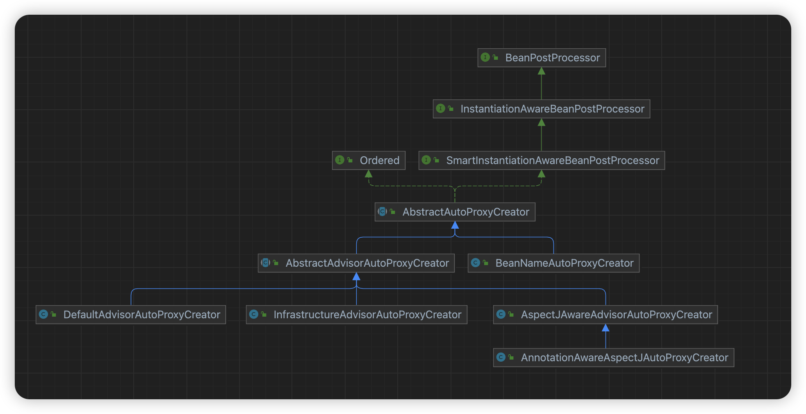

### 前言

代理的使用在Spring中是用的非常的多，如AOP、声明式事务(@Transactional)、异步任务(@Async)、缓存(@Cacheable，@CachePut，@CacheEvict)这些使用注解来增强逻辑的功能都是通过代理来实现的。那么Spring是何时来帮我们创建代理，怎样创建代理呢？

### 概述

众所周知，Spring创建代理时，底层有两种方式可选
- JDK动态代理
- CGLIB代理
默认情况下，**如果目标类有实现接口，则使用JDK动态代理技术来创建代理类，否则使用CGLIB技术来创建。** 
拿`@EnableTransactionManagement`开启事务注解类来举例，其他如`@EnableCaching`、`@EnableAsync`等开启缓存注解(`@Cacheable`)，开启异步任务注解(`@Async`)是一样的。

```java
public @interface EnableTransactionManagement {

    boolean proxyTargetClass() default false;

    AdviceMode mode() default AdviceMode.PROXY;

}
```

- proxyTargetClass属性用于控制使用哪种代理技术来创建代理类，默认为false，也就是使用JDK动态代理(目标没有实现接口，则转为CGLIB技术)。若指定为true，则直接使用CGLIB技术。
- mode属性是用于指定增强逻辑是采用**代理(PROXY)还是ASPECTJ**，若指定为**ASPECTJ**，则`proxyTargetClass`属性无效。
注: **ASPECTJ是使用字节码织入实现，会修改目标类的字节码文件，直接将增强逻辑插入到对应字节码文件中，需要使用特定的ajc编译器编译。**

### 开胃菜，自定义注解模拟添加缓存

相信如果使用AOP的一些注解来实现这个逻辑，基本上很多人都会写。但是如果不使用AOP那些注解呢，有人可能会想到`BeanPostProcessor`，没错就是它，但是我们只写增强逻辑，创建代理还是交给Spring自己来实现，创建代理的类其实就是一个`BeanPostProcessor`，Spring已经为我们写好了。

**我们只需要编写一个Advisor放入到容器中即可，Advisor包含了PointCut、Advise。是不是发现和AOP很像，只不过一个是接口，一个注解，想象就对了，毕竟AOP也是通过这套机制来实现的。**

- PointCut，切点，用于判断一个类是否需要使用本Advisor来增强。
- Advice，用于封装增强逻辑。
**PointCut和Advice就组成了Advisor，AOP中的@Aspect切面其实就是会被解释成一个Advisor。**

第一步，编写注解，用于标识哪个方法需要被增强

```java
@Retention(RetentionPolicy.RUNTIME)  
@Target(ElementType.METHOD)  
@Inherited  
@Documented  
public @interface MyCacheable {  
  
}
```

第二步，编写Advisor

```java
/**
 * 实现很简单，只要指定PointCut, Advice即可
 * 在不开启AOP时，Spring默认情况下只认识角色为BeanDefinition.ROLE_INFRASTRUCTURE的Advisor Bean
 */
@Slf4j
@Role(BeanDefinition.ROLE_INFRASTRUCTURE)
@Component
public class MyCacheAdvisor extends AbstractBeanFactoryPointcutAdvisor {

    private final Pointcut pointcut;

    public MyCacheAdvisor() {
        /*
         * 定义切点
         * 第一个参数为null，表示所有的类都符合
         * 第二参数为@MyCacheable，表示只有被@MyCacheable注解的方法符合条件
         * 第三个参数为true，表示会检查父类或者接口上的方法有没有指定的注解
         * 比如目标实现类方法没有加@MyCacheable注解，但是接口上的该方法有@MyCacheable注解，也是符合条件的。
         */
        this.pointcut = new AnnotationMatchingPointcut(null, MyCacheable.class, true);
        this.setAdvice(new MyCacheAdvice());
    }

    @NonNull
    @Override
    public Pointcut getPointcut() {
        return pointcut;
    }

    /**
     * MethodInterceptor继承了Advice接口
     */
    static class MyCacheAdvice implements MethodInterceptor {

        @Override
        public Object invoke(MethodInvocation invocation) throws Throwable {
            // 获取目标对象
            log.info("obj: {}", invocation.getThis());
            // 获取方法参数
            log.info("args: {}", Arrays.toString(invocation.getArguments()));
            // 执行目标方法
            Object result = invocation.proceed();
            // 模拟添加缓存
            log.info("put cache: {}", result);
            return result;
        }
    }

}
```

第三步，编写样例

```java
@Component  
public class MyCacheExample {  
  
    @MyCacheable  
    public String getById(Integer id) {  
        return "str-" + id;  
    }  
}
```

结果
```text
obj: com.wangtao.springboottest.mycache.MyCacheExample@3af58f76
args: [1]
put cache: str-1
str-1
```

### 原理解析

由于ASPECTJ增强模式用的很少，且需要特定的编译器(ajc)来编译，因此只分析PROXY模式。

先简单熟悉下一些关键的类或接口。

#### PointCut接口
简单来说就是用于判断目标类是否需要创建代理

```java
public interface Pointcut {  
  
    /**
     * 用于过滤类
     */
    ClassFilter getClassFilter();  
      
    /**
     * 类满足了再看有没有匹配的方法
     */
    MethodMatcher getMethodMatcher();  
      
    /**
     * 一个常量，表示所有情况都满足(排除掉那些失效场景，比如不是public方法，被final修饰(cglib))
     */  
    Pointcut TRUE = TruePointcut.INSTANCE;  
  
}
```

#### Advice接口
用于表示增强逻辑，有很多子接口，比如`MethodInterceptor`、`BeforeAdvice`、`AfterAdvice`等。

```java
/**
 * 顶层标记接口
 */
public interface Advice {  
  
}

/**
 * 比较灵活，目标方法由自己调用
 * Interceptor接口继承了Advice接口
 */
@FunctionalInterface  
public interface MethodInterceptor extends Interceptor {  

    /**
     * 增强逻辑
     * 可以拿到目标方法，目标对象，方法参数
     */
    Object invoke(MethodInvocation invocation) throws Throwable;  
}

/**
 * 前置通知，在目标方法执行之前执行
 */
public interface MethodBeforeAdvice extends BeforeAdvice {  
  
    void before(Method method, Object[] args, @Nullable Object target) throws Throwable;  
  
}

/**
 * 后置通知，子类实现又细分为目标方法执行成功后执行，还是执行发生异常时执行
 */
public interface AfterAdvice extends Advice {  
  
}
```

#### Advisor接口

可以简单理解为`PointCut`和`Advice`的组合，当目标方法满足条件后，使用其中对应的`Advice`来增强。

```java
public interface Advisor {

    /**
     * 空实现
     */
    Advice EMPTY_ADVICE = new Advice() {};

    /**
     * 获取Advice
     */
    Advice getAdvice();

   
    boolean isPerInstance();

}

public interface PointcutAdvisor extends Advisor {

    /**
     * 增加获取PointCut方法
     */
    Pointcut getPointcut();

}
```

#### 创建代理的BeanPostProcessor

Spring增强Bean通常都是通过`BeanPostProcessor`来实现的，也就是说创建代理的入口就是在这里，简要的继承体系如下图所示。


主要分为两大派系
- AbstractAutoProxyCreator，会**自动从容器**寻找符合条件的`Advise`或`Advisor`，可能存在**多个**。
- AbstractAdvisingBeanPostProcessor，需要自己指定，内部持有**一个**`Advisor`变量。

`ProxyConfig`是对创建代理的一些配置，如上文提到的`proxyTargetClass`、`exposeProxy`等。

#### AbstractAutoProxyCreator基类

该类是一个抽象基类，有好几个常用的子类实现，下面是它的一个继承体系图。

目前Spring用到的实现类主要是下面这两个。

- InfrastructureAdvisorAutoProxyCreator
- AnnotationAwareAspectJAutoProxyCreator

其中`AnnotationAwareAspectJAutoProxyCreator`几乎拥有`InfrastructureAdvisorAutoProxyCreator`所有的功能，除此之外，还扩展了AspectJ的一些注解，如`@Aspect`、`@PointCut`、`@Before`、`@After`、`@Around`等，会对这些注解注解的类进行代理增强。

**`@EnableAspectJAutoProxy`就是会自动注册`AnnotationAwareAspectJAutoProxyCreator`到容器中，用于支持Spring AOP注解切面编程。而`@EnableTransactionManagement`、`@EnableCaching`会自动注册`InfrastructureAdvisorAutoProxyCreator`用于增强方法逻辑。**

**`AnnotationAwareAspectJAutoProxyCreator`和`InfrastructureAdvisorAutoProxyCreator`自动注册时在容器中只能存在一个，并且`AnnotationAwareAspectJAutoProxyCreator`优先级更高，因为它的功能更全。**

**`AbstractAutoProxyCreator`封装了创建代理的逻辑，寻找`Advisor`的逻辑则交给子类来实现，比如从容器获取所有的`Advisor`，然后利用`Advisor`中的`PointCut`来和当前bean去匹配，挑出所有的符合的`Advisor`后，进行代理创建。**

#### AbstractAdvisingBeanPostProcessor基类

该类实现需要自己指定一个Advisor，而不会去容器中寻找，同时它没有实现`SmartInstantiationAwareBeanPostProcessor`接口，也就意味着**不支持循环依赖**。
`@EnableAsync`则是注册了一个`AsyncAnnotationBeanPostProcessor`用来创建代理，它便是`AbstractAdvisingBeanPostProcessor`的一个子类实现。异步任务使用它来实现可能是Spring团队不想异步任务bean也能循环依赖吧。

#### ProxyFactory类

该类就是用于创建代理，`AbstractAutoProxyCreator`或者`AbstractAdvisingBeanPostProcessor`内部就是使用它来创建代理的。由于创建代理分为JDK动态代理和CGLIB，于是便又有了`AopProxy`，它子类实现有`JdkDynamicAopProxy`、`ObjenesisCglibAopProxy`。

```java
public class ProxyFactory extends ProxyCreatorSupport {

    /**
     * 创建代理，根据proxyTargetClass来选择使用JDK还是CGLIB
     */
    public Object getProxy() {
        return createAopProxy().getProxy();
    }
}
```

```java
public class DefaultAopProxyFactory implements AopProxyFactory, Serializable {

    @Override
    public AopProxy createAopProxy(AdvisedSupport config) throws AopConfigException {
        if (config.isOptimize() || config.isProxyTargetClass() || hasNoUserSuppliedProxyInterfaces(config)) {
            Class<?> targetClass = config.getTargetClass();
            if (targetClass == null) {
                throw new AopConfigException("TargetSource cannot determine target class: " +
                        "Either an interface or a target is required for proxy creation.");
            }
            /*
             * 如果目标类是一个接口或者是一个JDK动态代理生成的类
             * 即便proxyTargetClass=true，依然使用JDK动态代理
             */
            if (targetClass.isInterface() || Proxy.isProxyClass(targetClass)) {
                return new JdkDynamicAopProxy(config);
            }
            return new ObjenesisCglibAopProxy(config);
        }
        else {
            return new JdkDynamicAopProxy(config);
        }
    }

}
```

#### 源码流程分析

通过`@EnableAspectJAutoProxy`、`@EnableTransactionManagement`、`@EnableAsync` 这3个注解来分析，为什么是这3个，前面两个都是自动创建代理(自动创建的代理类的`BeanPostProcessor`不同)，后面一个是手动创建，自己注册了一个别的`BeanPostProcessor`来创建代理，非` AbstractAutoProxyCreator`子类。

```java
@Target(ElementType.TYPE)
@Retention(RetentionPolicy.RUNTIME)
@Documented
@Import(AspectJAutoProxyRegistrar.class)
public @interface EnableAspectJAutoProxy {

    /**
     * 全局配置，是使用JDK动态代理还是CGLIB
     */
    boolean proxyTargetClass() default false;

    
    /**
     * 是否暴露代理对象到ThreadLocal中，可以通过AopContext.currentProxy()方法拿到代理对象
     * 比如一个类中有两个方法a, b。其中a方法调用b方法，此时调用b方法的对象是目标对象而不是代理对象，导致
     * b方法没有增强逻辑。此时在a方法中，则可以通过AopContext.currentProxy()拿到代理对象再去调用b方法
     */
    boolean exposeProxy() default false;
}
```

```java
class AspectJAutoProxyRegistrar implements ImportBeanDefinitionRegistrar {

    /**
     * 就是注册了AnnotationAwareAspectJAutoProxyCreator类
     */
    @Override
    public void registerBeanDefinitions(
            AnnotationMetadata importingClassMetadata, BeanDefinitionRegistry registry) {

        AopConfigUtils.registerAspectJAnnotationAutoProxyCreatorIfNecessary(registry);

        AnnotationAttributes enableAspectJAutoProxy =
                AnnotationConfigUtils.attributesFor(importingClassMetadata, EnableAspectJAutoProxy.class);
        if (enableAspectJAutoProxy != null) {
            // 设置proxyTargetClasss属性
            if (enableAspectJAutoProxy.getBoolean("proxyTargetClass")) {
                AopConfigUtils.forceAutoProxyCreatorToUseClassProxying(registry);
            }
            // 设置exposeProxy属性
            if (enableAspectJAutoProxy.getBoolean("exposeProxy")) {
                AopConfigUtils.forceAutoProxyCreatorToExposeProxy(registry);
            }
        }
    }

}
```

再看`@EnableTransactionManagement`

```java
@Target(ElementType.TYPE)
@Retention(RetentionPolicy.RUNTIME)
@Documented
@Import(TransactionManagementConfigurationSelector.class)
public @interface EnableTransactionManagement {

    /**
     * 不再赘述
     */
    boolean proxyTargetClass() default false;

    
    /**
     * 增强模式, PROXY还是ASPECTJ
     */    
    AdviceMode mode() default AdviceMode.PROXY;

}
```

```java
public class TransactionManagementConfigurationSelector extends AdviceModeImportSelector<EnableTransactionManagement> {

    
    /**
     * 1. 注册了AutoProxyRegistrar, 而AutoProxyRegistrar又注册了InfrastructureAdvisorAutoProxyCreator
     * 2. 注册了ProxyTransactionManagementConfiguration，该类主要注册了一个Advisor
     *    通过前面铺垫我们知道InfrastructureAdvisorAutoProxyCreator是从容器中拿Advisor
     *    创建代理，增强方法逻辑的
     */
    @Override
    protected String[] selectImports(AdviceMode adviceMode) {
        switch (adviceMode) {
            case PROXY:
                return new String[] {AutoProxyRegistrar.class.getName(),
                        ProxyTransactionManagementConfiguration.class.getName()};
            case ASPECTJ:
                return new String[] {determineTransactionAspectClass()};
            default:
                return null;
        }
    }

}
```

**如果多个注册同时存在，只会保留`AnnotationAwareAspectJAutoProxyCreator`，并且`proxyTargetClass`、`exposeProxy`的值原先为false，后面为true才会发生属性值的覆盖。**

具体看
```java
public abstract class AopConfigUtils {

    @Nullable
    public static BeanDefinition registerAutoProxyCreatorIfNecessary(BeanDefinitionRegistry registry) {
        return registerAutoProxyCreatorIfNecessary(registry, null);
    }

    @Nullable
    public static BeanDefinition registerAspectJAutoProxyCreatorIfNecessary(BeanDefinitionRegistry registry) {
        return registerAspectJAutoProxyCreatorIfNecessary(registry, null);
    }

    /**
     * 覆盖proxyTargetClass属性
     */
    public static void forceAutoProxyCreatorToUseClassProxying(BeanDefinitionRegistry registry) {
        if (registry.containsBeanDefinition(AUTO_PROXY_CREATOR_BEAN_NAME)) {
            BeanDefinition definition = registry.getBeanDefinition(AUTO_PROXY_CREATOR_BEAN_NAME);
            definition.getPropertyValues().add("proxyTargetClass", Boolean.TRUE);
        }
    }

    
    /**
     * 覆盖exposeProxy属性
     */
    public static void forceAutoProxyCreatorToExposeProxy(BeanDefinitionRegistry registry) {
        if (registry.containsBeanDefinition(AUTO_PROXY_CREATOR_BEAN_NAME)) {
            BeanDefinition definition = registry.getBeanDefinition(AUTO_PROXY_CREATOR_BEAN_NAME);
            definition.getPropertyValues().add("exposeProxy", Boolean.TRUE);
        }
    }

    @Nullable
    private static BeanDefinition registerOrEscalateApcAsRequired(
            Class<?> cls, BeanDefinitionRegistry registry, @Nullable Object source) {

        Assert.notNull(registry, "BeanDefinitionRegistry must not be null");

        // 如果bean已经存在
        if (registry.containsBeanDefinition(AUTO_PROXY_CREATOR_BEAN_NAME)) {
            BeanDefinition apcDefinition = registry.getBeanDefinition(AUTO_PROXY_CREATOR_BEAN_NAME);
            // 并且类名不一样, 使用优先级更高的替换掉(优先级通过数组下标比较)
            if (!cls.getName().equals(apcDefinition.getBeanClassName())) {
                int currentPriority = findPriorityForClass(apcDefinition.getBeanClassName());
                int requiredPriority = findPriorityForClass(cls);
                if (currentPriority < requiredPriority) {
                    apcDefinition.setBeanClassName(cls.getName());
                }
            }
            return null;
        }

        RootBeanDefinition beanDefinition = new RootBeanDefinition(cls);
        beanDefinition.setSource(source);
        beanDefinition.getPropertyValues().add("order", Ordered.HIGHEST_PRECEDENCE);
        beanDefinition.setRole(BeanDefinition.ROLE_INFRASTRUCTURE);
        registry.registerBeanDefinition(AUTO_PROXY_CREATOR_BEAN_NAME, beanDefinition);
        return beanDefinition;
    }

}
```

最后是`@EnableAsync`

```java
@Target(ElementType.TYPE)
@Retention(RetentionPolicy.RUNTIME)
@Documented
@Import(AsyncConfigurationSelector.class)
public @interface EnableAsync {
    
    /**
     * 指定要拦截的注解, 默认是@Async
     */
    Class<? extends Annotation> annotation() default Annotation.class;

   
    boolean proxyTargetClass() default false;

    
    AdviceMode mode() default AdviceMode.PROXY;

}

```

```java

public class AsyncConfigurationSelector extends AdviceModeImportSelector<EnableAsync> {

    private static final String ASYNC_EXECUTION_ASPECT_CONFIGURATION_CLASS_NAME =
            "org.springframework.scheduling.aspectj.AspectJAsyncConfiguration";


    /**
     * 注册了ProxyAsyncConfiguration, 而它又注册了AsyncAnnotationBeanPostProcessor
     */
    @Override
    @Nullable
    public String[] selectImports(AdviceMode adviceMode) {
        switch (adviceMode) {
            case PROXY:
                return new String[] {ProxyAsyncConfiguration.class.getName()};
            case ASPECTJ:
                return new String[] {ASYNC_EXECUTION_ASPECT_CONFIGURATION_CLASS_NAME};
            default:
                return null;
        }
    }

}
```

通过这3个注解注册的东西，可以总结下规律。

- `@EnableAspectJAutoProxy`仅仅注册了`AnnotationAwareAspectJAutoProxyCreator`，并没有注册`Advisor`，很好理解，因为Spring AOP需要我们自己写切面，实现增强逻辑。`@Aspect`其实就是相当于`Advisor`，是由用户注册到容器的。
- `@EnableTransactionManagement`不仅注册了`InfrastructureAdvisorAutoProxyCreator`，还注册了自己的`Advisor`。
- `@EnableAsync`仅仅注册了`AsyncAnnotationBeanPostProcessor`，用于创建自己的代理，当然了这个类内部自己设置了自己所需要的`Advisor`，而没有把`Advisor`注册到容器中，因为如果把Advisor注册到容器中，**则会重复代理**，不管是`AnnotationAwareAspectJAutoProxyCreator`还是`InfrastructureAdvisorAutoProxyCreator`都会从容器中获取`Advisor`。**这几个BeanPostProcessor创建代理的底层是一样的，都是通过ProxyFactory实现。**
- `@EnableAsync`为啥选择使用`AsyncAnnotationBeanPostProcessor`而不是`AbstractAutoProxyCreator`的子类，**我想是Spring团队不希望异步任务bean发生循环依赖吧。**`AsyncAnnotationBeanPostProcessor`没有实现`SmartInstantiationAwareBeanPostProcessor`接口。

**因此如果想要Spring为我们创建代理，最简单的方式就是编写一个Advisor注册到容器即可。**

最后来分析下最重要的`AbstractAutoProxyCreator`，毫无疑问从`BeanPostProcessor`的钩子方法入手。

```java
@Override
public Object postProcessAfterInitialization(@Nullable Object bean, String beanName) {
    if (bean != null) {
        Object cacheKey = getCacheKey(bean.getClass(), beanName);
        /*
         * 如果当前bean发生了循环依赖，即getEarlyBeanReference方法会调用
         * 直接返回，不再重复创建代理。getEarlyBeanReference方法内部也
         * 调用了wrapIfNecessary方法
         *
         * 注: 这里的bean还是目标对象，不是代理对象，发生循环依赖，getBean方法
         * 会直接从二级缓存拿到代理对象，然后放到容器中。 
         * 可参见AbstractAutowireCapableBeanFactory.doCreateBean方法
         */
        if (this.earlyProxyReferences.remove(cacheKey) != bean) {
            return wrapIfNecessary(bean, beanName, cacheKey);
        }
    }
    return bean;
}
```

```java
protected Object wrapIfNecessary(Object bean, String beanName, Object cacheKey) {
    if (StringUtils.hasLength(beanName) && this.targetSourcedBeans.contains(beanName)) {
        return bean;
    }
    if (Boolean.FALSE.equals(this.advisedBeans.get(cacheKey))) {
        return bean;
    }
    if (isInfrastructureClass(bean.getClass()) || shouldSkip(bean.getClass(), beanName)) {
        this.advisedBeans.put(cacheKey, Boolean.FALSE);
        return bean;
    }

    // 寻找advice，由子类实现
    Object[] specificInterceptors = getAdvicesAndAdvisorsForBean(bean.getClass(), beanName, null);
    if (specificInterceptors != DO_NOT_PROXY) {
        this.advisedBeans.put(cacheKey, Boolean.TRUE);
        // 创建代理
        Object proxy = createProxy(
                bean.getClass(), beanName, specificInterceptors, new SingletonTargetSource(bean));
        this.proxyTypes.put(cacheKey, proxy.getClass());
        return proxy;
    }

    this.advisedBeans.put(cacheKey, Boolean.FALSE);
    return bean;
}
```

```java
protected Object createProxy(Class<?> beanClass, @Nullable String beanName,
            @Nullable Object[] specificInterceptors, TargetSource targetSource) {

    if (this.beanFactory instanceof ConfigurableListableBeanFactory) {
        AutoProxyUtils.exposeTargetClass((ConfigurableListableBeanFactory) this.beanFactory, beanName, beanClass);
    }

    // 每次的创建一个新的实例
    ProxyFactory proxyFactory = new ProxyFactory();
    // 复制全局的属性, 如proxyTargetClass、exposeProxy
    proxyFactory.copyFrom(this);

    // 如果是JDK动态代理，则检查有没有实现接口，若没有，强制实现CGLIB
    if (!proxyFactory.isProxyTargetClass()) {
        if (shouldProxyTargetClass(beanClass, beanName)) {
            proxyFactory.setProxyTargetClass(true);
        }
        else {
            // 添加接口到ProxyFactory中
            evaluateProxyInterfaces(beanClass, proxyFactory);
        }
    }

    Advisor[] advisors = buildAdvisors(beanName, specificInterceptors);
    // 添加advisor
    proxyFactory.addAdvisors(advisors);
    proxyFactory.setTargetSource(targetSource);
    customizeProxyFactory(proxyFactory);

    proxyFactory.setFrozen(this.freezeProxy);
    if (advisorsPreFiltered()) {
        proxyFactory.setPreFiltered(true);
    }
    // 返回代理对象
    return proxyFactory.getProxy(getProxyClassLoader());
}

```

子类AbstractAdvisorAutoProxyCreator.java
```java
@Override
@Nullable
protected Object[] getAdvicesAndAdvisorsForBean(
        Class<?> beanClass, String beanName, @Nullable TargetSource targetSource) {
    // 寻找满足条件的advisor，因为advisor里就有advice
    List<Advisor> advisors = findEligibleAdvisors(beanClass, beanName);
    if (advisors.isEmpty()) {
        return DO_NOT_PROXY;
    }
    return advisors.toArray();
}

protected List<Advisor> findEligibleAdvisors(Class<?> beanClass, String beanName) {
    
    // 候选者, 仅仅只是第一步筛选(从容器中获取advisor)
    List<Advisor> candidateAdvisors = findCandidateAdvisors();
    /*
     * 将这些候选者与当前创建的bean进行匹配，挑选出符合条件的advisor
     * 这里会把Advisor分类，有PointCut，则使用PointCut筛选
     */
    List<Advisor> eligibleAdvisors = findAdvisorsThatCanApply(candidateAdvisors, beanClass, beanName);
    extendAdvisors(eligibleAdvisors);
    if (!eligibleAdvisors.isEmpty()) {
        eligibleAdvisors = sortAdvisors(eligibleAdvisors);
    }
    return eligibleAdvisors;
}
```

**而`AnnotationAwareAspectJAutoProxyCreator`和`InfrastructureAdvisorAutoProxyCreator`都是`AbstractAdvisorAutoProxyCreator`的子类，仅仅扩展了挑选Advisor的条件罢了。**

- InfrastructureAdvisorAutoProxyCreator，只需要容器中role为`BeanDefinition.ROLE_INFRASTRUCTURE`的`Advisor`。
- AnnotationAwareAspectJAutoProxyCreator，除了容器中的`Advisor`，还会把`@Aspect`注解的bean上面的关于AspectJ的注解信息解析成`Advisor`。不过它不要求`Advisor`的role为`BeanDefinition.ROLE_INFRASTRUCTURE`。

### 总结

- 如果想要Spring为我们创建代理，最简单的方式就是编写一个Advisor注册到容器即可。
- Spring**自动创建代理**的基类为`AbstractAutoProxyCreator`，它下面有两个实现，分别为`InfrastructureAdvisorAutoProxyCreator`、`AnnotationAwareAspectJAutoProxyCreator`。后者拥有前者的功能，如果应用中有开启AOP，即使用了`@EnableAspectJAutoProxy`，Spring Boot中如果引入了`spring-boot-starter-aop`，则自动开启AOP，那么**自动创建代理**的类就是`AnnotationAwareAspectJAutoProxyCreator`，它支持把`@Aspect注解`解析成`Advisor`。
- 何为自动创建代理，简单理解成自动从容器中寻找`Advice`（`Advisor`中就有`Advice`)，然后帮应用创建代理对象。即`AbstractAutoProxyCreator`的子类实现。
- Spring中也有不用`AbstractAutoProxyCreator`去创建代理的功能，而是使用别的`BeanPostProcessor`去创建代理类，比如`@EnableAsync`。如果使用这种方式，就不要把Advisor注册到容器里，否则会和`AbstractAutoProxyCreator`冲突，重复创建代理。
- Spring创建的代理对象都会实现`Advised`接口，从这个接口我们可以获取到目标对象。`getTargetSource`方法，或者直接通过工具类`AopProxyUtils.getSingletonTarget(proxy)`获取。

**一些注意的点**
- Spring中的AOP实现仅仅只是使用了AspectJ的一些注解，如`@Aspect`、`@PointCut`、`@Before`、`@After`、`@Around`等，并没有使用AspectJ的字节码织入，而是采用动态代理(JDK、CGLIB)来增强。
- 只有通过`AbstractAutoProxyCreator`，严谨的说是`SmartInstantiationAwareBeanPostProcessor`接口的实现增强的bean才支持循环依赖，因为Spring在解决循环依赖时使用了该接口的`getEarlyBeanReference`方法获取代理类。而`AbstractAutoProxyCreator`实现了`SmartInstantiationAwareBeanPostProcessor`。这里举个例子，就是`EnableAsync`注解支持的异步任务增强bean就不支持循环依赖，容器启动时会发生错误，因为异步任务不是通过`AbstractAutoProxyCreator`增强的，而是另外的`BeanPostProcessor`。