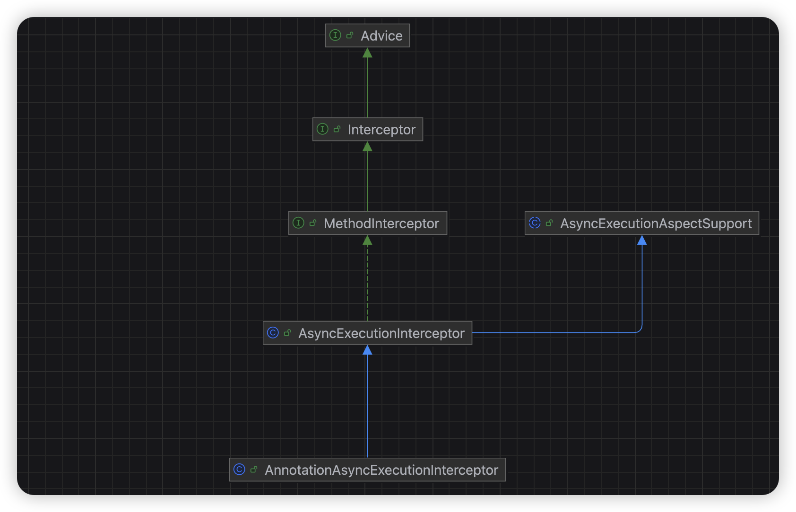

## 1 异步任务（`@Async`）

### 1.1 启用注解

Spring 的异步不是「装上就能用」的，需要先打开 `@EnableAsync` 开关，否则 `@Async` 会被当作普通注解直接忽略，通常放到启动类中。

```java
@EnableAsync
@SpringBootApplication
public class Application {

    public static void main(String[] args) {
        SpringApplication.run(pplication.class, args);
    }

}
```

`@EnableAsync` 读起来像配置项，但本质是 `@Import` 导入了一组基础设施 bean。关键路径：

```tex
@EnableAsync
  → @Import(AsyncConfigurationSelector.class)
        (mode=PROXY) → ProxyAsyncConfiguration
        (mode=ASPECTJ) → AspectJAsyncConfiguration
```

最终注册 `AsyncAnnotationBeanPostProcessor`，对 `@Async` 方法生成 AOP 代理。

`@EnableAsync` 的两个参数：

```java
@EnableAsync(proxyTargetClass = false, mode = AdviceMode.PROXY)
```

- `mode = AdviceMode.PROXY`（默认）：基于 Spring AOP 代理，**只能代理 public 方法且只能通过外部调用生效**。
- `mode = AdviceMode.ASPECTJ`：需要 `aspectjweaver`，编译期/加载期织入，可绕过自调用限制。

绝大多数项目用默认 PROXY 模式即可。

### 1.2 自动配置类

Spring Boot 在 `org.springframework.boot.autoconfigure.task` 包下提供 `TaskExecutionAutoConfiguration`，专门服务 `@Async`。

绑定属性前缀：`spring.task.execution` → `TaskExecutionProperties`。

```java
@ConditionalOnClass(ThreadPoolTaskExecutor.class)
@AutoConfiguration
@EnableConfigurationProperties(TaskExecutionProperties.class)
public class TaskExecutionAutoConfiguration {

    /**
     * Bean name of the application {@link TaskExecutor}.
     */
    public static final String APPLICATION_TASK_EXECUTOR_BEAN_NAME = "applicationTaskExecutor";

    @Bean
    @ConditionalOnMissingBean
    public TaskExecutorBuilder taskExecutorBuilder(TaskExecutionProperties properties,
            ObjectProvider<TaskExecutorCustomizer> taskExecutorCustomizers,
            ObjectProvider<TaskDecorator> taskDecorator) {
        TaskExecutionProperties.Pool pool = properties.getPool();
        TaskExecutorBuilder builder = new TaskExecutorBuilder();
        builder = builder.queueCapacity(pool.getQueueCapacity());
        builder = builder.corePoolSize(pool.getCoreSize());
        builder = builder.maxPoolSize(pool.getMaxSize());
        builder = builder.allowCoreThreadTimeOut(pool.isAllowCoreThreadTimeout());
        builder = builder.keepAlive(pool.getKeepAlive());
        Shutdown shutdown = properties.getShutdown();
        builder = builder.awaitTermination(shutdown.isAwaitTermination());
        builder = builder.awaitTerminationPeriod(shutdown.getAwaitTerminationPeriod());
        builder = builder.threadNamePrefix(properties.getThreadNamePrefix());
        builder = builder.customizers(taskExecutorCustomizers.orderedStream()::iterator);
        builder = builder.taskDecorator(taskDecorator.getIfUnique());
        return builder;
    }

    @Lazy
    @Bean(name = { APPLICATION_TASK_EXECUTOR_BEAN_NAME,
            AsyncAnnotationBeanPostProcessor.DEFAULT_TASK_EXECUTOR_BEAN_NAME })
    @ConditionalOnMissingBean(Executor.class)
    public ThreadPoolTaskExecutor applicationTaskExecutor(TaskExecutorBuilder builder) {
        return builder.build();
    }

}
```

**可见只要容器中有一个Executor实例存在，那么就不会注册这个默认的ThreadPoolTaskExecutor**

默认属性值速查：

```yaml
spring:
  task:
    execution:
      thread-name-prefix: task-       # 默认前缀
      pool:
        core-size: 8                  # 核心线程数默认 8
        max-size: Integer.MAX_VALUE
        queue-capacity: Integer.MAX_VALUE  # 无界队列 
        keep-alive: 60s
```

> 核心事故源：异步默认**无界 `LinkedBlockingQueue`**，导致max-size无用

### 1.3 TaskExecutor接口

`TaskExecutor` 是 Spring 框架定义的**异步任务执行器抽象接口**，它直接继承自 JDK 的 `java.util.concurrent.Executor`，因此本质上就是一个 **Executor**。

#### 与 JDK Executor 的关系

- **完全兼容**：`TaskExecutor` 就是一个 `Executor`，可被任何接受 `Executor` 的 API 直接使用。
- **语义增强**：Spring 为它赋予了“面向异步任务处理”的语义，并结合 Spring 的 `@Async`、监听器、消息驱动等特性深度集成。
- **指标监控**：引入`spring-boot-starter-actuator`，可以监控`ThreadPoolTaskExecutor`运行情况。

最常用的实现为`ThreadPoolTaskExecutor`，内部包装了JDK的`ThreadPoolExecutor`。

### 1.4 代理切面继承关系图



### 1.5 异步任务执行器寻找逻辑

当方法被 `@Async` 代理后，`AnnotationAsyncExecutionInterceptor.invoke()` （继承自`AsyncExecutionInterceptor`）会决定用哪个 `Executor`。内部有一个`determineAsyncExecutor`方法，就是用来挑选执行器的。

顺序为：

1. **`@Async("xxx")` 显式指定** → 用名字为 `xxx` 的 `Executor`  bean。找不到直接抛 `NoUniqueBeanDefinitionException`。

2. **未指定，则使用默认的线程池，默认的线程池初始化逻辑如下，位于AsyncExecutionAspectSupport构造方法以及getDefaultExecutor()中**

   2.1 若`AnnotationAsyncExecutionInterceptor`初始化时指定了Executor，用它。这个可由`AsyncConfigurer`接口配置，使用`AnnotationAsyncExecutionInterceptor.configure`来设置。

   2.2 容器中存在唯一一个 `TaskExecutor`，用它。若没有，但是存在一个beanName为`taskExecutor`的`Executor`，使用它。

   2.3 容器中存在多个`TaskExecutor`时，找beanName为`taskExecutor`的`Executor`。

   2.3 以上都没有命中时，退化成`SimpleAsyncTaskExecutor`，**这个TaskExecutor每次调用都会新建线程，不复用。**这段兜底逻辑位于`AsyncExecutionInterceptor.getDefaultExecutor`，它重写了`AsyncExecutionAspectSupport.getDefaultExecutor`，增加了一个`SimpleAsyncTaskExecutor`兜底逻辑。

**注1: 从上面查找线程池的逻辑不难看出，这里有一个大坑，如果用户有在容器中定义`Executor`，那么会导致Spring Boot自动装配的`ThreadPoolTaskExecutor`失效，如果此时用户自己也没有定义一个`ThreadPoolTaskExecutor`或者一个beanName为`taskExecutor`的`Executor`，那么就直接使用这个`SimpleAsyncTaskExecutor`兜底执行器了，那是大灾难。**

**注2：Spring的设计哲学，如果有唯一的`TaskExecutor`，那么可以使用，如果只是`Executor`，则必须名为`TaskExecutor`，毕竟Executor是Jdk的标准，用户可能会拿它执行业务逻辑，和异步任务混在一起就不好了。**

**最佳实践自己注入一个名为taskExecutor的 ThreadPoolTaskExecutor，且通过TaskExecutorBuilder去创建，这样可利用application.yml中的配置。这样能避免Spring Boot自动装配的ThreadPoolTaskExecutor没有生效时也有一个兜底的名为taskExecutor的ThreadPoolExecutor。**

```java
@Configuration
public class TaskExecutorConfig {

    @Bean(AsyncAnnotationBeanPostProcessor.DEFAULT_TASK_EXECUTOR_BEAN_NAME)
    public ThreadPoolTaskExecutor taskExecutor(TaskExecutorBuilder builder) {

        ThreadPoolTaskExecutor taskExecutor = builder.build();
        // 其它配置(无法通过配置文件进行的配置)
        return taskExecutor;
    }
}
```

### 1.6 异常处理和结果返回

AsyncExecutionInterceptor.java

```java
public Object invoke(final MethodInvocation invocation) throws Throwable {
    Class<?> targetClass = (invocation.getThis() != null ? AopUtils.getTargetClass(invocation.getThis()) : null);
    Method specificMethod = ClassUtils.getMostSpecificMethod(invocation.getMethod(), targetClass);
    final Method userDeclaredMethod = BridgeMethodResolver.findBridgedMethod(specificMethod);

    AsyncTaskExecutor executor = determineAsyncExecutor(userDeclaredMethod);
    if (executor == null) {
        throw new IllegalStateException(
                "No executor specified and no default executor set on AsyncExecutionInterceptor either");
    }

    Callable<Object> task = () -> {
        try {
            Object result = invocation.proceed();
            if (result instanceof Future) {
                return ((Future<?>) result).get();
            }
        }
        // 异常处理
        catch (ExecutionException ex) {
            handleError(ex.getCause(), userDeclaredMethod, invocation.getArguments());
        }
        catch (Throwable ex) {
            handleError(ex, userDeclaredMethod, invocation.getArguments());
        }
        return null;
    };

    return doSubmit(task, executor, invocation.getMethod().getReturnType());
}

protected void handleError(Throwable ex, Method method, Object... params) throws Exception {
    if (Future.class.isAssignableFrom(method.getReturnType())) {
        ReflectionUtils.rethrowException(ex);
    }
    else {
        // Could not transmit the exception to the caller with default executor
        try {
            this.exceptionHandler.obtain().handleUncaughtException(ex, method, params);
        }
        catch (Throwable ex2) {
            logger.warn("Exception handler for async method '" + method.toGenericString() +
                    "' threw unexpected exception itself", ex2);
        }
    }
}
```


- `@Async` **返回 `void` 的方法**：抛出异常会被 `AsyncUncaughtExceptionHandler` 处理，默认实现为`SimpleAsyncUncaughtExceptionHandler`，会打印错误日志。**此情况是无论如何异常也无法返回给调用线程，无报错情况时结果也会被吞掉。**
- `@Async` 返回 `Future`：异常被包装进 `Future`，`get()` 时才抛 `ExecutionException`。正常结果也会随着get方法返回给调用方。

**因此如果需要结果，@Async标注的异步方法一定要返回一个Future，并且调用方通过get()方法拿到结果或者异常信息。**

**最致命的问题就是，异步方法返回Future，但是调用方没有调用get方法，那么执行异常时，异常就会被吞掉了，日志中也不会有任务异常信息。**

### 1.7 扩展点

按「修改自动配置构建出的线程池」与「完全接管」两层理解。

| 扩展点                             | 作用                                                         | 何时用                                                       |
| ---------------------------------- | ------------------------------------------------------------ | ------------------------------------------------------------ |
| `AsyncConfigurer`                  | 提供 `getAsyncExecutor()` 与 `getAsyncUncaughtExceptionHandler()` | 设置`AnnotationAsyncExecutionInterceptor`的`Executor`、以及`AsyncUncaughtExceptionHandler` |
| `@Async("xxx")`                    | 指定单个方法使用的池                                         | 多池场景精确控制                                             |
| `ThreadPoolTaskExecutorCustomizer` | 在 Builder 构出 executor 之前做最后微调                      | 一些属性没有暴露出配置时，可通过该接口拿到build出来的`ThreadPoolTaskExecutor`来进行精细化配置 |
| `TaskDecorator`                    | 包装每个 `Runnable`，可塞 MDC / TraceContext / SecurityContext | 跨线程上下文传递                                             |

### 1.8 Actuator 指标

只要引入了 `spring-boot-starter-actuator`，Spring Boot 会自动给容器中类型为 `org.springframework.scheduling.concurrent.ThreadPoolTaskExecutor` 的 bean 打点：
- 指标名：`executor.*`（active、completed、queued、queueRemaining、poolSize 等）
- **tag 是 bean 的 name**，所以自定义线程池记得给一个有意义的 bean 名。

通过/actuator/metrics端点查看所有的指标名称

通过/actuator/metrics/executor.pool.core查看具体某一个指标的值(所有的tag)

通过/actuator/metrics/executor.pool.core?tag=name:taskExecutor查看具体某一个指标指定tag的值

需要暴露/actuator/metrics端点

```yml
management:
  endpoints:
    web:
      exposure:
        include: metrics
```

### 1.9 容易踩的坑

#### 坑 1：自调用失效

```java
@Service
public class OrderService {
    public void place() {
        this.sendNotice();        // 不异步！走的是原始对象，不经过代理
    }
    @Async
    public void sendNotice() { ... }
}
```

原因：`@Async` 基于 AOP 代理，`this.sendNotice()` 不走代理切面。同类问题也适用于事务、`@Cacheable`、`@Transactional`。

对策：
- 把 `@Async` 方法拆到另一个 bean，互相注入调用；
- 或注入自身代理：`@Autowired private OrderService self;` 然后 `self.sendNotice()`；
- 改用 `AsyncAspectJ` 模式（编译/加载织入）。

#### 坑 2：`private` / `static` 方法静默不生效

- `private` 方法无法被代理（子类/接口代理都进不去）；
- `static` 方法不在 Spring 容器实例维度；
- 直接被 `final`/`private` 修饰的方法上加 `@Async` 不会报错，但**静默不生效**，非常难排查。

对策：保持 `@Async` 方法是 `public`、非 `final`、非 `static`、且不直接被同类方法调用。

#### 坑 3：默认无界队列

`spring.task.execution.pool.queue-capacity` 默认 `Integer.MAX_VALUE`，意味着：

- 任务积压全塞进 `LinkedBlockingQueue`，**永远不会扩容到 maxPoolSize**；
- 队列无限增长 → OOM；
- JVM 看着很「稳」，但请求实际上在排队，超时不可控、堆积可能打挂系统。

对策：明确设置 `queue-capacity`，让池在队列满后扩容到 `max-size`，再饱和则走拒绝策略。

```yaml
spring:
  task:
    execution:
      pool:
        core-size: 8
        max-size: 64
        queue-capacity: 200
        keep-alive: 60s
```

#### 坑 4：默认拒绝策略是 `AbortPolicy`

当设置有界队列且达到 `maxSize` 后，新任务触发 `RejectedExecutionException`。很多业务场景希望「丢回调用方等」或「记日志降级」，但 Spring 默认沿用 JDK 的 `AbortPolicy`。

对策：自定义 `ThreadPoolTaskExecutor`（直接 new 或用 `ThreadPoolTaskExecutorCustomizer`）设置 `setRejectedExecutionHandler(...)`，例如 CallerRunsPolicy、DiscardOldestPolicy。

#### 坑 5：异常或者结果被吞

见异常处理和结果返回章节

## 2 定时任务（`@Scheduled`）

###  2.1 启用注解

`@Scheduled` 同样需要先开 `@EnableScheduling`，否则注解被忽略。

```java
@EnableScheduling
@SpringBootApplication
public class Application {

    public static void main(String[] args) {
        SpringApplication.run(pplication.class, args);
    }
}
```

`@EnableScheduling` 通过 `@Import(SchedulingConfiguration.class)` 注册 `ScheduledAnnotationBeanPostProcessor`，它负责扫描容器里所有 `@Scheduled` 方法并注册到 `ScheduledTaskRegistrar`，最终由 `TaskScheduler` 执行。

### 2.2 自动配置类

`TaskSchedulingAutoConfiguration` 专门服务 `@Scheduled`。绑定属性前缀：`spring.task.scheduling` → `TaskSchedulingProperties`。

```java
@ConditionalOnClass(ThreadPoolTaskScheduler.class)
@AutoConfiguration(after = TaskExecutionAutoConfiguration.class)
@EnableConfigurationProperties(TaskSchedulingProperties.class)
public class TaskSchedulingAutoConfiguration {

	@Bean
	@ConditionalOnBean(name = TaskManagementConfigUtils.SCHEDULED_ANNOTATION_PROCESSOR_BEAN_NAME)
	@ConditionalOnMissingBean({ SchedulingConfigurer.class, TaskScheduler.class, ScheduledExecutorService.class })
	public ThreadPoolTaskScheduler taskScheduler(TaskSchedulerBuilder builder) {
		return builder.build();
	}

	@Bean
	@ConditionalOnBean(name = TaskManagementConfigUtils.SCHEDULED_ANNOTATION_PROCESSOR_BEAN_NAME)
	public static LazyInitializationExcludeFilter scheduledBeanLazyInitializationExcludeFilter() {
		return new ScheduledBeanLazyInitializationExcludeFilter();
	}

	@Bean
	@ConditionalOnMissingBean
	public TaskSchedulerBuilder taskSchedulerBuilder(TaskSchedulingProperties properties,
			ObjectProvider<TaskSchedulerCustomizer> taskSchedulerCustomizers) {
		TaskSchedulerBuilder builder = new TaskSchedulerBuilder();
		builder = builder.poolSize(properties.getPool().getSize());
		Shutdown shutdown = properties.getShutdown();
		builder = builder.awaitTermination(shutdown.isAwaitTermination());
		builder = builder.awaitTerminationPeriod(shutdown.getAwaitTerminationPeriod());
		builder = builder.threadNamePrefix(properties.getThreadNamePrefix());
		builder = builder.customizers(taskSchedulerCustomizers);
		return builder;
	}

}
```

可以看到
- 只要容器中存在`SchedulingConfigurer`、 `TaskScheduler`、 `ScheduledExecutorService`实例，那么便不会自动装配`ThreadPoolTaskScheduler`。
- 默认产出 bean 名为 `taskScheduler`。

默认属性值速查：

```java
public class TaskSchedulingProperties {
    private String threadNamePrefix = "scheduling-";   // 默认前缀
    public static class Pool {
        private int size = 1;   // 默认调度线程池大小只有 1
    }
    
    public static class Shutdown {
        private boolean awaitTermination;
        private @Nullable Duration awaitTerminationPeriod;
    }
}
```

> 核心事故源：定时默认**单线程**。

### 2.3 TaskScheduler接口

`TaskScheduler` 是 Spring 框架中用于任务调度的核心接口，自 Spring 3.0 起引入。它提供了一套与具体实现（如 JDK 的 `ScheduledExecutorService`）解耦的抽象，用于在未来的某个时间点或按照特定规则（如固定频率、Cron 表达式）执行任务。

#### 常用方法

| 方法分类            | 方法签名                                            | 说明                                                         |
| :------------------ | :-------------------------------------------------- | :----------------------------------------------------------- |
| **一次性调度**      | `schedule(Runnable task, Date startTime)`           | 在指定的时间点执行一次任务。                                 |
| **基于Trigger调度** | `schedule(Runnable task, Trigger trigger)`          | 通过 `Trigger` 对象（如 `CronTrigger`）来灵活定义任务的执行规则。 |
| **固定速率调度**    | `scheduleAtFixedRate(Runnable task, long period)`   | 任务启动后，以**固定频率**执行，不考虑上次任务是否完成。     |
| **固定延迟调度**    | `scheduleWithFixedDelay(Runnable task, long delay)` | 任务启动后，**每次执行完成后**，等待指定的延迟时间再开始下一次。 |

这些方法都会返回一个 `ScheduledFuture` 对象，可以用它来取消任务或检查任务状态。

#### 主要实现类

Spring 提供了几个开箱即用的实现，其中最常用的是 `ThreadPoolTaskScheduler`。

- **`ThreadPoolTaskScheduler`（最常用）**：这是官方推荐的默认实现。它包装了 JDK 的 `ScheduledThreadPoolExecutor`，提供了丰富的线程池配置选项（如核心池大小、队列容量等），非常适用于生产环境。
- **`ConcurrentTaskScheduler`**：一个适配器，可以将任意的 `ScheduledExecutorService` 包装成 Spring 的 `TaskScheduler`。当你已有或需要更细粒度控制 JDK 线程池时，可以使用它。
- **`SimpleAsyncTaskScheduler`**：一个简单的实现。它不会复用线程，每个任务都在新线程中执行。通常用于测试或非常简单的场景。

### 2.3 调度器寻找逻辑

`@Scheduled` 方法最终被注册到 `ScheduledTaskRegistrar`，由它驱动 `TaskScheduler` 执行。也就是看如何给`ScheduledTaskRegistrar`中的`taskScheduler`属性赋值。

赋值逻辑位于`ScheduledAnnotationBeanPostProcessor`的`finishRegistration`方法中。

1. 直接取`ScheduledAnnotationBeanPostProcessor`自身的`scheduler`，自动装配时创建`ScheduledAnnotationBeanPostProcessor`未指定`scheduler`，这一步相当于无效。

2. 直接使用`ScheduledTaskRegistrar`自己的`taskScheduler`，可通过`SchedulingConfigurer`接口进行配置。

3. 若都没有，则从容器中挑选。

   3.1 容器中存在唯一的`TaskScheduler`，直接使用。

   3.2 容器中存在多个`TaskScheduler`，找名字为`taskScheduler`的`TaskScheduler` bean，**没有 -> 第4步**

   3.3 容器中不存在`TaskScheduler`，找唯一的`ScheduledExecutorService`，存在多个，找名字为`taskScheduler`的`ScheduledExecutorService` bean，**没有 -> 第四步**

4. 容器中没有找到合适的调度器，`ScheduledTaskRegistrar`内部最后初始化时进行一个兜底，创建一个单线程的`ScheduledExecutorService`，然后使用`ConcurrentTaskScheduler`进行包装。

**最佳实践: 自己注入一个名为taskScheduler的 ThreadPoolTaskScheduler，且通过TaskSchedulerBuilder去创建，这样可利用application.yml中的配置。这样能避免Spring Boot自动装配的ThreadPoolTaskScheduler没有生效时也有一个兜底的名为taskScheduler的ThreadPoolTaskScheduler。**

```java
@Configuration
public class TaskSchedulerConfig {
    
    @Bean(ScheduledAnnotationBeanPostProcessor.DEFAULT_TASK_SCHEDULER_BEAN_NAME)
    public ThreadPoolTaskScheduler taskScheduler(TaskSchedulerBuilder builder) {
        
        ThreadPoolTaskScheduler taskScheduler = builder.build();
        // 其它配置(无法通过配置文件进行的配置)
        return taskScheduler;
    }
}
```

### 2.4 异常处理

`@Scheduled` 抛出异常，通过`ErrorHandler`处理

ThreadPoolTaskExecutor.java

```java
public ScheduledFuture<?> schedule(Runnable task, Trigger trigger) {
    ScheduledExecutorService executor = getScheduledExecutor();
    try {
        ErrorHandler errorHandler = this.errorHandler;
        if (errorHandler == null) {
            errorHandler = TaskUtils.getDefaultErrorHandler(true);
        }
        return new ReschedulingRunnable(task, trigger, this.clock, executor, errorHandler).schedule();
    }
    catch (RejectedExecutionException ex) {
        throw new TaskRejectedException("Executor [" + executor + "] did not accept task: " + task, ex);
    }
}
```

TaskUtils.java

```java
public static final ErrorHandler LOG_AND_SUPPRESS_ERROR_HANDLER = new LoggingErrorHandler();
	
public static final ErrorHandler LOG_AND_PROPAGATE_ERROR_HANDLER = new PropagatingErrorHandler();

public static ErrorHandler getDefaultErrorHandler(boolean isRepeatingTask) {
    return (isRepeatingTask ? LOG_AND_SUPPRESS_ERROR_HANDLER : LOG_AND_PROPAGATE_ERROR_HANDLER);
}
```

如果是周期性任务，会捕获异常，只是简单打印日志，避免周期性任务因为异常而取消下一次调度。

如果不是周期性任务，会先打印日志，然后将异常再次抛出。

### 2.5 扩展点

| 扩展点                                                | 作用                                                         |
| ----------------------------------------------------- | ------------------------------------------------------------ |
| `ThreadPoolTaskSchedulerCustomizer`                   | 对 Builder 产出的 scheduler 微调，可设置ErrorHandler。       |
| `SchedulingConfigurer`                                | 提供 `configureTasks(ScheduledTaskRegistrar)`，这样可扩展`ScheduledTaskRegistrar`实例，比如：<br />1. 指定底层的调度器 `TaskScheduler`<br />2. 手动注册任务 |
| 自定义 `TaskScheduler` bean（命名为 `taskScheduler`） | 覆盖默认调度器                                               |

```java
@Configuration
public class SchedulingConfig implements SchedulingConfigurer {

    @Override
    public void configureTasks(ScheduledTaskRegistrar registrar) {
        // 注入一个自定义的TaskScheduler
        ThreadPoolTaskScheduler scheduler = new ThreadPoolTaskScheduler();
        scheduler.setPoolSize(4);
        scheduler.setThreadNamePrefix("biz-sched-");
        scheduler.setErrorHandler(t -> log.error("调度异常", t));
        scheduler.initialize();
        registrar.setTaskScheduler(scheduler);

        // 还能在这里以编程方式注册定时任务
        registrar.addFixedRateTask(() -> doWork(), Duration.ofSeconds(10));
    }
}
```

### 2.6 Actuator 指标

只要引入了 `spring-boot-starter-actuator`，Spring Boot 会自动给容器中类型为 `ThreadPoolTaskScheduler` 的 bean 打点：
- 指标名：`executor.*`（active、completed、queued、poolSize 等）
- **tag 是 bean 的 name**。

**指标名和异步任务是一样的，通过tag进行区分。**

通过/actuator/metrics端点查看所有的指标名称

通过/actuator/metrics/executor.pool.core查看具体某一个指标的值(所有的tag)

通过/actuator/metrics/executor.pool.core?tag=name:taskScheduler查看具体某一个指标指定tag的值

### 2.7 容易踩的坑

#### 坑 1：默认单线程，任务互相阻塞

`spring.task.scheduling.pool.size` 默认 `1`。后果：

```java
@Scheduled(fixedDelay = 1000)
void taskA() { Thread.sleep(5000); }   // 跑 5s

@Scheduled(fixedRate = 1000)
void taskB() { ... }                     // 被 taskA 阻塞，5s 后才首次执行
```

对策：
```yaml
spring:
  task:
    scheduling:
      pool:
        size: 5
```
或自定义 `ThreadPoolTaskScheduler`。再或者让每个长任务自己 `@Async` 走异步池，定时只负责触发。

### 坑 2：`cron` 与 `fixedRate` / `fixedDelay` 行为差异

* 这些周期性任务，都是在当前任务执行完后才再次提交到调度器的工作队列中，因此如果任务执行时间比较长，调度时机可能就会错过，只能等待下一次调度。
* 如果任务执行报错，这个周期性任务也会结束，因为是正常执行完才会再次提交。（这一点`ThreadPoolTaskExecutor`做了处理，就是会对任务进行一次包装，对执行出现的异常进行catch，并暴露一个`ErrorHandler`给用户进行处理，默认的`ErrorHandler`为`LoggingErrorHandler`，只是打印日志。）
* 上面这两点与单线程还是多线程无关，这是底层`ScheduledThreadPoolExecutor`执行机制决定的。

比如fixedRate=2，本意是每2秒执行一次，即0秒，2秒都会执行一次，如果任务本身需要3秒才会执行完。

那么就是0秒第一次执行，3秒再执行一次，依次类推。因为第2秒时队列还没有这个任务，需要第3秒任务执行完了才提交到队列中，此时调度线程就可以拿到任务执行了(会先判断时间，任务定义是第2秒执行，此时已经是第3秒了，满足条件，推迟了1秒)

### 坑 3：分布式环境重复执行

`@Scheduled` 基于单机调度，集群部署时**每个实例都会触发**，导致同一任务被多次执行（如重复扣款、重复推送）。

对策：引入分布式锁组件。

## 附录

### 属性配置一览

```yaml
spring:
  threads:
    virtual:
      enabled: false   # 视情况开启，注意虚拟线程坑
  task:
    execution:
      thread-name-prefix: async-
      pool:
        core-size: 8
        max-size: 64
        queue-capacity: 200
        keep-alive: 60s
        allow-core-thread-time-out: true
      shutdown:
        await-termination: true
        await-termination-period: 30s
    scheduling:
      thread-name-prefix: sched-
      pool:
        size: 4
      shutdown:
        await-termination: true
        await-termination-period: 30s
```

### 对比速记表

| 维度                   | `@Async`                                    | `@Scheduled`                                                 |
| ---------------------- | ------------------------------------------- | ------------------------------------------------------------ |
| 开关注解               | `@EnableAsync`                              | `@EnableScheduling`                                          |
| 处理器                 | `AsyncAnnotationBeanPostProcessor`          | `ScheduledAnnotationBeanPostProcessor`（注册到 `ScheduledTaskRegistrar`） |
| 自动配置类             | `TaskExecutionAutoConfiguration`            | `TaskSchedulingAutoConfiguration`                            |
| 属性前缀               | `spring.task.execution`                     | `spring.task.scheduling`                                     |
| 默认产出 bean          | `applicationTaskExecutor`                   | `taskScheduler`                                              |
| 默认池(自动配置)       | `ThreadPoolTaskExecutor`（核心8、队列无界） | `ThreadPoolTaskScheduler`（size=1）                          |
| 显式指定池（方法级别） | `@Async("xxx")`                             | 无                                                           |
| 异常出口               | `AsyncUncaughtExceptionHandler` / `Future`  | `ErrorHandler`                                               |
| 上下文透传             | `TaskDecorator`                             | `TaskDecorator`                                              |
| 监控打点               | 认 bean name                                | 认 bean name                                                 |
| 虚拟线程               | `SimpleAsyncTaskExecutor`，**池参数失效**   | `SimpleAsyncTaskScheduler`，**池参数失效**                   |
