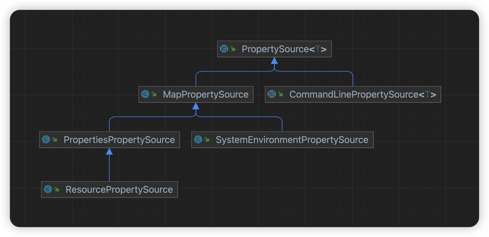
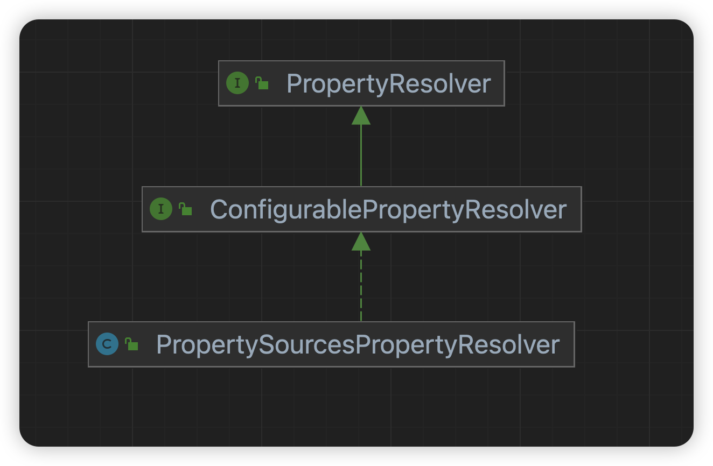
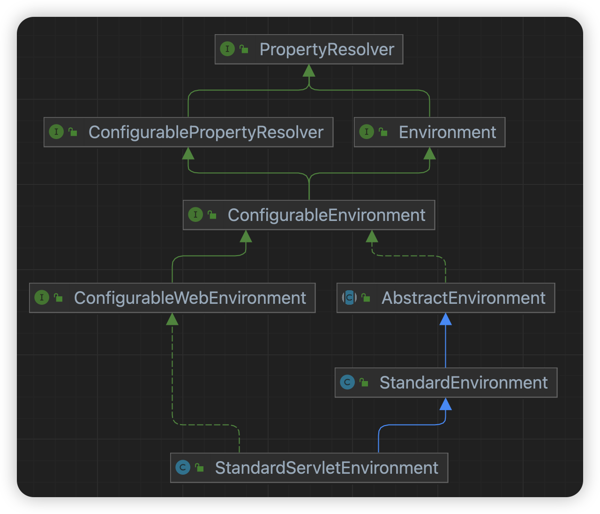

### PropertySource
类型继承图如下所示，只是挑选了一些常见的实现类。

`PropertySource`是一个抽象类，代表一个属性源，Spring `Environment`中所有的属性就存储在一个`PropertySource`列表中，属性源可以是一个`Map`、`Resource`(yaml文件, properties文件)、命令行(--形式)、系统变量等等。

**注: PropertySource本身无法处理占位符，需要下面介绍的PropertyResolver组件。**

### PropertySourceLoader

`PropertySourceLoader`负责将一个`Resource`转换成PropertySource对象，目前仅仅只有两个实现。
- PropertiesPropertySourceLoader，负责处理后缀为properties、xml的文件。
- YamlPropertySourceLoader，负责处理后缀为yaml、yml文件。

### PropertyResolver
#### 简要介绍

类型继承图如下所示

`PropertyResolver`是一个顶层接口，定义了一些获取属性值，以及解析占位符的方法

```java
public interface PropertyResolver {

    
    /**
     * 是否包含指定的属性
     */
    boolean containsProperty(String key);

   
    /**
     * 根据属性名获取对应的属性值, 如果属性值含有占位符且属性值为字符串, 并且占位符中的key存在, 会替换掉, 最后还会进行类型转换
     */
    @Nullable
    String getProperty(String key);

    /**
     * 如果没有对应的属性值, 则返回指定的默认值
     */
    
    String getProperty(String key, String defaultValue);

   
    /**
     * 根据属性名获取对应的属性值, 如果属性值含有占位符且属性值为字符串, 并且占位符中的key存在, 会替换掉, 最后还会进行类型转换
     */
    @Nullable
    <T> T getProperty(String key, Class<T> targetType);

   
    <T> T getProperty(String key, Class<T> targetType, T defaultValue);

    
    /**
     * 属性不存在抛异常
     */
    String getRequiredProperty(String key) throws IllegalStateException;

    
    <T> T getRequiredProperty(String key, Class<T> targetType) throws IllegalStateException;

    
    /**
     * 替换占位符, 占位符中的key不存在原样返回, 默认占位符为${}
     */
    String resolvePlaceholders(String text);

    
    /**
     * 替换占位符, 占位符中的key不存在抛异常
     */
    String resolveRequiredPlaceholders(String text) throws IllegalArgumentException;

}
```

`ConfigurablePropertyResolver`接口则增加了一些配置方法，如占位符的前缀、后缀等。

#### 使用

```java
public class PropertyResolverTest {

    private static ConfigurablePropertyResolver propertyResolver;

    @BeforeClass
    public static void init() {
        Map<String, Object> map = new HashMap<>();
        map.put("age", "20");
        map.put("prefix", "user");
        map.put("name", "${prefix}-1");
        MutablePropertySources propertySources = new MutablePropertySources();
        PropertySource<?> propertySource = new MapPropertySource("mapSource", map);
        propertySources.addLast(propertySource);
        propertyResolver = new PropertySourcesPropertyResolver(propertySources);
    }

    @Test
    public void testApi() {
        // 自动类型转换
        Integer age = propertyResolver.getProperty("age", Integer.class);
        Assert.assertEquals(Integer.valueOf(20), age);

        // 自动替换属性值中的占位符
        String name = propertyResolver.getProperty("name");
        Assert.assertEquals("user-1", name);

        // 手动替换占位符
        String text = "${prefix}-1";
        String res = propertyResolver.resolvePlaceholders(text);
        Assert.assertEquals("user-1", res);
    }
}
```

### Environment

#### 简要介绍

类型继承图如下所示

可以看到`Environment`是继承了`PropertyResolver`接口的，只是增加了一些环境信息方法(profile)

- ConfigurableEnvironment，增加了一些配置的方法，以及可以获取到内部的`PropertySource`列表。
- StandardEnvironment，非web上下文使用的环境实例。
- StandardServletEnvironment，web上下午使用的环境实例。

其中`Environment`实例关于`PropertyResolver`接口的方法是通过组合模式实现的，内部持有一个`PropertySourcesPropertyResolver`实例。

### 属性绑定

Spring提供了一个很强大的工具类，支持将`Environment`或者`ConfigurationPropertySource`中的属性绑定到一个Java对象中，这个类就是`Binder`，且支持占位符，类型转换，宽松绑定。

如Java对象中的字段名为driverClassName，而属性对应的key不管为driverClassName、driverclassname、driver-class-name，都能绑定成功。

下面来看下几个重要的类。

#### ConfigurationPropertyName
`ConfigurationPropertyName`，属性key的抽象，支持.符合，key只能包含a-z、0-9、.、-这几个字符。注意不能包含大写字母。其中username与user-name被认为是等价的。

#### ConfigurationPropertySource
`ConfigurationPropertySource`，这是一个新的接口，不过它的实现类也是借助了`PropertySource`来实现，尽管他们之间没有任何继承关系。

```java
@FunctionalInterface
public interface ConfigurationPropertySource {
    
    /**
     * 根据属性名获取对应的值
     * 注:
     * 内部维护的属性名为driverClassName，则参数driverclassname、driver-class-name可以获取到值
     * 参数为driverClassName不能获取到，并且会报错，因为参数不支持大写字母
     *
     * 内部维护的属性名为driverclassname，则参数driverclassname、driver-class-name可以获取到值
     *
     * 内部维护的属性名为driver-class-name，则参数driverclassname、driver-class-name可以获取到值
     */
    ConfigurationProperty getConfigurationProperty(ConfigurationPropertyName name);

    /**
     * 判断是否包含后代属性
     * 内部维护了user.name属性名, 如果参数为user，则返回存在
     * 虽然getConfigurationProperty(ConfigurationPropertyName.of("user"))为空
     * 但是containsDescendantOf(ConfigurationPropertyName.of("user"))存在
     */
    default ConfigurationPropertyState containsDescendantOf(ConfigurationPropertyName name) {
        return ConfigurationPropertyState.UNKNOWN;
    }

    
    /**
     * 注册别名
     */
    default ConfigurationPropertySource withAliases(ConfigurationPropertyNameAliases aliases) {
        return new AliasedConfigurationPropertySource(this, aliases);
    }

}
```

使用例子

```java
public class ConfigurationPropertySourceTest {

    private static ConfigurationPropertySource configurationPropertySource;

    @BeforeClass
    public static void init() {
        Map<String, Object> map = new HashMap<>();
        map.put("db.url", "jdbc:mysql://127.0.0.1/test");
        map.put("db.driverClassName", "com.mysql.cj.jdbc.Driver");
        map.put("db.init-size", 20);
        PropertySource<?> propertySource = new MapPropertySource("map", map);
        /*
         * 使用PropertySource构建
         */
        Iterable<ConfigurationPropertySource> it = ConfigurationPropertySources.from(propertySource);
        if (it.iterator().hasNext()) {
            configurationPropertySource = it.iterator().next();
        } else {
            throw new IllegalStateException();
        }
        // 使用MapConfigurationPropertySource直接构建
        // configurationPropertySource = new MapConfigurationPropertySource(map);

        // 注册别名(注意返回的是一个新对象)
        configurationPropertySource = configurationPropertySource.withAliases(new ConfigurationPropertyNameAliases("db.url", "db.jdbc-url"));
    }

    @Test
    public void testBuildKey() {
        ConfigurationPropertyName.of("driver-class-name");
        try {
            ConfigurationPropertyName.of("driverClassName");
        } catch (Exception e) {
            Assert.assertTrue(e instanceof InvalidConfigurationPropertyNameException);
        }
    }

    @Test
    public void testApi() {
        Assert.assertNotNull(configurationPropertySource.getConfigurationProperty(ConfigurationPropertyName.of("db.url")));
        // 别名
    Assert.assertNotNull(configurationPropertySource.getConfigurationProperty(ConfigurationPropertyName.of("db.jdbc-url")));

        // 宽松形式(注意不能使用大写作为参数)
        Assert.assertNotNull(configurationPropertySource.getConfigurationProperty(ConfigurationPropertyName.of("db.driver-class-name")));
        Assert.assertNotNull(configurationPropertySource.getConfigurationProperty(ConfigurationPropertyName.of("db.driverclassname")));

        Assert.assertNotNull(configurationPropertySource.getConfigurationProperty(ConfigurationPropertyName.of("db.init-size")));
        Assert.assertNotNull(configurationPropertySource.getConfigurationProperty(ConfigurationPropertyName.of("db.initsize")));

        // 判断后续属性
        ConfigurationPropertyState state = configurationPropertySource.containsDescendantOf(ConfigurationPropertyName.of("db"));
        Assert.assertEquals(ConfigurationPropertyState.PRESENT, state);
    }
}

```

#### Binder

终于来到重头戏，前面的铺垫都是为了该类的使用。因为Binder依赖`ConfigurationPropertySource`。

该类可以将`ConfigurationPropertySource`维护的属性根据名称绑定到Java对象中。

下面来介绍用法。

```java
public class BinderTest {

    private static Binder binder;

    @Data
    private static class DbProperties {
        private String url;

        private String driverClassName;

        private Integer initSize;

        private String name;
    }

    @BeforeClass
    public static void init() {
        Map<String, Object> map = new HashMap<>();
        map.put("db.db-name", "test");
        map.put("db.url", "jdbc:mysql://127.0.0.1/${db.db-name}");
        map.put("db.driverClassName", "com.mysql.cj.jdbc.Driver");
        map.put("db.init-size", "20");
        PropertySource<?> propertySource = new MapPropertySource("map", map);
        MutablePropertySources propertySources = new MutablePropertySources();
        propertySources.addLast(propertySource);
        /*
         * 使用PropertySource构建, 并指定placeholdersResolver, 否则无法处理占位符
         */
        PropertySourcesPlaceholdersResolver placeholdersResolver = new PropertySourcesPlaceholdersResolver(propertySources);
        binder = new Binder(ConfigurationPropertySources.from(propertySources), placeholdersResolver);
    }

    @Test
    public void testApi() {
        // 创建一个新对象
        DbProperties db1 = binder.bindOrCreate("db", DbProperties.class);
        check(db1);

        // 基于已有的对象重新映射
        DbProperties db2 = new DbProperties();
        db2.setName("user");
        // 补齐其他字段
        DbProperties db3 = binder.bindOrCreate("db", Bindable.ofInstance(db2));
        // 返回的是同一个实例
        Assert.assertSame(db2, db3);
        check(db2);
    }

    private void check(DbProperties db) {
        Assert.assertEquals("jdbc:mysql://127.0.0.1/test", db.getUrl());
        Assert.assertEquals("com.mysql.cj.jdbc.Driver", db.getDriverClassName());
        Assert.assertEquals(Integer.valueOf(20), db.getInitSize());

    }
}

```

`Binder`类还提供一个静态方法来构造`Binder`实例，从`Environment`实例获取`PropertySources`。

```java
public static Binder get(Environment environment) {  
    return get(environment, null);  
}

public static Binder get(Environment environment, BindHandler defaultBindHandler) {
    Iterable<ConfigurationPropertySource> sources = ConfigurationPropertySources.get(environment);
    PropertySourcesPlaceholdersResolver placeholdersResolver = 
        new PropertySourcesPlaceholdersResolver(environment);
    return new Binder(sources, placeholdersResolver, null, null, defaultBindHandler);
}
```

**属性绑定简要过程：**
**根据Java类型找到所有的字段，将字段名称变成宽松类型，本例会变成url、driver-class-name、init-size、name，然后一个个根据宽松字段名称去获取对应的值，当然这个值会替换其中的占位符，会做类型转换。**

### @ConfigurationProperties

`@ConfigurationProperties`注解在Spring Boot中常用来绑定属性到Java Bean中，不难猜出内部原理便是使用上面所介绍的`Binder`类来实现的。使用该注解时常常搭配`@EnableConfigurationProperties`注解一起使用，`@EnableConfigurationProperties`的主要作用就是将指定的class注册到Spring容器中，同时注册了一个`ConfigurationPropertiesBindingPostProcessor`用来将`Environment`实例中的属性绑定到Java Bean中。`ConfigurationPropertiesBindingPostProcessor`是一个`BeanPostProcessor`。

**有时候我们并没有使用`@EnableConfigurationProperties`注解，而是使用`@Compoment`注解也能生效，因为本质上绑定属性是`ConfigurationPropertiesBindingPostProcessor`做的，只要我们的Bean在Spring容器中即可。而Spring Boot自动装配时内部也到处使用了@EnableConfigurationProperties注解，因此`ConfigurationPropertiesBindingPostProcessor`类也是在Spring容器（只会注册一次）中的。**

ConfigurationPropertiesBindingPostProcessor.java

```java
@Override
public Object postProcessBeforeInitialization(Object bean, String beanName) throws BeansException {
    bind(ConfigurationPropertiesBean.get(this.applicationContext, bean, beanName));
    return bean;
}

private void bind(ConfigurationPropertiesBean bean) {
    if (bean == null || hasBoundValueObject(bean.getName())) {
        return;
    }
    Assert.state(bean.getBindMethod() == BindMethod.JAVA_BEAN, "Cannot bind @ConfigurationProperties for bean '"
            + bean.getName() + "'. Ensure that @ConstructorBinding has not been applied to regular bean");
    try {
        // 绑定属性
        this.binder.bind(bean);
    }
    catch (Exception ex) {
        throw new ConfigurationPropertiesBindException(bean, ex);
    }
}
```

**可以看到绑定属性的时机是在`postProcessBeforeInitialization`方法中，也就是会先于`init-method`、`afterProperties`这些钩子方法，这样也合情合理。**