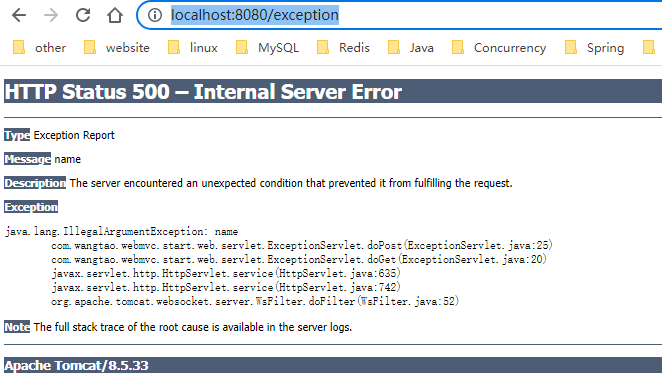
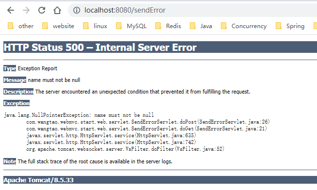
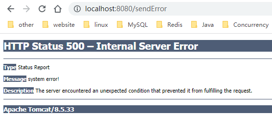

### 声明

> 源码基于Spring Boot 2.3.12中依赖的Tomcat

### 异常例子

tomcat中返回错误页面目前主要是以下两种情况。

* 执行`servlet`发生异常
* 程序中主动调用`response.sendError()`方法。

下面先来看看tomcat默认的处理结果

编写以下例子触发第一种情况

```java
@WebServlet("/exception")
public class ExceptionServlet extends HttpServlet {
    private static final long serialVersionUID = -4621356333568059989L;

    @Override
    protected void doGet(HttpServletRequest req, HttpServletResponse resp) throws ServletException, IOException {
        doPost(req, resp);
    }

    @Override
    protected void doPost(HttpServletRequest req, HttpServletResponse resp) throws ServletException, IOException {
        throw new IllegalArgumentException("name");
    }
}
```

执行结果如下图所示



编写下面例子触发第二种情况

```java
@WebServlet("/sendError")
public class SendErrorServlet extends HttpServlet {

    private static final long serialVersionUID = -7823675542130292567L;

    @Override
    protected void doGet(HttpServletRequest req, HttpServletResponse resp) throws ServletException, IOException {
        doPost(req, resp);
    }

    @Override
    protected void doPost(HttpServletRequest req, HttpServletResponse resp) throws ServletException, IOException {
        // 使用该属性可携带异常信息
        req.setAttribute(RequestDispatcher.ERROR_EXCEPTION, new NullPointerException("name must not be null"));
        resp.sendError(500, "system error!");
    }
}
```

执行结果如下图所示



如果把代码中`req.setAttribute(RequestDispatcher.ERROR_EXCEPTION, 'xxxx')`去掉则是以下结果



可以看到tomcat给我们返回的主要信息便是`Message`、`Exception`，其中`Message`的取值逻辑如下，如果有异常信息，即存在`Exception`，则为`e.getMessage`，否则便是`sendError`方法中指定的值。

注:

**以上代码如果在Spring Boot环境中执行，需要在启动类排除掉错误处理的自动配置类，Spring Boot默认使用/error来返回错误页面。**

即`@SpringBootApplication(exclude = ErrorMvcAutoConfiguration.class)`

### 源码说明

首先要明确一点，`sendError`方法并不是在执行时就返回页面给客户端，该方法仅仅只是打了一个错误标记而已。打开源码可以看到以下片段

```java
/**
 * org.apache.catalina.connector.Response.java
 */
@Override
public void sendError(int status, String message) throws IOException {

    if (isCommitted()) {
        throw new IllegalStateException
            (sm.getString("coyoteResponse.sendError.ise"));
    }

    // Ignore any call from an included servlet
    if (included) {
        return;
    }

    // 打一个错误标记，真正处理错误时会用到这个标记
    setError();

    // 设置返回状态码, 同时会清空message
    getCoyoteResponse().setStatus(status);
    // 设置错误信息
    getCoyoteResponse().setMessage(message);

    // Clear any data content that has been buffered
    resetBuffer();

    // Cause the response to be finished (from the application perspective)
    setSuspended(true);
}

public boolean setError() {
    // 将内部的reponse对象的errorState更新成1
    return getCoyoteResponse().setError();
}

public boolean setError() {
    return errorState.compareAndSet(0, 1);
}
```

真正执行错误页面逻辑的类是`org.apache.catalina.core.StandardHostValve`

```java
@Override
public final void invoke(Request request, Response response)
    throws IOException, ServletException {
	// ...略
    // 从request对象中获取异常信息
    Throwable t = (Throwable) request.getAttribute(RequestDispatcher.ERROR_EXCEPTION);

    /*
     * 判断是否有错误，errorState == 1
     * sendError方法中会调用setError方法，更新errorState为1
     */
    if (response.isErrorReportRequired()) {
        AtomicBoolean result = new AtomicBoolean(false);
        response.getCoyoteResponse().action(ActionCode.IS_IO_ALLOWED, result);
        if (result.get()) {
            if (t != null) {
                // 根据异常处理
                throwable(request, response, t);
            } else {
                // 根据状态码处理
                status(request, response);
            }
        }
    }
}
```

```java
protected void throwable(Request request, Response response,
                         Throwable throwable) {
    Context context = request.getContext();
    if (context == null) {
        return;
    }

    // 真实的错误
    Throwable realError = throwable;

    if (realError instanceof ServletException) {
        // 获取cause by
        realError = ((ServletException) realError).getRootCause();
        if (realError == null) {
            realError = throwable;
        }
    }

    // If this is an aborted request from a client just log it and return
    if (realError instanceof ClientAbortException ) {
        if (log.isDebugEnabled()) {
            log.debug
                (sm.getString("standardHost.clientAbort",
                              realError.getCause().getMessage()));
        }
        return;
    }

    // 获取该异常对应的错误页面
    ErrorPage errorPage = context.findErrorPage(throwable);
    if ((errorPage == null) && (realError != throwable)) {
        // 没有找到，再根据真实的异常再找一遍
        errorPage = context.findErrorPage(realError);
    }

    if (errorPage != null) {
        // 错误页面不为空，设置一系列的属性，
        if (response.setErrorReported()) {
            response.setAppCommitted(false);
            request.setAttribute(Globals.DISPATCHER_REQUEST_PATH_ATTR,
                                 errorPage.getLocation());
            request.setAttribute(Globals.DISPATCHER_TYPE_ATTR,
                                 DispatcherType.ERROR);
            // 错误码, 默认就是500
            request.setAttribute(RequestDispatcher.ERROR_STATUS_CODE,
                                 Integer.valueOf(HttpServletResponse.SC_INTERNAL_SERVER_ERROR));
            // 错误原因
            request.setAttribute(RequestDispatcher.ERROR_MESSAGE,
                                 throwable.getMessage());
            // 真实的异常信息
            request.setAttribute(RequestDispatcher.ERROR_EXCEPTION,
                                 realError);
            Wrapper wrapper = request.getWrapper();
            if (wrapper != null) {
                request.setAttribute(RequestDispatcher.ERROR_SERVLET_NAME,
                                     wrapper.getName());
            }
            // 请求路径
            request.setAttribute(RequestDispatcher.ERROR_REQUEST_URI,
                                 request.getRequestURI());
            request.setAttribute(RequestDispatcher.ERROR_EXCEPTION_TYPE,
                                 realError.getClass());
            // 响应页面内容
            if (custom(request, response, errorPage)) {
                try {
                    response.finishResponse();
                } catch (IOException e) {
                    container.getLogger().warn("Exception Processing " + errorPage, e);
                }
            }
        }
    } else {
        // 根据异常没有找到错误页面，再根据错误码找，将状态码改成500
        response.setStatus(HttpServletResponse.SC_INTERNAL_SERVER_ERROR);
        // The response is an error
        response.setError();
        // 根据状态码处理
        status(request, response);
    }
}
```

```java
private void status(Request request, Response response) {

    // 获取状态码
    int statusCode = response.getStatus();

    // Handle a custom error page for this status code
    Context context = request.getContext();
    if (context == null) {
        return;
    }

    if (!response.isError()) {
        return;
    }

    // 根据状态码获取错误页面
    ErrorPage errorPage = context.findErrorPage(statusCode);
    if (errorPage == null) {
        // 找不到则使用0再找一次，这点很重要, SpringBoot就是注册了一个0的错误页面
        errorPage = context.findErrorPage(0);
    }
    if (errorPage != null && response.isErrorReportRequired()) {
        response.setAppCommitted(false);
        // 设置状态码
        request.setAttribute(RequestDispatcher.ERROR_STATUS_CODE,
                             Integer.valueOf(statusCode));
		// 获取错误信息，sendError方法第二个参数的值（参加该方法说明）
        String message = response.getMessage();
        if (message == null) {
            message = "";
        }
        // 设置错误信息
        request.setAttribute(RequestDispatcher.ERROR_MESSAGE, message);
        request.setAttribute(Globals.DISPATCHER_REQUEST_PATH_ATTR,
                             errorPage.getLocation());
        request.setAttribute(Globals.DISPATCHER_TYPE_ATTR,
                             DispatcherType.ERROR);


        Wrapper wrapper = request.getWrapper();
        if (wrapper != null) {
            request.setAttribute(RequestDispatcher.ERROR_SERVLET_NAME,
                                 wrapper.getName());
        }
        // 设置请求路径
        request.setAttribute(RequestDispatcher.ERROR_REQUEST_URI,
                             request.getRequestURI());
        // 响应页面内容
        if (custom(request, response, errorPage)) {
            response.setErrorReported();
            try {
                response.finishResponse();
            } catch (ClientAbortException e) {
                // Ignore
            } catch (IOException e) {
                container.getLogger().warn("Exception Processing " + errorPage, e);
            }
        }
    }
}
```

```java
private boolean custom(Request request, Response response,
                       ErrorPage errorPage) {

    if (container.getLogger().isDebugEnabled()) {
        container.getLogger().debug("Processing " + errorPage);
    }

    try {
        // Forward control to the specified location
        ServletContext servletContext =
            request.getContext().getServletContext();
        // 根据错误页面的路径获取转发器
        RequestDispatcher rd =
            servletContext.getRequestDispatcher(errorPage.getLocation());

        if (rd == null) {
            container.getLogger().error(
                sm.getString("standardHostValue.customStatusFailed", errorPage.getLocation()));
            return false;
        }

        if (response.isCommitted()) {
            // Response is committed - including the error page is the
            // best we can do
            rd.include(request.getRequest(), response.getResponse());
        } else {
            // Reset the response (keeping the real error code and message)
            response.resetBuffer(true);
            response.setContentLength(-1);
			// 转发到指定页面，Spring Boot默认是/error
            rd.forward(request.getRequest(), response.getResponse());

            // If we forward, the response is suspended again
            response.setSuspended(false);
        }

        // Indicate that we have successfully processed this custom page
        return true;

    } catch (Throwable t) {
        ExceptionUtils.handleThrowable(t);
        // Report our failure to process this custom page
        container.getLogger().error("Exception Processing " + errorPage, t);
        return false;
    }
}
```

如果根据异常或者状态码找到了对应的错误页面，则会根据错误页面的配置的路径进行返回。在Spring Boot中就是配置了一个状态码为0，路径为/error的一个错误页面，而/error则对应于`BasicErrorController`这个处理器，用于处理所有的错误信息。当然了如果请求被全局异常处理器处理掉了，而没有走到tomcat本身的异常处理逻辑(即`DispatcherServlet`没有向外抛出异常，也没有调用`response.sendError`方法时)是不会转发到/error路径的。

默认情况下，tomcat中是没有配置任何错误页面的，因此根据异常或者状态码是找不到错误页面的，最终会执行一个默认处理，处理类为`org.apache.catalina.valves.ErrorReportValve`，展示的内容如上面例子图片所示。

可以看到上面处理逻辑会先从request对象中获取异常信息，那么对于上文所说的第一种情况，即Servlet处理时往外抛出异常时，不难猜到tomcat内部在执行Servlet时会捕获异常，同时通过`req.setAttribute(RequestDispatcher.ERROR_EXCEPTION, e)`方法将异常信息放到request对象中，供后续异常处理时使用，具体代码见`org.apache.catalina.core.StandardWrapperValve`类，该类会执行过滤器链以及Servlet本身逻辑。

```java
@Override
public final void invoke(Request request, Response response)
    throws IOException, ServletException {
    // ... 略
    Servlet servlet = null;
    try {
        // 获取Servlet
        servlet = wrapper.allocate();
    }
    
    // 省略了很多无关逻辑
    try {
        if ((servlet != null) && (filterChain != null)) {
            // 执行过滤器链以及Servlet
            filterChain.doFilter(request.getRequest(),  response.getResponse());
        }
    } catch (Throwable e) {
        exception(request, response, e);
    }
    // ...略
}

private void exception(Request request, Response response,
                           Throwable exception) {
    // 设置异常信息
    request.setAttribute(RequestDispatcher.ERROR_EXCEPTION, exception);
    // 设置状态码
    response.setStatus(HttpServletResponse.SC_INTERNAL_SERVER_ERROR);
    // 设置错误标记
    response.setError();
}
```

到这里，tomcat内部的一个错误处理机制便基本介绍完了。

### 配置错误页面

前文说到，tomcat会根据异常信息或者状态码去寻找对应的错误页面，如果没有找到则会使用一个默认页面返回给客户端。那么该如何配置错误页面，便是本节要说明的内容。

* 通过web.xml方式配置

```xml
<!-- 根据状态码配置 -->
<error-page> 
    <error-code>404</error-code>          
    <location>/404.html</location>
</error-page>

<!-- 状态码为0时可以匹配所有的状态码 -->
<error-page> 
    <error-code>0</error-code>          
    <location>/error.html</location>
</error-page>

<!-- 根据异常类型配置 -->
<error-page> 
    <exception-type>java.lang.NullPointerException</exception-type>          
    <location>/error.html</location>
</error-page>
```

* 内嵌容器编码

Spring Boot运行时一般使用内嵌容器，在`org.apache.catalina.Context`接口中定义了方法，可配置错误页面

```java
public interface Context extends Container, ContextBind {
    
    void addErrorPage(ErrorPage errorPage);
}
```

可以参考`org.springframework.boot.web.embedded.tomcat.TomcatServletWebServerFactory`

```java
protected void configureContext(Context context, ServletContextInitializer[] initializers) {
    TomcatStarter starter = new TomcatStarter(initializers);
    if (context instanceof TomcatEmbeddedContext) {
        TomcatEmbeddedContext embeddedContext = (TomcatEmbeddedContext) context;
        embeddedContext.setStarter(starter);
        embeddedContext.setFailCtxIfServletStartFails(true);
    }
    context.addServletContainerInitializer(starter, NO_CLASSES);
    for (LifecycleListener lifecycleListener : this.contextLifecycleListeners) {
        context.addLifecycleListener(lifecycleListener);
    }
    for (Valve valve : this.contextValves) {
        context.getPipeline().addValve(valve);
    }
    // 配置错误页面
    for (ErrorPage errorPage : getErrorPages()) {
        org.apache.tomcat.util.descriptor.web.ErrorPage tomcatErrorPage = new org.apache.tomcat.util.descriptor.web.ErrorPage();
        tomcatErrorPage.setLocation(errorPage.getPath());
        tomcatErrorPage.setErrorCode(errorPage.getStatusCode());
        tomcatErrorPage.setExceptionType(errorPage.getExceptionName());
        context.addErrorPage(tomcatErrorPage);
    }
    for (MimeMappings.Mapping mapping : getMimeMappings()) {
        context.addMimeMapping(mapping.getExtension(), mapping.getMimeType());
    }
    configureSession(context);
    new DisableReferenceClearingContextCustomizer().customize(context);
    for (TomcatContextCustomizer customizer : this.tomcatContextCustomizers) {
        customizer.customize(context);
    }
}

```

### 总结

1. `response`中3个关键方法的作用

* `setStatus(404)`，设置状态码以及message，message将为空。
* `sendError(404)`，设置错误标志，状态码，message为空。
* `sendError(404, "System Error!")`，设置错误标志、状态码、message。

2. tomcat处理错误时，优先以异常处理，然后再是状态码处理，如果有异常，**状态码固定是500，即`setStatus`、`sendError`方法指定的状态码无效，message取e.getMessage()**。如果没有异常，**则状态码为`sendError`指定的状态码，message为`sendError`指定的message**。响应给客户端时，会优先根据异常信息寻找配置的错误页面，找不到则会再根据状态码寻找配置的错误页面，特别的，**状态码为0的错误页面可以匹配到所有的状态码**，找到错误页面后，会给request对象设置一系列的值，诸如状态码，message，异常，请求路径等重要信息，然后转发到错误页面指定的路径。若没有找到错误页面，则返回一个默认的返回给客户端，包含状态码，message，异常等重要信息。
3. `request.getAttribute(RequestDispatcher.ERROR_EXCEPTION`)方法可以获取到Servlet执行时抛出的异常。

