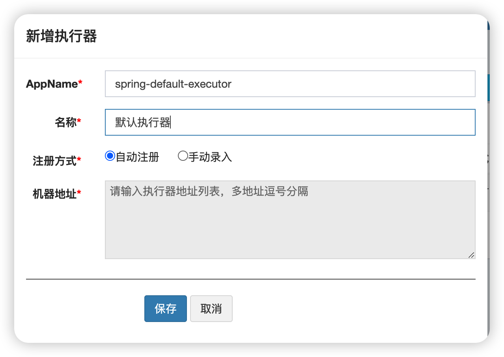
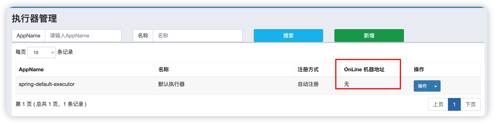
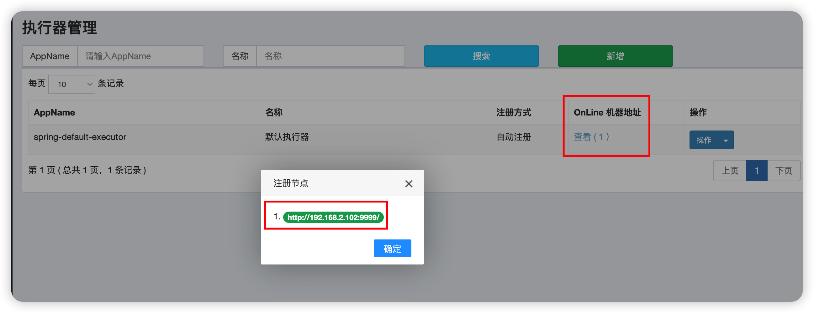
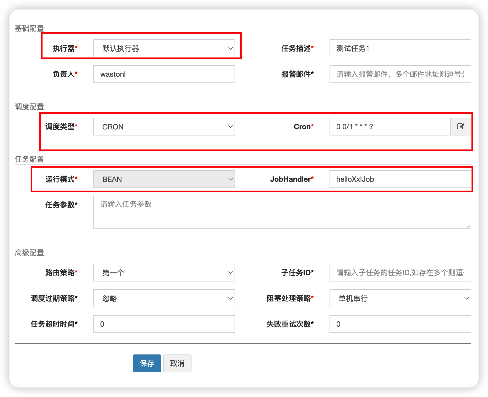

### xxl-job-admin(调度中心)搭建

#### docker arm64架构镜像构建

由于官方没有构建arm64架构的docker镜像，只好自己构建了，下面是详细步骤。

1. 下载源码进行构建，[下载地址](https://github.com/xuxueli/xxl-job/releases)

2. 构建jar包，进入xxl-job-admin模块根目录

   ```
   mvn package -Dmaven.test.skip=true
   ```

3. 在xxl-job-admin模块根目录已经写好了Dockfile，进入该目录构建即可。

   ```bash
   docker build -t wastonl/xxl-job-admin:2.4.0 .
   ```

#### docker部署

1. 在下载的源码目录找到db脚本，执行。(官方只支持MySQL)

2. 执行命令

   ```bash
   docker run -d \
   	--name xxl-job-admin \
   	-e PARAMS="--spring.datasource.url=jdbc:mysql://host.docker.internal:3306/xxl_job?useUnicode=true&characterEncoding=UTF-8&autoReconnect=true&serverTimezone=Asia/Shanghai --spring.datasource.username=root --spring.datasource.password=123456" \
   	-p 9080:8080 \
   	wastonl/xxl-job-admin:2.4.0
   ```

3. 查看运行日志，出现>>>>>>>>> init xxl-job admin scheduler success，即部署成功
4. 访问`http://localhost:9080/xxl-job-admin`，默认登录账号 admin/123456

### 重要表介绍

1. xxl_job_group

   用来存储执行器配置信息，如果执行器是自动注册，那么`address_list`字段由调度中心的后台线程根据注册信息自动更新进去的，每次更新间隔为30s。

   **注：执行器自动注册时只会新增注册信息，不会往这张表插入记录，因此需要在调度中心手动新增执行器基本信息。**

2. xxl_job_info

   用于存储任务配置信息

3. xxl_job_registry

   执行器自动注册的注册信息，保存执行器的地址(ip、port)

### 使用

#### 执行器新增以及注册

第一步，在任务调度中心-》执行器管理界面新增一个执行器，如图所示



点击保存，则会将信息保存到`xxl_job_group`表中。



第二步，编写执行器，会与调度中心`xxl-job-admin`建立长连接，维持心跳，将注册信息保存到`xxl_job_registry`表中。调度中心的后台线程每隔30s会从这个表中取到真实的地址信息更新到`xxl_job_group`表中的`address_list`字段中，同时该任务会删除掉下线的执行器的注册信息。

application.yml配置信息如下

```yaml
xxl:
  job:
    # 调度中心部署根地址 [选填]：如调度中心集群部署存在多个地址则用逗号分隔
    admin-addresses: http://127.0.0.1:9080/xxl-job-admin
    # 执行器通讯TOKEN [选填]：非空时启用
    access-token: default_token
    executor:
      # 执行器AppName [选填]：执行器心跳注册分组依据；为空则关闭自动注册
      appname: spring-default-executor
      # 执行器注册 [选填]：优先使用该配置作为注册地址，为空时使用内嵌服务 ”IP:PORT“ 作为注册地址
      address:
      # 执行器IP [选填]：默认为空表示自动获取IP，多网卡时可手动设置指定IP，该IP不会绑定Host仅作为通讯实用
      ip:
      # 执行器端口号 [选填]：小于等于0则自动获取；默认端口为9999，单机部署多个执行器时，注意要配置不同执行器端口
      port: 9999
      logpath: ./xxl-job/jobhandler
      logretentiondays: 30
```

XxlJobConfig.java

```java
package com.wangtao.task.simple.config;

import com.xxl.job.core.executor.impl.XxlJobSpringExecutor;
import lombok.extern.slf4j.Slf4j;
import org.springframework.beans.factory.annotation.Autowired;
import org.springframework.boot.context.properties.EnableConfigurationProperties;
import org.springframework.context.annotation.Bean;
import org.springframework.context.annotation.Configuration;

@Slf4j
@EnableConfigurationProperties(XxlJobProperties.class)
@Configuration
public class XxlJobConfig {

    @Autowired
    private XxlJobProperties xxlJobProperties;

    @Bean
    public XxlJobSpringExecutor xxlJobExecutor() {
        log.info(">>>>>>>>>>> xxl-job config init.");
        XxlJobSpringExecutor xxlJobSpringExecutor = new XxlJobSpringExecutor();
        xxlJobSpringExecutor.setAdminAddresses(xxlJobProperties.getAdminAddresses());
        xxlJobSpringExecutor.setAppname(xxlJobProperties.getExecutor().getAppname());
        xxlJobSpringExecutor.setAddress(xxlJobProperties.getExecutor().getAddress());
        xxlJobSpringExecutor.setIp(xxlJobProperties.getExecutor().getIp());
        xxlJobSpringExecutor.setPort(xxlJobProperties.getExecutor().getPort());
        xxlJobSpringExecutor.setAccessToken(xxlJobProperties.getAccessToken());
        xxlJobSpringExecutor.setLogPath(xxlJobProperties.getExecutor().getLogPath());
        xxlJobSpringExecutor.setLogRetentionDays(xxlJobProperties.getExecutor().getLogRetentionDays());
        log.info(">>>>>>>>>>> xxl-job config end.");
        return xxlJobSpringExecutor;
    }
}
```

XxlJobProperties.java

```java
package com.wangtao.task.simple.config;

import lombok.Getter;
import lombok.Setter;
import org.springframework.boot.context.properties.ConfigurationProperties;
import org.springframework.boot.context.properties.NestedConfigurationProperty;

@Setter
@Getter
@ConfigurationProperties(prefix = "xxl.job")
public class XxlJobProperties {

    private String adminAddresses;

    private String accessToken;

    @NestedConfigurationProperty
    private ExecutorInfo executor;

    @Setter
    @Getter
    static class ExecutorInfo {

        private String appname;

        private String address;

        private String ip;

        private int port;

        private String logPath;

        private int logRetentionDays;
    }
}

```

将Spring Boot项目启动后，稍等片刻，再次查询



#### 任务编写及配置

第一步，编写任务执行逻辑

SimpleJob.java

```java
package com.wangtao.task.simple.job;

import com.xxl.job.core.handler.annotation.XxlJob;
import lombok.extern.slf4j.Slf4j;
import org.springframework.stereotype.Component;

@Slf4j
@Component
public class SimpleJob {

   /**
    * 使用XxlJob注解标注一个具体任务的执行逻辑，注解里面的名称等会在配置任务时需要使用到
    */
    @XxlJob("helloXxlJob")
    public void helloXxlJob() {
        log.info("Hello XXL-JOB!");
    }
}

```

第二步，在调度中心-》任务管理界面新增任务配置

如果所示



执行器选择我们上面新增好的默认执行器，调度配置使用cron表达式，运行模式选择BEAN，JobHandler输入`@XxlJob`注解指定的名称即可。该配置表示每一分钟执行一次。

新建完了之后，我们可以点击执行一次操作，让任务立马执行一次。也可以让任务变成启动状态，这样就会按照cron表达式的语义去执行任务了。

**注：必须让任务变成启动状态，调度中心才会去调度它。**

