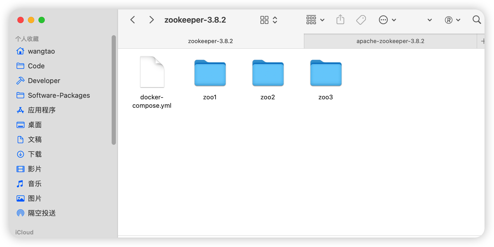
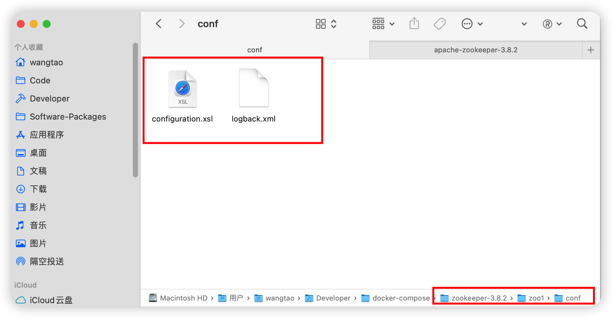

>zookeeper 3.8.2

### 使用docker安装zookeeper集群

[zookeeper下载地址](https://zookeeper.apache.org/releases.html)

下载最新的稳定版本即可，当前稳定版本为3.8.2。

第一步，修改logback.xml

解压后，进入conf目录，修改logback.xml文件，默认的内容只在控制台打印，需要放开文件记录的appender。

```xml
<!-- 修改目录日志，使用环境变量传进来 -->
<property name="zookeeper.log.dir" value="${ZOO_LOG_DIR}" />
<root level="INFO">
    <appender-ref ref="CONSOLE" />
    <!-- 添加文件日志打印，记得放开ROLLINGFILE appender的注释 -->
    <appender-ref ref="ROLLINGFILE" />
</root>
```

第二步，准备docker挂载的目录，将需要的文件放进去


集群为3个zookeeper组成，因此规划zoo1、zoo2、zoo3这3个目录，在这3个目录中新建conf文件夹，用来存放配置信息，将zookeeper安装包conf目录下的logback.xml以及configuration.xsl文件复制到该目录中。


第三步，编写docker-compose.yml文件

```yaml
services:
  zoo1:
    image: zookeeper:3.8.2
    container_name: zoo1
    ports:
      - 2181:2181
    volumes:
      - ./zoo1/conf:/conf
      - ./zoo1/data:/data
      - ./zoo1/datalog:/datalog
      - ./zoo1/logs:/logs
    environment:
      - ZOO_MY_ID=1
      - "ZOO_SERVERS=server.1=zoo1:2888:3888;2181 server.2=zoo2:2888:3888;2181 server.3=zoo3:2888:3888;2181"
      # 开启四字命令
      - ZOO_4LW_COMMANDS_WHITELIST=*
    networks:
      - zookeeper
      

  zoo2:
    image: zookeeper:3.8.2
    container_name: zoo2
    ports:
      - 2182:2181
    volumes:
      - ./zoo2/conf:/conf
      - ./zoo2/data:/data
      - ./zoo2/datalog:/datalog
      - ./zoo2/logs:/logs
    environment:
      - ZOO_MY_ID=2
      - "ZOO_SERVERS=server.1=zoo1:2888:3888;2181 server.2=zoo2:2888:3888;2181 server.3=zoo3:2888:3888;2181"
      # 开启四字命令
      - ZOO_4LW_COMMANDS_WHITELIST=*
    networks:
      - zookeeper
      

  zoo3:
    image: zookeeper:3.8.2
    container_name: zoo3
    ports:
      - 2183:2181
    volumes:
      - ./zoo3/conf:/conf
      - ./zoo3/data:/data
      - ./zoo3/datalog:/datalog
      - ./zoo3/logs:/logs
    environment:
      - ZOO_MY_ID=3
      - "ZOO_SERVERS=server.1=zoo1:2888:3888;2181 server.2=zoo2:2888:3888;2181 server.3=zoo3:2888:3888;2181"
      # 开启四字命令
      - ZOO_4LW_COMMANDS_WHITELIST=*
    networks:
      - zookeeper

      
networks:
  zookeeper:
    name: zookeeper
    driver: bridge
```

一些必要的说明

关于zoo.cfg
zookeeper docker镜像自己自定义了一些环境变量，如果启动时发现配置目录的zoo.cfg文件不存在，则会新建一个zoo.cfg配置文件，并且将这些环境变量给写入到zoo.cfg配置文件中去，因此可以使用这些自定义的环境变量来当做配置项。如上述docker-compose.yml文件中的ZOO_4LW_COMMANDS_WHITELIST环境变量对应的属性就是`4lw.commands.whitelist`。**因此上面复制时没有复制这个文件，这个文件会自动生成**。

关于配置目录
zookeeper默认的配置目录为安装目录的conf子目录，docker镜像修改成了/conf。这个目录在zkEnv.sh启动脚本中配置。只需要指定ZOOCFGDIR环境变量即可。docker镜像指定了这个变量的值为/conf。

```bash
# 如果变量不存在，则使用安装目录下的conf目录，ZOOBINDIR为bin目录，conf和bin同级
if [ "x$ZOOCFGDIR" = "x" ]
then
  if [ -e "${ZOOKEEPER_PREFIX}/conf" ]; then
    ZOOCFGDIR="$ZOOBINDIR/../conf"
  else
    ZOOCFGDIR="$ZOOBINDIR/../etc/zookeeper"
  fi
fi
```

关于数据目录
docker镜像设置了两个环境变量ZOO_DATA_DIR=/data、ZOO_DATA_LOG_DIR=/datalog。
分别对应了dataDir、dataLogDir配置属性。

关于程序日志
zookeeper使用logback来打印系统日志，启动脚本中会将配置目录(/conf)加入到CLASSPATH中，因此/conf/logback.xml便是zookeeper的日志配置文件，而上面logback.xml配置了日志目录为`${ZOO_LOG_DIR}`，这个环境变量默认为/log。

关于环境变量的默认值，以及定义了哪些环境变量

参见`Dockerfile`以及`docker-entrypoint.sh`
[github地址](https://github.com/31z4/zookeeper-docker/blob/master/3.8.2/Dockerfile)

### 运行

```bash
docker compose up -d
```

### 关闭

```bash
docker compose stop
```
### 验证

telnet 127.0.0.1:2181
然后输入stat

或者进入到任意一台zookeeper容器中，使用脚本验证。

```bash
cd apache-zookeeper-3.8.2-bin/bin
zkServer.sh status
```
输出
ZooKeeper JMX enabled by default
Using config: /conf/zoo.cfg
Client port found: 2181. Client address: localhost. Client SSL: false.
Mode: follower

可以看到这台机器是follower。